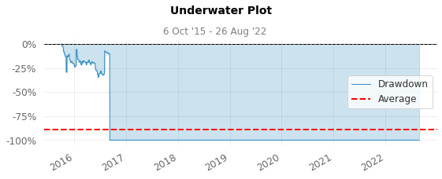

## Google Drive setting


```python
from google.colab import drive
drive.mount('/content/drive')
```

    Drive already mounted at /content/drive; to attempt to forcibly remount, call drive.mount("/content/drive", force_remount=True).
    


```python
%cd /content/drive/MyDrive/AIncome
```

    /content/drive/MyDrive/AIncome
    


```python
!pwd
```

    /content/drive/MyDrive/AIncome
    

### 作業フォルダ


```python
!mkdir AutoTrade10
```

    mkdir: cannot create directory ‘AutoTrade10’: File exists
    


```python
%cd  AutoTrade10
```/content/drive/MyDrive/AIncome/AutoTrade10
    


```python
!pwd
```

    /content/drive/MyDrive/AIncome/AutoTrade10
    

## 必要パッケージのインストール


```python
"""
#!pip install gym[all] -U
!pip install "gym==0.19.0"
!pip install stable-baselines[mpi]
#!pip install tensorflow==1.14.0
!pip install tensorflow-gpu==1.14.0
!pip install pyqt5
!pip install imageio
!pip install gym-anytrading
"""
!pip install "gym==0.19.0"
!pip install stable-baselines[mpi]
!pip uninstall -y tensorflow-gpu
!pip uninstall -y tensorflow
!pip install tensorflow-gpu==1.14.0
!pip install gym-anytrading

!pip install QuantStats
```

    Looking in indexes: https://pypi.org/simple, https://us-python.pkg.dev/colab-wheels/public/simple/
    Requirement already satisfied: gym==0.19.0 in /usr/local/lib/python3.7/dist-packages (0.19.0)
    Requirement already satisfied: numpy>=1.18.0 in /usr/local/lib/python3.7/dist-packages (from gym==0.19.0) (1.21.6)
    Requirement already satisfied: cloudpickle<1.7.0,>=1.2.0 in /usr/local/lib/python3.7/dist-packages (from gym==0.19.0) (1.5.0)
    Looking in indexes: https://pypi.org/simple, https://us-python.pkg.dev/colab-wheels/public/simple/
    Requirement already satisfied: stable-baselines[mpi] in /usr/local/lib/python3.7/dist-packages (2.10.2)
    Requirement already satisfied: pandas in /usr/local/lib/python3.7/dist-packages (from stable-baselines[mpi]) (1.3.5)
    Requirement already satisfied: cloudpickle>=0.5.5 in /usr/local/lib/python3.7/dist-packages (from stable-baselines[mpi]) (1.5.0)
    Requirement already satisfied: scipy in /usr/local/lib/python3.7/dist-packages (from stable-baselines[mpi]) (1.7.3)
    Requirement already satisfied: opencv-python in /usr/local/lib/python3.7/dist-packages (from stable-baselines[mpi]) (4.6.0.66)
    Requirement already satisfied: joblib in /usr/local/lib/python3.7/dist-packages (from stable-baselines[mpi]) (1.1.0)
    Requirement already satisfied: numpy in /usr/local/lib/python3.7/dist-packages (from stable-baselines[mpi]) (1.21.6)
    Requirement already satisfied: gym[atari,classic_control]>=0.11 in /usr/local/lib/python3.7/dist-packages (from stable-baselines[mpi]) (0.19.0)
    Requirement already satisfied: matplotlib in /usr/local/lib/python3.7/dist-packages (from stable-baselines[mpi]) (3.2.2)
    Requirement already satisfied: mpi4py in /usr/local/lib/python3.7/dist-packages (from stable-baselines[mpi]) (3.1.3)
    Requirement already satisfied: atari-py==0.2.6 in /usr/local/lib/python3.7/dist-packages (from gym[atari,classic_control]>=0.11->stable-baselines[mpi]) (0.2.6)
    Requirement already satisfied: pyglet>=1.4.0 in /usr/local/lib/python3.7/dist-packages (from gym[atari,classic_control]>=0.11->stable-baselines[mpi]) (1.5.26)
    Requirement already satisfied: six in /usr/local/lib/python3.7/dist-packages (from atari-py==0.2.6->gym[atari,classic_control]>=0.11->stable-baselines[mpi]) (1.15.0)
    Requirement already satisfied: cycler>=0.10 in /usr/local/lib/python3.7/dist-packages (from matplotlib->stable-baselines[mpi]) (0.11.0)
    Requirement already satisfied: pyparsing!=2.0.4,!=2.1.2,!=2.1.6,>=2.0.1 in /usr/local/lib/python3.7/dist-packages (from matplotlib->stable-baselines[mpi]) (3.0.9)
    Requirement already satisfied: kiwisolver>=1.0.1 in /usr/local/lib/python3.7/dist-packages (from matplotlib->stable-baselines[mpi]) (1.4.4)
    Requirement already satisfied: python-dateutil>=2.1 in /usr/local/lib/python3.7/dist-packages (from matplotlib->stable-baselines[mpi]) (2.8.2)
    Requirement already satisfied: typing-extensions in /usr/local/lib/python3.7/dist-packages (from kiwisolver>=1.0.1->matplotlib->stable-baselines[mpi]) (4.1.1)
    Requirement already satisfied: pytz>=2017.3 in /usr/local/lib/python3.7/dist-packages (from pandas->stable-baselines[mpi]) (2022.2.1)
    Found existing installation: tensorflow-gpu 1.14.0
    Uninstalling tensorflow-gpu-1.14.0:
      Successfully uninstalled tensorflow-gpu-1.14.0
    WARNING: Skipping tensorflow as it is not installed.
    Looking in indexes: https://pypi.org/simple, https://us-python.pkg.dev/colab-wheels/public/simple/
    Collecting tensorflow-gpu==1.14.0
      Using cached tensorflow_gpu-1.14.0-cp37-cp37m-manylinux1_x86_64.whl (377.1 MB)
    Requirement already satisfied: keras-applications>=1.0.6 in /usr/local/lib/python3.7/dist-packages (from tensorflow-gpu==1.14.0) (1.0.8)
    Requirement already satisfied: six>=1.10.0 in /usr/local/lib/python3.7/dist-packages (from tensorflow-gpu==1.14.0) (1.15.0)
    Requirement already satisfied: numpy<2.0,>=1.14.5 in /usr/local/lib/python3.7/dist-packages (from tensorflow-gpu==1.14.0) (1.21.6)
    Requirement already satisfied: keras-preprocessing>=1.0.5 in /usr/local/lib/python3.7/dist-packages (from tensorflow-gpu==1.14.0) (1.1.2)
    Requirement already satisfied: grpcio>=1.8.6 in /usr/local/lib/python3.7/dist-packages (from tensorflow-gpu==1.14.0) (1.47.0)
    Requirement already satisfied: wheel>=0.26 in /usr/local/lib/python3.7/dist-packages (from tensorflow-gpu==1.14.0) (0.37.1)
    Requirement already satisfied: tensorboard<1.15.0,>=1.14.0 in /usr/local/lib/python3.7/dist-packages (from tensorflow-gpu==1.14.0) (1.14.0)
    Requirement already satisfied: absl-py>=0.7.0 in /usr/local/lib/python3.7/dist-packages (from tensorflow-gpu==1.14.0) (1.2.0)
    Requirement already satisfied: gast>=0.2.0 in /usr/local/lib/python3.7/dist-packages (from tensorflow-gpu==1.14.0) (0.5.3)
    Requirement already satisfied: wrapt>=1.11.1 in /usr/local/lib/python3.7/dist-packages (from tensorflow-gpu==1.14.0) (1.14.1)
    Requirement already satisfied: google-pasta>=0.1.6 in /usr/local/lib/python3.7/dist-packages (from tensorflow-gpu==1.14.0) (0.2.0)
    Requirement already satisfied: astor>=0.6.0 in /usr/local/lib/python3.7/dist-packages (from tensorflow-gpu==1.14.0) (0.8.1)
    Requirement already satisfied: tensorflow-estimator<1.15.0rc0,>=1.14.0rc0 in /usr/local/lib/python3.7/dist-packages (from tensorflow-gpu==1.14.0) (1.14.0)
    Requirement already satisfied: termcolor>=1.1.0 in /usr/local/lib/python3.7/dist-packages (from tensorflow-gpu==1.14.0) (1.1.0)
    Requirement already satisfied: protobuf>=3.6.1 in /usr/local/lib/python3.7/dist-packages (from tensorflow-gpu==1.14.0) (3.17.3)
    Requirement already satisfied: h5py in /usr/local/lib/python3.7/dist-packages (from keras-applications>=1.0.6->tensorflow-gpu==1.14.0) (3.1.0)
    Requirement already satisfied: setuptools>=41.0.0 in /usr/local/lib/python3.7/dist-packages (from tensorboard<1.15.0,>=1.14.0->tensorflow-gpu==1.14.0) (57.4.0)
    Requirement already satisfied: werkzeug>=0.11.15 in /usr/local/lib/python3.7/dist-packages (from tensorboard<1.15.0,>=1.14.0->tensorflow-gpu==1.14.0) (1.0.1)
    Requirement already satisfied: markdown>=2.6.8 in /usr/local/lib/python3.7/dist-packages (from tensorboard<1.15.0,>=1.14.0->tensorflow-gpu==1.14.0) (3.4.1)
    Requirement already satisfied: importlib-metadata>=4.4 in /usr/local/lib/python3.7/dist-packages (from markdown>=2.6.8->tensorboard<1.15.0,>=1.14.0->tensorflow-gpu==1.14.0) (4.12.0)
    Requirement already satisfied: zipp>=0.5 in /usr/local/lib/python3.7/dist-packages (from importlib-metadata>=4.4->markdown>=2.6.8->tensorboard<1.15.0,>=1.14.0->tensorflow-gpu==1.14.0) (3.8.1)
    Requirement already satisfied: typing-extensions>=3.6.4 in /usr/local/lib/python3.7/dist-packages (from importlib-metadata>=4.4->markdown>=2.6.8->tensorboard<1.15.0,>=1.14.0->tensorflow-gpu==1.14.0) (4.1.1)
    Requirement already satisfied: cached-property in /usr/local/lib/python3.7/dist-packages (from h5py->keras-applications>=1.0.6->tensorflow-gpu==1.14.0) (1.5.2)
    Installing collected packages: tensorflow-gpu
    Successfully installed tensorflow-gpu-1.14.0
    


    Looking in indexes: https://pypi.org/simple, https://us-python.pkg.dev/colab-wheels/public/simple/
    Requirement already satisfied: gym-anytrading in /usr/local/lib/python3.7/dist-packages (1.3.1)
    Requirement already satisfied: gym>=0.12.5 in /usr/local/lib/python3.7/dist-packages (from gym-anytrading) (0.19.0)
    Requirement already satisfied: matplotlib>=3.1.1 in /usr/local/lib/python3.7/dist-packages (from gym-anytrading) (3.2.2)
    Requirement already satisfied: pandas>=0.24.2 in /usr/local/lib/python3.7/dist-packages (from gym-anytrading) (1.3.5)
    Requirement already satisfied: numpy>=1.16.4 in /usr/local/lib/python3.7/dist-packages (from gym-anytrading) (1.21.6)
    Requirement already satisfied: cloudpickle<1.7.0,>=1.2.0 in /usr/local/lib/python3.7/dist-packages (from gym>=0.12.5->gym-anytrading) (1.5.0)
    Requirement already satisfied: pyparsing!=2.0.4,!=2.1.2,!=2.1.6,>=2.0.1 in /usr/local/lib/python3.7/dist-packages (from matplotlib>=3.1.1->gym-anytrading) (3.0.9)
    Requirement already satisfied: python-dateutil>=2.1 in /usr/local/lib/python3.7/dist-packages (from matplotlib>=3.1.1->gym-anytrading) (2.8.2)
    Requirement already satisfied: kiwisolver>=1.0.1 in /usr/local/lib/python3.7/dist-packages (from matplotlib>=3.1.1->gym-anytrading) (1.4.4)
    Requirement already satisfied: cycler>=0.10 in /usr/local/lib/python3.7/dist-packages (from matplotlib>=3.1.1->gym-anytrading) (0.11.0)
    Requirement already satisfied: typing-extensions in /usr/local/lib/python3.7/dist-packages (from kiwisolver>=1.0.1->matplotlib>=3.1.1->gym-anytrading) (4.1.1)
    Requirement already satisfied: pytz>=2017.3 in /usr/local/lib/python3.7/dist-packages (from pandas>=0.24.2->gym-anytrading) (2022.2.1)
    Requirement already satisfied: six>=1.5 in /usr/local/lib/python3.7/dist-packages (from python-dateutil>=2.1->matplotlib>=3.1.1->gym-anytrading) (1.15.0)
    Looking in indexes: https://pypi.org/simple, https://us-python.pkg.dev/colab-wheels/public/simple/
    Requirement already satisfied: QuantStats in /usr/local/lib/python3.7/dist-packages (0.0.59)
    Requirement already satisfied: pandas>=0.24.0 in /usr/local/lib/python3.7/dist-packages (from QuantStats) (1.3.5)
    Requirement already satisfied: seaborn>=0.9.0 in /usr/local/lib/python3.7/dist-packages (from QuantStats) (0.11.2)
    Requirement already satisfied: matplotlib>=3.0.0 in /usr/local/lib/python3.7/dist-packages (from QuantStats) (3.2.2)
    Requirement already satisfied: yfinance>=0.1.70 in /usr/local/lib/python3.7/dist-packages (from QuantStats) (0.1.74)
    Requirement already satisfied: scipy>=1.2.0 in /usr/local/lib/python3.7/dist-packages (from QuantStats) (1.7.3)
    Requirement already satisfied: numpy>=1.16.5 in /usr/local/lib/python3.7/dist-packages (from QuantStats) (1.21.6)
    Requirement already satisfied: tabulate>=0.8.0 in /usr/local/lib/python3.7/dist-packages (from QuantStats) (0.8.10)
    Requirement already satisfied: python-dateutil>=2.0 in /usr/local/lib/python3.7/dist-packages (from QuantStats) (2.8.2)
    Requirement already satisfied: cycler>=0.10 in /usr/local/lib/python3.7/dist-packages (from matplotlib>=3.0.0->QuantStats) (0.11.0)
    Requirement already satisfied: pyparsing!=2.0.4,!=2.1.2,!=2.1.6,>=2.0.1 in /usr/local/lib/python3.7/dist-packages (from matplotlib>=3.0.0->QuantStats) (3.0.9)
    Requirement already satisfied: kiwisolver>=1.0.1 in /usr/local/lib/python3.7/dist-packages (from matplotlib>=3.0.0->QuantStats) (1.4.4)
    Requirement already satisfied: typing-extensions in /usr/local/lib/python3.7/dist-packages (from kiwisolver>=1.0.1->matplotlib>=3.0.0->QuantStats) (4.1.1)
    Requirement already satisfied: pytz>=2017.3 in /usr/local/lib/python3.7/dist-packages (from pandas>=0.24.0->QuantStats) (2022.2.1)
    Requirement already satisfied: six>=1.5 in /usr/local/lib/python3.7/dist-packages (from python-dateutil>=2.0->QuantStats) (1.15.0)
    Requirement already satisfied: multitasking>=0.0.7 in /usr/local/lib/python3.7/dist-packages (from yfinance>=0.1.70->QuantStats) (0.0.11)
    Requirement already satisfied: lxml>=4.5.1 in /usr/local/lib/python3.7/dist-packages (from yfinance>=0.1.70->QuantStats) (4.9.1)
    Requirement already satisfied: requests>=2.26 in /usr/local/lib/python3.7/dist-packages (from yfinance>=0.1.70->QuantStats) (2.28.1)
    Requirement already satisfied: certifi>=2017.4.17 in /usr/local/lib/python3.7/dist-packages (from requests>=2.26->yfinance>=0.1.70->QuantStats) (2022.6.15)
    Requirement already satisfied: idna<4,>=2.5 in /usr/local/lib/python3.7/dist-packages (from requests>=2.26->yfinance>=0.1.70->QuantStats) (2.10)
    Requirement already satisfied: urllib3<1.27,>=1.21.1 in /usr/local/lib/python3.7/dist-packages (from requests>=2.26->yfinance>=0.1.70->QuantStats) (1.24.3)
    Requirement already satisfied: charset-normalizer<3,>=2 in /usr/local/lib/python3.7/dist-packages (from requests>=2.26->yfinance>=0.1.70->QuantStats) (2.1.0)
    


```python
!pip uninstall tensorboard-plugin-wit --yes
```

    WARNING: Skipping tensorboard-plugin-wit as it is not installed.
    

## インポート


```python
"""

import gym_anytrading

from gym_anytrading.envs import TradingEnv, ForexEnv, StocksEnv, Actions, Positions
from gym_anytrading.datasets import FOREX_EURUSD_1H_ASK, STOCKS_GOOGL
from stable_baselines.common.vec_env import DummyVecEnv
from stable_baselines import PPO2
from stable_baselines import ACKTR
from stable_baselines.bench import Monitor
from stable_baselines.common import set_global_seeds
"""
import os
import matplotlib.pyplot as plt
import numpy as np
import pandas as pd

import gym

import gym_anytrading
from gym_anytrading.envs import TradingEnv, ForexEnv, StocksEnv, Actions, Positions
from gym_anytrading.datasets import FOREX_EURUSD_1H_ASK, STOCKS_GOOGL

from stable_baselines.bench import Monitor

from stable_baselines.common.vec_env import DummyVecEnv
from stable_baselines.common.policies import MlpPolicy
from stable_baselines.common import make_vec_env
from stable_baselines import PPO2
from stable_baselines import ACKTR
from stable_baselines import A2C

import quantstats as qs
```

## 設定


```python

# ログフォルダの生成
log_dir = './logs/'
os.makedirs(log_dir, exist_ok=True)


# train data
idx1 = 100
idx2 = 5000

# test data
idx3 = 6000

window_size = 100

trade_fee = 0

```

## Read datasets

ビットコインのデータを読み込んでいきます．


```python
df_dataset = pd.read_csv('./datasets/btc_1D.csv', header=None)
```

列名を表記します．


```python
df_dataset.columns = ["Time", "Open", "High", "Low", "Close", "Vol"]
```

                   Open     High      Low    Close          Vol
    Time                                                       
    2015-06-26    29020    32000    29020    32000     0.033000
    2015-06-27    32000    31700    31700    31700     0.001000
    2015-06-28    31700    31704    30550    31000     2.739000
    2015-06-29    31000    31220    30870    30870     1.280000
    2015-06-30    30870    31550    30900    31550     0.990000
    ...             ...      ...      ...      ...          ...
    2022-08-22  2897228  2982883  2884460  2947952  1417.869557
    2022-08-23  2948139  2964999  2859350  2945000  1901.812426
    2022-08-24  2945000  2970000  2870201  2943127  2145.486097
    2022-08-25  2943835  2998000  2896440  2931406  1692.627332
    2022-08-26  2931406  2978566  2920001  2947374  1318.078997
    
    [2618 rows x 5 columns]
    

`index`をdatetime型の時間にします．


```python
df_dataset["Time"] = pd.to_datetime(df_dataset["Time"])
df_dataset = df_dataset.set_index("Time")
print(df_dataset)
```

## 環境の生成


```python

def my_process_data(env):
    start = env.frame_bound[0] - env.window_size
    end = env.frame_bound[1]
    prices = env.df.loc[:, 'Low'].to_numpy()[start:end]
    signal_features = env.df.loc[:, ['Close', 'Open', 'High', 'Low', 'Vol']].to_numpy()[start:end]
    return prices, signal_features

class MyBTCEnv(ForexEnv):
    _process_data = my_process_data

env_marker2 = lambda:  MyBTCEnv(df=df_dataset, window_size=window_size, frame_bound=(idx1, idx2))
env_marker2.trade_fee = trade_fee

env = DummyVecEnv([env_marker2 for _ in range(1)])

#env = Monitor(env, log_dir, allow_early_resets=True)
```

## Train trade


```python
policy_kwargs = dict(net_arch=[64, 'lstm', dict(vf=[128, 128, 128], pi=[64, 64])])
model = PPO2('MlpLstmPolicy', env, verbose=1, policy_kwargs=policy_kwargs, nminibatches=1, tensorboard_log=log_dir)
model.learn(total_timesteps=100000)
```

    WARNING:tensorflow:From /usr/local/lib/python3.7/dist-packages/stable_baselines/common/tf_util.py:191: The name tf.ConfigProto is deprecated. Please use tf.compat.v1.ConfigProto instead.
    
    WARNING:tensorflow:From /usr/local/lib/python3.7/dist-packages/stable_baselines/common/tf_util.py:200: The name tf.Session is deprecated. Please use tf.compat.v1.Session instead.
    
    WARNING:tensorflow:From /usr/local/lib/python3.7/dist-packages/stable_baselines/common/policies.py:116: The name tf.variable_scope is deprecated. Please use tf.compat.v1.variable_scope instead.
    
    WARNING:tensorflow:From /usr/local/lib/python3.7/dist-packages/stable_baselines/common/input.py:25: The name tf.placeholder is deprecated. Please use tf.compat.v1.placeholder instead.
    
    WARNING:tensorflow:From /usr/local/lib/python3.7/dist-packages/stable_baselines/common/policies.py:442: flatten (from tensorflow.python.layers.core) is deprecated and will be removed in a future version.
    Instructions for updating:
    Use keras.layers.flatten instead.
    WARNING:tensorflow:Entity <bound method Flatten.call of <tensorflow.python.layers.core.Flatten object at 0x7f33d8cbdad0>> could not be transformed and will be executed as-is. Please report this to the AutgoGraph team. When filing the bug, set the verbosity to 10 (on Linux, `export AUTOGRAPH_VERBOSITY=10`) and attach the full output. Cause: converting <bound method Flatten.call of <tensorflow.python.layers.core.Flatten object at 0x7f33d8cbdad0>>: AttributeError: module 'gast' has no attribute 'Index'
    WARNING:tensorflow:From /usr/local/lib/python3.7/dist-packages/stable_baselines/common/tf_layers.py:123: The name tf.get_variable is deprecated. Please use tf.compat.v1.get_variable instead.
    
    

    WARNING: Entity <bound method Flatten.call of <tensorflow.python.layers.core.Flatten object at 0x7f33d8cbdad0>> could not be transformed and will be executed as-is. Please report this to the AutgoGraph team. When filing the bug, set the verbosity to 10 (on Linux, `export AUTOGRAPH_VERBOSITY=10`) and attach the full output. Cause: converting <bound method Flatten.call of <tensorflow.python.layers.core.Flatten object at 0x7f33d8cbdad0>>: AttributeError: module 'gast' has no attribute 'Index'
    

    WARNING:tensorflow:Entity <bound method Flatten.call of <tensorflow.python.layers.core.Flatten object at 0x7f33d8b95d90>> could not be transformed and will be executed as-is. Please report this to the AutgoGraph team. When filing the bug, set the verbosity to 10 (on Linux, `export AUTOGRAPH_VERBOSITY=10`) and attach the full output. Cause: converting <bound method Flatten.call of <tensorflow.python.layers.core.Flatten object at 0x7f33d8b95d90>>: AttributeError: module 'gast' has no attribute 'Index'
    

    WARNING: Entity <bound method Flatten.call of <tensorflow.python.layers.core.Flatten object at 0x7f33d8b95d90>> could not be transformed and will be executed as-is. Please report this to the AutgoGraph team. When filing the bug, set the verbosity to 10 (on Linux, `export AUTOGRAPH_VERBOSITY=10`) and attach the full output. Cause: converting <bound method Flatten.call of <tensorflow.python.layers.core.Flatten object at 0x7f33d8b95d90>>: AttributeError: module 'gast' has no attribute 'Index'
    

    WARNING:tensorflow:From /usr/local/lib/python3.7/dist-packages/stable_baselines/ppo2/ppo2.py:190: The name tf.summary.scalar is deprecated. Please use tf.compat.v1.summary.scalar instead.
    
    WARNING:tensorflow:From /usr/local/lib/python3.7/dist-packages/tensorflow/python/ops/math_grad.py:1250: add_dispatch_support.<locals>.wrapper (from tensorflow.python.ops.array_ops) is deprecated and will be removed in a future version.
    Instructions for updating:
    Use tf.where in 2.0, which has the same broadcast rule as np.where
    WARNING:tensorflow:From /usr/local/lib/python3.7/dist-packages/stable_baselines/ppo2/ppo2.py:206: The name tf.train.AdamOptimizer is deprecated. Please use tf.compat.v1.train.AdamOptimizer instead.
    
    WARNING:tensorflow:From /usr/local/lib/python3.7/dist-packages/stable_baselines/ppo2/ppo2.py:242: The name tf.summary.merge_all is deprecated. Please use tf.compat.v1.summary.merge_all instead.
    
    WARNING:tensorflow:From /usr/local/lib/python3.7/dist-packages/stable_baselines/common/base_class.py:1169: The name tf.summary.FileWriter is deprecated. Please use tf.compat.v1.summary.FileWriter instead.
    
    

    -------------------------------------------
    | approxkl           | 0.0009794978       |
    | clipfrac           | 0.0                |
    | explained_variance | 0                  |
    | fps                | 24                 |
    | n_updates          | 1                  |
    | policy_entropy     | 0.69172597         |
    | policy_loss        | -0.0019599954      |
    | serial_timesteps   | 128                |
    | time_elapsed       | 3.89e-05           |
    | total_timesteps    | 128                |
    | value_loss         | 1885447200000000.0 |
    -------------------------------------------
    ・・・・・
    ---------------------------------------
    | approxkl           | 6.737061e-06   |
    | clipfrac           | 0.0            |
    | explained_variance | 0              |
    | fps                | 240            |
    | n_updates          | 781            |
    | policy_entropy     | 0.6532042      |
    | policy_loss        | -4.2208238e-05 |
    | serial_timesteps   | 99968          |
    | time_elapsed       | 476            |
    | total_timesteps    | 99968          |
    | value_loss         | 4.2795494e+17  |
    ---------------------------------------
    


    <stable_baselines.ppo2.ppo2.PPO2 at 0x7f33d8bd5210>


## Save model


```python
model.save("ppo2_forex-v0_lstm")
```

## Load model


```python
model = PPO2.load("ppo2_forex-v0_lstm")
```

    WARNING:tensorflow:Entity <bound method Flatten.call of <tensorflow.python.layers.core.Flatten object at 0x7f33c88af750>> could not be transformed and will be executed as-is. Please report this to the AutgoGraph team. When filing the bug, set the verbosity to 10 (on Linux, `export AUTOGRAPH_VERBOSITY=10`) and attach the full output. Cause: converting <bound method Flatten.call of <tensorflow.python.layers.core.Flatten object at 0x7f33c88af750>>: AttributeError: module 'gast' has no attribute 'Index'
    

    Loading a model without an environment, this model cannot be trained until it has a valid environment.
    WARNING: Entity <bound method Flatten.call of <tensorflow.python.layers.core.Flatten object at 0x7f33c88af750>> could not be transformed and will be executed as-is. Please report this to the AutgoGraph team. When filing the bug, set the verbosity to 10 (on Linux, `export AUTOGRAPH_VERBOSITY=10`) and attach the full output. Cause: converting <bound method Flatten.call of <tensorflow.python.layers.core.Flatten object at 0x7f33c88af750>>: AttributeError: module 'gast' has no attribute 'Index'
    

    WARNING:tensorflow:Entity <bound method Flatten.call of <tensorflow.python.layers.core.Flatten object at 0x7f33c7176690>> could not be transformed and will be executed as-is. Please report this to the AutgoGraph team. When filing the bug, set the verbosity to 10 (on Linux, `export AUTOGRAPH_VERBOSITY=10`) and attach the full output. Cause: converting <bound method Flatten.call of <tensorflow.python.layers.core.Flatten object at 0x7f33c7176690>>: AttributeError: module 'gast' has no attribute 'Index'
    

    WARNING: Entity <bound method Flatten.call of <tensorflow.python.layers.core.Flatten object at 0x7f33c7176690>> could not be transformed and will be executed as-is. Please report this to the AutgoGraph team. When filing the bug, set the verbosity to 10 (on Linux, `export AUTOGRAPH_VERBOSITY=10`) and attach the full output. Cause: converting <bound method Flatten.call of <tensorflow.python.layers.core.Flatten object at 0x7f33c7176690>>: AttributeError: module 'gast' has no attribute 'Index'
    

## Test  trade


```python
import numpy as np

# env = DummyVecEnv([env_maker for _ in range(10)])
# env = env_maker()
env = env_marker2()
observation = env.reset()

while True:
    observation = observation[np.newaxis, ...]
    #observation = np.tile(observation, (10, 1, 1))

    # ----------------------------
    # observation
    #
    # print(observation)
    # print(observation.shape)

    # action = env.action_space.sample()
    action, _states = model.predict(observation)
    # print(action.shape)
    observation, reward, done, info = env.step(action)

    # print(done)
    # env.render()
    if done:
        print("info:", info)
        break
```

    False
    False
    ・・・・・
    False
    False
    False
    True
    info: {'total_reward': 34887850000.0, 'total_profit': -2.2556078418342185e-09, 'position': 1}
    

## Analysis Using quantstats

ポートフォリオのプロファイリングを行い，詳細な分析とリスクメトリクスを算出します．


```python
print(env)
print(len(env.history['total_profit']))
print(len(df_dataset.index))
print(len(df_dataset.index[idx1:idx2]))
```

    <MyBTCEnv instance>
    2517
    2618
    2518
    


```python
qs.extend_pandas()

net_worth = pd.Series(env.history['total_profit'], index=df_dataset.index[idx1+1:idx2])
returns = net_worth.pct_change().iloc[1:]

qs.reports.full(returns)
qs.reports.html(returns, output='a2c_quantstats.html')
```

    [Performance Metrics]
    
    

    WARNING:matplotlib.font_manager:findfont: Font family ['Arial'] not found. Falling back to DejaVu Sans.
    

                               Strategy
    -------------------------  ----------
    Start Period               2015-10-06
    End Period                 2022-08-26
    Risk-Free Rate             0.0%
    Time in Market             25.0%
    
    Cumulative Return          -100.0%
    CAGR﹪                     -94.43%
    
    Sharpe                     -0.07
    Prob. Sharpe Ratio         41.53%
    Smart Sharpe               -0.07
    Sortino                    -0.11
    Smart Sortino              -0.11
    Sortino/√2                 -0.07
    Smart Sortino/√2           -0.07
    Omega                      0.96
    
    Max Drawdown               -100.0%
    Longest DD Days            2514
    Volatility (ann.)          64.95%
    Calmar                     -0.94
    Skew                       2.55
    Kurtosis                   330.46
    
    Expected Daily %           -
    Expected Monthly %         -
    Expected Yearly %          -
    Kelly Criterion            -1.53%
    Risk of Ruin               0.0%
    Daily Value-at-Risk        -6.75%
    Expected Shortfall (cVaR)  -6.75%
    
    Max Consecutive Wins       1
    Max Consecutive Losses     1
    Gain/Pain Ratio            -0.04
    Gain/Pain (1M)             -0.07
    
    Payoff Ratio               1.38
    Profit Factor              0.96
    Common Sense Ratio         0.79
    CPC Index                  0.55
    Tail Ratio                 0.82
    Outlier Win Ratio          19.11
    Outlier Loss Ratio         2.67
    
    MTD                        7.08%
    3M                         3.97%
    6M                         14.57%
    YTD                        66.02%
    1Y                         85.72%
    3Y (ann.)                  -7.23%
    5Y (ann.)                  -3.61%
    10Y (ann.)                 -94.43%
    All-time (ann.)            -94.43%
    
    Best Day                   103.97%
    Worst Day                  -100.0%
    Best Month                 73.21%
    Worst Month                -100.0%
    Best Year                  166.74%
    Worst Year                 -100.0%
    
    Avg. Drawdown              -100.0%
    Avg. Drawdown Days         2514
    Recovery Factor            -1.0
    Ulcer Index                0.93
    Serenity Index             -0.03
    
    Avg. Up Month              16.8%
    Avg. Down Month            -12.29%
    Win Days %                 41.06%
    Win Month %                39.76%
    Win Quarter %              50.0%
    Win Year %                 25.0%
    
    
    
    [5 Worst Drawdowns]
    
        Start       Valley      End           Days    Max Drawdown    99% Max Drawdown
    --  ----------  ----------  ----------  ------  --------------  ------------------
     1  2015-10-08  2019-02-09  2022-08-26    2514         -100.00             -100.00
    
    
    
    [Strategy Visualization]
    via Matplotlib
    


    

    


    

    


    

    


    

    


    

    


    

    


    

    


    

    


    

    


    

    


    

    


    

    


## Plot Results


```python
plt.figure(figsize=(30, 10))
env.render_all()
plt.show()
```


    

    


# Tensorboard


```python
# Load the TensorBoard notebook extension
%load_ext tensorboard
```


```python
%tensorboard --logdir logs/
```

