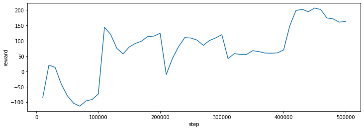

## Training, Saving, Loading + Callback Code 

Github Repo: [https://github.com/hill-a/stable-baselines](https://github.com/hill-a/stable-baselines)

Medium article: [https://medium.com/@araffin/stable-baselines-a-fork-of-openai-baselines-df87c4b2fc82](https://medium.com/@araffin/stable-baselines-a-fork-of-openai-baselines-df87c4b2fc82)

>[RL Baselines Zoo](https://github.com/araffin/rl-baselines-zoo) is a collection of pre-trained Reinforcement Learning agents using Stable-Baselines.

RL Baselines Zooは、Stable-Baselinesを用いた強化学習エージェントをあらかじめ学習させたコレクションです。

>It also provides basic scripts for training, evaluating agents, tuning hyperparameters and recording videos.

また、トレーニング、エージェントの評価、ハイパーパラメータの調整、ビデオの録画のための基本的なスクリプトが用意されています。


Documentation is available online: [https://stable-baselines.readthedocs.io/](https://stable-baselines.readthedocs.io/)


### パッケージのインストール

#### OpenGym関係


```python
!pip install "gym==0.19.0"
#!pip install stable-baselines[mpi]
!apt install swig cmake libopenmpi-dev zlib1g-dev
!pip install stable-baselines[mpi]==2.10.2 box2d box2d-kengz
```

#### tensorflow


```python
# Stable Baselines only supports tensorflow 1.x for now
!pip uninstall -y tensorflow-gpu
!pip uninstall -y tensorflow
!pip install tensorflow-gpu==1.14.0
```

#### tensorboard


```python
!pip uninstall tensorboard-plugin-wit --yes
```

### Import policy, RL agent, ...


```python
import gym
import numpy as np
from tqdm import tqdm

import glob
import os

import warnings
import typing
from typing import Union, List, Dict, Any, Optional

from stable_baselines import DQN
from stable_baselines import PPO2
from stable_baselines import ACKTR
from stable_baselines import A2C

from stable_baselines.common.vec_env import VecEnv, sync_envs_normalization, DummyVecEnv
from stable_baselines.common.evaluation import evaluate_policy

import warnings
warnings.filterwarnings('ignore')

import os
os.environ['TF_CPP_MIN_LOG_LEVEL']='2'

# callback 関係
from stable_baselines.common.callbacks import CallbackList, CheckpointCallback, EvalCallback, EventCallback
from stable_baselines.common.callbacks import BaseCallback

```

### Create the Gym env and instantiate the agent

>For this example, we will use Lunar Lander environment.

この例では、Lunar Lander環境を使用します。

>"Landing outside landing pad is possible. Fuel is infinite, so an agent can learn to fly and then land on its first attempt. Four discrete actions available: do nothing, fire left orientation engine, fire main engine, fire right orientation engine. "

着陸パッドの外に着陸することも可能です。燃料は無限であるため、エージェントは飛行を学習し、最初の試みで着陸することができます。何もしない」「左旋回エンジン起動」「メインエンジン起動」「右旋回エンジン起動」の4つの個別アクションが可能です。

>Lunar Lander environment: [https://gym.openai.com/envs/LunarLander-v2/](https://gym.openai.com/envs/LunarLander-v2/)


>Note: vectorized environments allow to easily multiprocess training. In this example, we are using only one process, hence the DummyVecEnv.

注意：ベクトル化された環境では、簡単にマルチプロセスで学習することができます。この例では、1つのプロセスしか使っていないので、DummyVecEnv.

>We chose the MlpPolicy because input of CartPole is a feature vector, not images.

CartPoleの入力は画像ではなく、特徴ベクトルなので、MlpPolicyを選択しました。

>The type of action to use (discrete/continuous) will be automatically deduced from the environment action space

使用するアクションの種類（離散/連続）は、環境のアクション空間から自動的に推測されます。


### Initial setting

#### Create dir


```python
# ログフォルダの生成
log_dir = './logs/'
datasets_dir = '../datasets/'

os.makedirs(log_dir, exist_ok=True)
os.makedirs(datasets_dir, exist_ok=True)
```

#### Train setting


```python
total_timesteps = 100000
```

#### callback setting


```python
save_freq = 10000
eval_freq = 10000
```


### Callback

#### CheckpointCallback

デフォルトの`CheckpointCallback`で問題なく動いたので特に修正しません．

#### EvalCallback


```python
class EvalCallback2(EventCallback):
    """
    Callback for evaluating an agent.

    :param eval_env: (Union[gym.Env, VecEnv]) The environment used for initialization
    :param callback_on_new_best: (Optional[BaseCallback]) Callback to trigger
        when there is a new best model according to the `mean_reward`
    :param n_eval_episodes: (int) The number of episodes to test the agent
    :param eval_freq: (int) Evaluate the agent every eval_freq call of the callback.
    :param log_path: (str) Path to a folder where the evaluations (`evaluations.npz`)
        will be saved. It will be updated at each evaluation.
    :param best_model_save_path: (str) Path to a folder where the best model
        according to performance on the eval env will be saved.
    :param deterministic: (bool) Whether the evaluation should
        use a stochastic or deterministic actions.
    :param render: (bool) Whether to render or not the environment during evaluation
    :param verbose: (int)
    """
    def __init__(self, eval_env: Union[gym.Env, VecEnv],
                 callback_on_new_best: Optional[BaseCallback] = None,
                 n_eval_episodes: int = 5,
                 eval_freq: int = 10000,
                 log_path: str = None,
                 best_model_save_path: str = None,
                 deterministic: bool = True,
                 render: bool = False,
                 verbose: int = 1,
                 name_prefix:str = None):
      
        super(EvalCallback2, self).__init__(callback_on_new_best, verbose=verbose)
        self.n_eval_episodes = n_eval_episodes
        self.eval_freq = eval_freq
        self.best_mean_reward = -np.inf
        self.last_mean_reward = -np.inf
        self.deterministic = deterministic
        self.render = render
        self.name_prefix = name_prefix

        # Convert to VecEnv for consistency
        if not isinstance(eval_env, VecEnv):
            eval_env = DummyVecEnv([lambda: eval_env])

        assert eval_env.num_envs == 1, "You must pass only one environment for evaluation"

        self.eval_env = eval_env
        self.best_model_save_path = best_model_save_path
        # Logs will be written in `evaluations.npz`
        if log_path is not None:
            log_path = os.path.join(log_path, 'evaluations')
        self.log_path = log_path
        self.evaluations_results = []
        self.evaluations_timesteps = []
        self.evaluations_length = []

    def _init_callback(self):
        # Does not work in some corner cases, where the wrapper is not the same
        if not type(self.training_env) is type(self.eval_env):
            warnings.warn("Training and eval env are not of the same type"
                          "{} != {}".format(self.training_env, self.eval_env))

        # Create folders if needed
        if self.best_model_save_path is not None:
            os.makedirs(self.best_model_save_path, exist_ok=True)
        if self.log_path is not None:
            os.makedirs(os.path.dirname(self.log_path), exist_ok=True)

    def _on_step(self) -> bool:

        if self.eval_freq > 0 and self.n_calls % self.eval_freq == 0:
            # Sync training and eval env if there is VecNormalize
            sync_envs_normalization(self.training_env, self.eval_env)

            episode_rewards, episode_lengths = evaluate_policy(self.model, self.eval_env,
                                                               n_eval_episodes=self.n_eval_episodes,
                                                               render=self.render,
                                                               deterministic=self.deterministic,
                                                               return_episode_rewards=True)

            print(">>> log_path >>>")
            self.log_path2 = self.log_path + "-{}".format(self.num_timesteps)
            print(self.log_path)
            print(self.log_path2)

            if self.log_path2 is not None:
                self.evaluations_timesteps.append(self.num_timesteps)
                self.evaluations_results.append(episode_rewards)
                self.evaluations_length.append(episode_lengths)
                np.savez(self.log_path2, timesteps=self.evaluations_timesteps,
                         results=self.evaluations_results, ep_lengths=self.evaluations_length)
            
            print(">>> episode_rewards >>>")
            print(episode_rewards)


            mean_reward, std_reward = np.mean(episode_rewards), np.std(episode_rewards)
            mean_ep_length, std_ep_length = np.mean(episode_lengths), np.std(episode_lengths)
            # Keep track of the last evaluation, useful for classes that derive from this callback
            self.last_mean_reward = mean_reward

            if self.verbose > 0:
                print("Eval num_timesteps={}, "
                      "episode_reward={:.2f} +/- {:.2f}".format(self.num_timesteps, mean_reward, std_reward))
                print("Episode length: {:.2f} +/- {:.2f}".format(mean_ep_length, std_ep_length))

            if mean_reward > self.best_mean_reward:
                if self.verbose > 0:
                    print("New best mean reward!")
                if self.best_model_save_path is not None:
                    self.model.save(os.path.join(self.best_model_save_path, 'best_model'))
                self.best_mean_reward = mean_reward
                # Trigger callback if needed
                if self.callback is not None:
                    return self._on_event()

        return True
```

#### ProgressBarCallback


```python
class ProgressBarCallback(BaseCallback):
    """
    A custom callback that derives from ``BaseCallback``.

    :param verbose: (int) Verbosity level 0: not output 1: info 2: debug
    """
    def __init__(self, total_timesteps=100000, verbose=0):
        super(ProgressBarCallback, self).__init__(verbose)
        self.total_timesteps = total_timesteps
        self.pbar = tqdm(total=self.total_timesteps)
        

    def _on_step(self) -> bool:

        self.pbar.n = self.n_calls
        self.pbar.update(0)

    def _on_training_end(self) -> None:
        self.pbar.n = self.total_timesteps
        self.pbar.update(0)
        self.pbar.close()
```

### Create model


学習環境の生成を行います．
仮想通貨の取引ではPP02ですが，引数や諸々違っており変更するのが面倒なためDQNでやります．


```python
env = gym.make('LunarLander-v2')
model = DQN('MlpPolicy', env, learning_rate=1e-3, prioritized_replay=True, verbose=0, tensorboard_log=log_dir, full_tensorboard_log=True)
#policy_kwargs = dict(net_arch=[64, 'lstm', dict(vf=[128, 128, 128], pi=[64, 64])])
#model = PPO2('MlpLstmPolicy', env, verbose=0, policy_kwargs=policy_kwargs, nminibatches=1, tensorboard_log=log_dir)
```

### Define evaluate func

評価する関数を定義します．何回も実施して平均を取るような中身になっています．


```python
def evaluate(model, num_steps=1000):
  """
  Evaluate a RL agent
  :param model: (BaseRLModel object) the RL Agent
  :param num_steps: (int) number of timesteps to evaluate it
  :return: (float) Mean reward for the last 100 episodes
  """
  episode_rewards = [0.0]
  obs = env.reset()
  for i in tqdm(range(num_steps)):
      # _states are only useful when using LSTM policies
      action, _states = model.predict(obs)

      obs, reward, done, info = env.step(action)
      
      # Stats
      episode_rewards[-1] += reward
      if done:
          obs = env.reset()
          episode_rewards.append(0.0)
  # Compute mean reward for the last 100 episodes
  mean_100ep_reward = round(np.mean(episode_rewards[-100:]), 1)
  print("Mean reward:", mean_100ep_reward, "Num episodes:", len(episode_rewards))
  
  return mean_100ep_reward
```

取りあえず，学習していない状態で評価してみます．


```python
# Random Agent, before training
mean_reward_before_train = evaluate(model, num_steps=10000)
```

    100%|██████████| 10000/10000 [00:13<00:00, 728.47it/s]

    Mean reward: -587.2 Num episodes: 144
    

    
    

### Save & Load & Learn

ここから，実際にコールバックを組み込んでいき，モデルを定期的に保存，評価する機構を作っていきます．

#### DQN Debug code

DQNのファイルになります．
これを直で変更することによってデバッグしやすくします．今回は`learn`関数に
```
        print("--------------------------------------------------------")
        print("tb_log_name    : {}".format(tb_log_name))
        print("new_tb_log     : {}".format(new_tb_log))
        print("verbose        : {}".format(self.verbose))
        print("tensorboard_log: {}".format(self.tensorboard_log))
        print("num_timesteps: {}".format(self.num_timesteps))
        print("self.graph     :")
        print(self.graph)
```
こいつを仕込むことで犯人を特定することができました．
上手く回らない方がいましたらお使いください．


```python
from functools import partial

import tensorflow as tf
import numpy as np
import gym

from stable_baselines import logger
from stable_baselines.common import tf_util, OffPolicyRLModel, SetVerbosity, TensorboardWriter
from stable_baselines.common.vec_env import VecEnv
from stable_baselines.common.schedules import LinearSchedule
from stable_baselines.common.buffers import ReplayBuffer, PrioritizedReplayBuffer
from stable_baselines.deepq.build_graph import build_train
from stable_baselines.deepq.policies import DQNPolicy


class DQN(OffPolicyRLModel):
    """
    The DQN model class.
    DQN paper: https://arxiv.org/abs/1312.5602
    Dueling DQN: https://arxiv.org/abs/1511.06581
    Double-Q Learning: https://arxiv.org/abs/1509.06461
    Prioritized Experience Replay: https://arxiv.org/abs/1511.05952
    :param policy: (DQNPolicy or str) The policy model to use (MlpPolicy, CnnPolicy, LnMlpPolicy, ...)
    :param env: (Gym environment or str) The environment to learn from (if registered in Gym, can be str)
    :param gamma: (float) discount factor
    :param learning_rate: (float) learning rate for adam optimizer
    :param buffer_size: (int) size of the replay buffer
    :param exploration_fraction: (float) fraction of entire training period over which the exploration rate is
            annealed
    :param exploration_final_eps: (float) final value of random action probability
    :param exploration_initial_eps: (float) initial value of random action probability
    :param train_freq: (int) update the model every `train_freq` steps. set to None to disable printing
    :param batch_size: (int) size of a batched sampled from replay buffer for training
    :param double_q: (bool) Whether to enable Double-Q learning or not.
    :param learning_starts: (int) how many steps of the model to collect transitions for before learning starts
    :param target_network_update_freq: (int) update the target network every `target_network_update_freq` steps.
    :param prioritized_replay: (bool) if True prioritized replay buffer will be used.
    :param prioritized_replay_alpha: (float)alpha parameter for prioritized replay buffer.
        It determines how much prioritization is used, with alpha=0 corresponding to the uniform case.
    :param prioritized_replay_beta0: (float) initial value of beta for prioritized replay buffer
    :param prioritized_replay_beta_iters: (int) number of iterations over which beta will be annealed from initial
            value to 1.0. If set to None equals to max_timesteps.
    :param prioritized_replay_eps: (float) epsilon to add to the TD errors when updating priorities.
    :param param_noise: (bool) Whether or not to apply noise to the parameters of the policy.
    :param verbose: (int) the verbosity level: 0 none, 1 training information, 2 tensorflow debug
    :param tensorboard_log: (str) the log location for tensorboard (if None, no logging)
    :param _init_setup_model: (bool) Whether or not to build the network at the creation of the instance
    :param full_tensorboard_log: (bool) enable additional logging when using tensorboard
        WARNING: this logging can take a lot of space quickly
    :param seed: (int) Seed for the pseudo-random generators (python, numpy, tensorflow).
        If None (default), use random seed. Note that if you want completely deterministic
        results, you must set `n_cpu_tf_sess` to 1.
    :param n_cpu_tf_sess: (int) The number of threads for TensorFlow operations
        If None, the number of cpu of the current machine will be used.
    """
    def __init__(self, policy, env, gamma=0.99, learning_rate=5e-4, buffer_size=50000, exploration_fraction=0.1,
                 exploration_final_eps=0.02, exploration_initial_eps=1.0, train_freq=1, batch_size=32, double_q=True,
                 learning_starts=1000, target_network_update_freq=500, prioritized_replay=False,
                 prioritized_replay_alpha=0.6, prioritized_replay_beta0=0.4, prioritized_replay_beta_iters=None,
                 prioritized_replay_eps=1e-6, param_noise=False,
                 n_cpu_tf_sess=None, verbose=0, tensorboard_log=None,
                 _init_setup_model=True, policy_kwargs=None, full_tensorboard_log=False, seed=None):

        # TODO: replay_buffer refactoring
        super(DQN, self).__init__(policy=policy, env=env, replay_buffer=None, verbose=verbose, policy_base=DQNPolicy,
                                  requires_vec_env=False, policy_kwargs=policy_kwargs, seed=seed, n_cpu_tf_sess=n_cpu_tf_sess)

        self.param_noise = param_noise
        self.learning_starts = learning_starts
        self.train_freq = train_freq
        self.prioritized_replay = prioritized_replay
        self.prioritized_replay_eps = prioritized_replay_eps
        self.batch_size = batch_size
        self.target_network_update_freq = target_network_update_freq
        self.prioritized_replay_alpha = prioritized_replay_alpha
        self.prioritized_replay_beta0 = prioritized_replay_beta0
        self.prioritized_replay_beta_iters = prioritized_replay_beta_iters
        self.exploration_final_eps = exploration_final_eps
        self.exploration_initial_eps = exploration_initial_eps
        self.exploration_fraction = exploration_fraction
        self.buffer_size = buffer_size
        self.learning_rate = learning_rate
        self.gamma = gamma
        self.tensorboard_log = tensorboard_log
        self.full_tensorboard_log = full_tensorboard_log
        self.double_q = double_q

        self.graph = None
        self.sess = None
        self._train_step = None
        self.step_model = None
        self.update_target = None
        self.act = None
        self.proba_step = None
        self.replay_buffer = None
        self.beta_schedule = None
        self.exploration = None
        self.params = None
        self.summary = None

        if _init_setup_model:
            self.setup_model()

    def _get_pretrain_placeholders(self):
        policy = self.step_model
        return policy.obs_ph, tf.placeholder(tf.int32, [None]), policy.q_values

    def setup_model(self):

        with SetVerbosity(self.verbose):
            assert not isinstance(self.action_space, gym.spaces.Box), \
                "Error: DQN cannot output a gym.spaces.Box action space."

            # If the policy is wrap in functool.partial (e.g. to disable dueling)
            # unwrap it to check the class type
            if isinstance(self.policy, partial):
                test_policy = self.policy.func
            else:
                test_policy = self.policy
            assert issubclass(test_policy, DQNPolicy), "Error: the input policy for the DQN model must be " \
                                                       "an instance of DQNPolicy."

            self.graph = tf.Graph()
            with self.graph.as_default():
                self.set_random_seed(self.seed)
                self.sess = tf_util.make_session(num_cpu=self.n_cpu_tf_sess, graph=self.graph)

                optimizer = tf.train.AdamOptimizer(learning_rate=self.learning_rate)

                self.act, self._train_step, self.update_target, self.step_model = build_train(
                    q_func=partial(self.policy, **self.policy_kwargs),
                    ob_space=self.observation_space,
                    ac_space=self.action_space,
                    optimizer=optimizer,
                    gamma=self.gamma,
                    grad_norm_clipping=10,
                    param_noise=self.param_noise,
                    sess=self.sess,
                    full_tensorboard_log=self.full_tensorboard_log,
                    double_q=self.double_q
                )
                self.proba_step = self.step_model.proba_step
                self.params = tf_util.get_trainable_vars("deepq")

                # Initialize the parameters and copy them to the target network.
                tf_util.initialize(self.sess)
                self.update_target(sess=self.sess)

                self.summary = tf.summary.merge_all()

    def learn(self, total_timesteps, callback=None, log_interval=100, tb_log_name="DQN",
              reset_num_timesteps=True, replay_wrapper=None):

        new_tb_log = self._init_num_timesteps(reset_num_timesteps)
        callback = self._init_callback(callback)

        print("--------------------------------------------------------")
        print("tb_log_name    : {}".format(tb_log_name))
        print("new_tb_log     : {}".format(new_tb_log))
        print("verbose        : {}".format(self.verbose))
        print("tensorboard_log: {}".format(self.tensorboard_log))
        print("num_timesteps: {}".format(self.num_timesteps))
        print("self.graph     :")
        print(self.graph)
        with SetVerbosity(self.verbose), TensorboardWriter(self.graph, self.tensorboard_log, tb_log_name, new_tb_log) \
                as writer:

            print("writer   :")
            print(writer)

            self._setup_learn()

            # Create the replay buffer
            if self.prioritized_replay:
                self.replay_buffer = PrioritizedReplayBuffer(self.buffer_size, alpha=self.prioritized_replay_alpha)
                if self.prioritized_replay_beta_iters is None:
                    prioritized_replay_beta_iters = total_timesteps
                else:
                    prioritized_replay_beta_iters = self.prioritized_replay_beta_iters
                self.beta_schedule = LinearSchedule(prioritized_replay_beta_iters,
                                                    initial_p=self.prioritized_replay_beta0,
                                                    final_p=1.0)
            else:
                self.replay_buffer = ReplayBuffer(self.buffer_size)
                self.beta_schedule = None

            if replay_wrapper is not None:
                assert not self.prioritized_replay, "Prioritized replay buffer is not supported by HER"
                self.replay_buffer = replay_wrapper(self.replay_buffer)

            # Create the schedule for exploration starting from 1.
            self.exploration = LinearSchedule(schedule_timesteps=int(self.exploration_fraction * total_timesteps),
                                              initial_p=self.exploration_initial_eps,
                                              final_p=self.exploration_final_eps)

            episode_rewards = [0.0]
            episode_successes = []

            callback.on_training_start(locals(), globals())
            callback.on_rollout_start()

            reset = True
            obs = self.env.reset()
            # Retrieve unnormalized observation for saving into the buffer
            if self._vec_normalize_env is not None:
                obs_ = self._vec_normalize_env.get_original_obs().squeeze()

            for _ in range(total_timesteps):
                # Take action and update exploration to the newest value
                kwargs = {}
                if not self.param_noise:
                    update_eps = self.exploration.value(self.num_timesteps)
                    update_param_noise_threshold = 0.
                else:
                    update_eps = 0.
                    # Compute the threshold such that the KL divergence between perturbed and non-perturbed
                    # policy is comparable to eps-greedy exploration with eps = exploration.value(t).
                    # See Appendix C.1 in Parameter Space Noise for Exploration, Plappert et al., 2017
                    # for detailed explanation.
                    update_param_noise_threshold = \
                        -np.log(1. - self.exploration.value(self.num_timesteps) +
                                self.exploration.value(self.num_timesteps) / float(self.env.action_space.n))
                    kwargs['reset'] = reset
                    kwargs['update_param_noise_threshold'] = update_param_noise_threshold
                    kwargs['update_param_noise_scale'] = True
                with self.sess.as_default():
                    action = self.act(np.array(obs)[None], update_eps=update_eps, **kwargs)[0]
                env_action = action
                reset = False
                new_obs, rew, done, info = self.env.step(env_action)

                self.num_timesteps += 1

                # Stop training if return value is False
                callback.update_locals(locals())
                if callback.on_step() is False:
                    break

                # Store only the unnormalized version
                if self._vec_normalize_env is not None:
                    new_obs_ = self._vec_normalize_env.get_original_obs().squeeze()
                    reward_ = self._vec_normalize_env.get_original_reward().squeeze()
                else:
                    # Avoid changing the original ones
                    obs_, new_obs_, reward_ = obs, new_obs, rew
                # Store transition in the replay buffer.
                self.replay_buffer_add(obs_, action, reward_, new_obs_, done, info)
                obs = new_obs
                # Save the unnormalized observation
                if self._vec_normalize_env is not None:
                    obs_ = new_obs_

                if writer is not None:
                    ep_rew = np.array([reward_]).reshape((1, -1))
                    ep_done = np.array([done]).reshape((1, -1))
                    tf_util.total_episode_reward_logger(self.episode_reward, ep_rew, ep_done, writer,
                                                        self.num_timesteps)

                episode_rewards[-1] += reward_
                if done:
                    maybe_is_success = info.get('is_success')
                    if maybe_is_success is not None:
                        episode_successes.append(float(maybe_is_success))
                    if not isinstance(self.env, VecEnv):
                        obs = self.env.reset()
                    episode_rewards.append(0.0)
                    reset = True

                # Do not train if the warmup phase is not over
                # or if there are not enough samples in the replay buffer
                can_sample = self.replay_buffer.can_sample(self.batch_size)
                if can_sample and self.num_timesteps > self.learning_starts \
                        and self.num_timesteps % self.train_freq == 0:

                    callback.on_rollout_end()
                    # Minimize the error in Bellman's equation on a batch sampled from replay buffer.
                    # pytype:disable=bad-unpacking
                    if self.prioritized_replay:
                        assert self.beta_schedule is not None, \
                               "BUG: should be LinearSchedule when self.prioritized_replay True"
                        experience = self.replay_buffer.sample(self.batch_size,
                                                               beta=self.beta_schedule.value(self.num_timesteps),
                                                               env=self._vec_normalize_env)
                        (obses_t, actions, rewards, obses_tp1, dones, weights, batch_idxes) = experience
                    else:
                        obses_t, actions, rewards, obses_tp1, dones = self.replay_buffer.sample(self.batch_size,
                                                                                                env=self._vec_normalize_env)
                        weights, batch_idxes = np.ones_like(rewards), None
                    # pytype:enable=bad-unpacking

                    if writer is not None:
                        # run loss backprop with summary, but once every 100 steps save the metadata
                        # (memory, compute time, ...)
                        # print(">>>> writer >>>>>>>>>>>>>>>>>>>>>>>>>>>>")
                        if (1 + self.num_timesteps) % 100 == 0:
                            run_options = tf.RunOptions(trace_level=tf.RunOptions.FULL_TRACE)
                            run_metadata = tf.RunMetadata()
                            summary, td_errors = self._train_step(obses_t, actions, rewards, obses_tp1, obses_tp1,
                                                                  dones, weights, sess=self.sess, options=run_options,
                                                                  run_metadata=run_metadata)
                            writer.add_run_metadata(run_metadata, 'step%d' % self.num_timesteps)
                        else:
                            summary, td_errors = self._train_step(obses_t, actions, rewards, obses_tp1, obses_tp1,
                                                                  dones, weights, sess=self.sess)
                        writer.add_summary(summary, self.num_timesteps)
                    else:
                        _, td_errors = self._train_step(obses_t, actions, rewards, obses_tp1, obses_tp1, dones, weights,
                                                        sess=self.sess)

                    if self.prioritized_replay:
                        new_priorities = np.abs(td_errors) + self.prioritized_replay_eps
                        assert isinstance(self.replay_buffer, PrioritizedReplayBuffer)
                        self.replay_buffer.update_priorities(batch_idxes, new_priorities)

                    callback.on_rollout_start()

                if can_sample and self.num_timesteps > self.learning_starts and \
                        self.num_timesteps % self.target_network_update_freq == 0:
                    # Update target network periodically.
                    self.update_target(sess=self.sess)

                if len(episode_rewards[-101:-1]) == 0:
                    mean_100ep_reward = -np.inf
                else:
                    mean_100ep_reward = round(float(np.mean(episode_rewards[-101:-1])), 1)

                num_episodes = len(episode_rewards)
                if self.verbose >= 1 and done and log_interval is not None and len(episode_rewards) % log_interval == 0:
                    logger.record_tabular("steps", self.num_timesteps)
                    logger.record_tabular("episodes", num_episodes)
                    if len(episode_successes) > 0:
                        logger.logkv("success rate", np.mean(episode_successes[-100:]))
                    logger.record_tabular("mean 100 episode reward", mean_100ep_reward)
                    logger.record_tabular("% time spent exploring",
                                          int(100 * self.exploration.value(self.num_timesteps)))
                    logger.dump_tabular()

        callback.on_training_end()
        return self

    def predict(self, observation, state=None, mask=None, deterministic=True):
        observation = np.array(observation)
        vectorized_env = self._is_vectorized_observation(observation, self.observation_space)

        observation = observation.reshape((-1,) + self.observation_space.shape)
        with self.sess.as_default():
            actions, _, _ = self.step_model.step(observation, deterministic=deterministic)

        if not vectorized_env:
            actions = actions[0]

        return actions, None

    def action_probability(self, observation, state=None, mask=None, actions=None, logp=False):
        observation = np.array(observation)
        vectorized_env = self._is_vectorized_observation(observation, self.observation_space)

        observation = observation.reshape((-1,) + self.observation_space.shape)
        actions_proba = self.proba_step(observation, state, mask)

        if actions is not None:  # comparing the action distribution, to given actions
            actions = np.array([actions])
            assert isinstance(self.action_space, gym.spaces.Discrete)
            actions = actions.reshape((-1,))
            assert observation.shape[0] == actions.shape[0], "Error: batch sizes differ for actions and observations."
            actions_proba = actions_proba[np.arange(actions.shape[0]), actions]
            # normalize action proba shape
            actions_proba = actions_proba.reshape((-1, 1))
            if logp:
                actions_proba = np.log(actions_proba)

        if not vectorized_env:
            if state is not None:
                raise ValueError("Error: The environment must be vectorized when using recurrent policies.")
            actions_proba = actions_proba[0]

        return actions_proba

    def get_parameter_list(self):
        return self.params

    def save(self, save_path, cloudpickle=False):
        # params
        data = {
            "double_q": self.double_q,
            "param_noise": self.param_noise,
            "learning_starts": self.learning_starts,
            "train_freq": self.train_freq,
            "prioritized_replay": self.prioritized_replay,
            "prioritized_replay_eps": self.prioritized_replay_eps,
            "batch_size": self.batch_size,
            "target_network_update_freq": self.target_network_update_freq,
            "prioritized_replay_alpha": self.prioritized_replay_alpha,
            "prioritized_replay_beta0": self.prioritized_replay_beta0,
            "prioritized_replay_beta_iters": self.prioritized_replay_beta_iters,
            "exploration_final_eps": self.exploration_final_eps,
            "exploration_fraction": self.exploration_fraction,
            "learning_rate": self.learning_rate,
            "gamma": self.gamma,
            "verbose": self.verbose,
            "observation_space": self.observation_space,
            "action_space": self.action_space,
            "policy": self.policy,
            "n_envs": self.n_envs,
            "n_cpu_tf_sess": self.n_cpu_tf_sess,
            "seed": self.seed,
            "_vectorize_action": self._vectorize_action,
            "policy_kwargs": self.policy_kwargs
        }

        params_to_save = self.get_parameters()

        self._save_to_file(save_path, data=data, params=params_to_save, cloudpickle=cloudpickle)
```

#### Loop train

ここから学習のループが始まります．


```python

# ====================================================
# Init 
#
resume_idx = 0
mean_reward_list = []


# ====================================================
# Create Env & Model
#
env = gym.make('LunarLander-v2')
model = DQN('MlpPolicy', env, learning_rate=1e-3, prioritized_replay=True, verbose=0, tensorboard_log=log_dir, full_tensorboard_log=True)

for i in tqdm(range(resume_idx,  5)):

  # ====================================================
  # callback
  #
  # -------
  # eval callback
  #
  eval_callback = EvalCallback2(env, best_model_save_path='./logs/best_model',
                              log_path='./logs/results', eval_freq=eval_freq, verbose=2, name_prefix='rl_model_{:05d}_'.format(i))
  # -------
  # checkpoint callback
  #
  checkpoint_callback = CheckpointCallback(save_freq=save_freq, save_path='./logs/', name_prefix='rl_model_{:05d}'.format(i), verbose=2)

  # -------
  # merge callback
  #
  #callback = CallbackList([checkpoint_callback, eval_callback, ProgressBarCallback(total_timesteps)])
  callback = CallbackList([checkpoint_callback, eval_callback, ])


  if(i>0):
    # ====================================================
    # Model setting
    #
    model = DQN.load("dqn_lunar_{:07d}".format(i-1))
    model.set_env(env)
    model.tensorboard_log = "logs"
    model.num_timesteps = total_timesteps*i
  
  #tb_log_name = "sampleE{}v".format(i)
  tb_log_name = "sampleG"
  print("tb_log_name : {}".format(tb_log_name))


  model.learn(total_timesteps=total_timesteps , log_interval=1, tb_log_name=tb_log_name, reset_num_timesteps=False, callback=callback)
  mean_reward = evaluate(model, num_steps=10000)
  print("------------")
  print(mean_reward)
  mean_reward_list.append(mean_reward)

  # ====================================================
  # Save model
  #
  model.save("dqn_lunar_{:07d}".format(i))
  
```

### Load evaluation


#### Get file list

評価結果が入っているnpzファイルのパス一覧を取得します．


```python
eva_files = glob.glob("./logs/results/*.npz")
```


```python
eva_files
```


    ['./logs/results/evaluations-460000.npz',
     './logs/results/evaluations-180000.npz',
     './logs/results/evaluations-480000.npz',
     './logs/results/evaluations-250000.npz',
     './logs/results/evaluations-170000.npz',
     './logs/results/evaluations-210000.npz',
     './logs/results/evaluations-190000.npz',
     './logs/results/evaluations-420000.npz',
     './logs/results/evaluations-430000.npz',
     './logs/results/evaluations-370000.npz',
     './logs/results/evaluations-50000.npz',
     './logs/results/evaluations-450000.npz',
     './logs/results/evaluations-20000.npz',
     './logs/results/evaluations-490000.npz',
     './logs/results/evaluations-280000.npz',
     './logs/results/evaluations-130000.npz',
     './logs/results/evaluations-400000.npz',
     './logs/results/evaluations-150000.npz',
     './logs/results/evaluations-240000.npz',
     './logs/results/evaluations-60000.npz',
     './logs/results/evaluations-390000.npz',
     './logs/results/evaluations-440000.npz',
     './logs/results/evaluations-120000.npz',
     './logs/results/evaluations-340000.npz',
     './logs/results/evaluations-220000.npz',
     './logs/results/evaluations-300000.npz',
     './logs/results/evaluations-100000.npz',
     './logs/results/evaluations-380000.npz',
     './logs/results/evaluations-350000.npz',
     './logs/results/evaluations-290000.npz',
     './logs/results/evaluations-200000.npz',
     './logs/results/evaluations-110000.npz',
     './logs/results/evaluations-140000.npz',
     './logs/results/evaluations-270000.npz',
     './logs/results/evaluations-80000.npz',
     './logs/results/evaluations-310000.npz',
     './logs/results/evaluations-230000.npz',
     './logs/results/evaluations-320000.npz',
     './logs/results/evaluations-40000.npz',
     './logs/results/evaluations-470000.npz',
     './logs/results/evaluations-500000.npz',
     './logs/results/evaluations-410000.npz',
     './logs/results/evaluations-360000.npz',
     './logs/results/evaluations-70000.npz',
     './logs/results/evaluations-330000.npz',
     './logs/results/evaluations-90000.npz',
     './logs/results/evaluations-260000.npz',
     './logs/results/evaluations-30000.npz',
     './logs/results/evaluations-160000.npz',
     './logs/results/evaluations-10000.npz']


#### Load npz file

npzファイルを順に読み込んでいきます．


```python
step_list = []
reward_list = []

for file_path in eva_files:
  result = np.load(file_path)
  print("--------------------------")
  step_name = file_path.split("-")[-1].split(".")[0]
  print(step_name)
  print(list(result))
  print(np.mean(result['results']))

  step_list.append(int(step_name))
  reward_list.append(np.mean(result['results']))
```

#### Adjust data


DataFrameに整形します．


```python
import pandas as pd
 
df_eval = pd.DataFrame(data={"reward":reward_list, "step":step_list})
df_eval = df_eval.sort_values('step')
```


```python
df_eval.head(5)
```


  <div id="df-151ac974-2948-4672-bbdf-2f6f9de9da01">
    <div class="colab-df-container">
      <div>
<style scoped>
    .dataframe tbody tr th:only-of-type {
        vertical-align: middle;
    }

    .dataframe tbody tr th {
        vertical-align: top;
    }

    .dataframe thead th {
        text-align: right;
    }
</style>
<table border="1" class="dataframe">
  <thead>
    <tr style="text-align: right;">
      <th></th>
      <th>reward</th>
      <th>step</th>
    </tr>
  </thead>
  <tbody>
    <tr>
      <th>49</th>
      <td>-86.500504</td>
      <td>10000</td>
    </tr>
    <tr>
      <th>12</th>
      <td>20.095142</td>
      <td>20000</td>
    </tr>
    <tr>
      <th>47</th>
      <td>12.921559</td>
      <td>30000</td>
    </tr>
    <tr>
      <th>38</th>
      <td>-41.613075</td>
      <td>40000</td>
    </tr>
    <tr>
      <th>10</th>
      <td>-80.080345</td>
      <td>50000</td>
    </tr>
  </tbody>
</table>
</div>
      <button class="colab-df-convert" onclick="convertToInteractive('df-151ac974-2948-4672-bbdf-2f6f9de9da01')"
              title="Convert this dataframe to an interactive table."
              style="display:none;">

  <svg xmlns="http://www.w3.org/2000/svg" height="24px"viewBox="0 0 24 24"
       width="24px">
    <path d="M0 0h24v24H0V0z" fill="none"/>
    <path d="M18.56 5.44l.94 2.06.94-2.06 2.06-.94-2.06-.94-.94-2.06-.94 2.06-2.06.94zm-11 1L8.5 8.5l.94-2.06 2.06-.94-2.06-.94L8.5 2.5l-.94 2.06-2.06.94zm10 10l.94 2.06.94-2.06 2.06-.94-2.06-.94-.94-2.06-.94 2.06-2.06.94z"/><path d="M17.41 7.96l-1.37-1.37c-.4-.4-.92-.59-1.43-.59-.52 0-1.04.2-1.43.59L10.3 9.45l-7.72 7.72c-.78.78-.78 2.05 0 2.83L4 21.41c.39.39.9.59 1.41.59.51 0 1.02-.2 1.41-.59l7.78-7.78 2.81-2.81c.8-.78.8-2.07 0-2.86zM5.41 20L4 18.59l7.72-7.72 1.47 1.35L5.41 20z"/>
  </svg>
      </button>

  <style>
    .colab-df-container {
      display:flex;
      flex-wrap:wrap;
      gap: 12px;
    }

    .colab-df-convert {
      background-color: #E8F0FE;
      border: none;
      border-radius: 50%;
      cursor: pointer;
      display: none;
      fill: #1967D2;
      height: 32px;
      padding: 0 0 0 0;
      width: 32px;
    }

    .colab-df-convert:hover {
      background-color: #E2EBFA;
      box-shadow: 0px 1px 2px rgba(60, 64, 67, 0.3), 0px 1px 3px 1px rgba(60, 64, 67, 0.15);
      fill: #174EA6;
    }

    [theme=dark] .colab-df-convert {
      background-color: #3B4455;
      fill: #D2E3FC;
    }

    [theme=dark] .colab-df-convert:hover {
      background-color: #434B5C;
      box-shadow: 0px 1px 3px 1px rgba(0, 0, 0, 0.15);
      filter: drop-shadow(0px 1px 2px rgba(0, 0, 0, 0.3));
      fill: #FFFFFF;
    }
  </style>

      <script>
        const buttonEl =
          document.querySelector('#df-151ac974-2948-4672-bbdf-2f6f9de9da01 button.colab-df-convert');
        buttonEl.style.display =
          google.colab.kernel.accessAllowed ? 'block' : 'none';

        async function convertToInteractive(key) {
          const element = document.querySelector('#df-151ac974-2948-4672-bbdf-2f6f9de9da01');
          const dataTable =
            await google.colab.kernel.invokeFunction('convertToInteractive',
                                                     [key], {});
          if (!dataTable) return;

          const docLinkHtml = 'Like what you see? Visit the ' +
            '<a target="_blank" href=https://colab.research.google.com/notebooks/data_table.ipynb>data table notebook</a>'
            + ' to learn more about interactive tables.';
          element.innerHTML = '';
          dataTable['output_type'] = 'display_data';
          await google.colab.output.renderOutput(dataTable, element);
          const docLink = document.createElement('div');
          docLink.innerHTML = docLinkHtml;
          element.appendChild(docLink);
        }
      </script>
    </div>
  </div>


```python
df_eval.tail(5)
```


  <div id="df-ada7bd77-6ea8-485b-81bb-d941220975d7">
    <div class="colab-df-container">
      <div>
<style scoped>
    .dataframe tbody tr th:only-of-type {
        vertical-align: middle;
    }

    .dataframe tbody tr th {
        vertical-align: top;
    }

    .dataframe thead th {
        text-align: right;
    }
</style>
<table border="1" class="dataframe">
  <thead>
    <tr style="text-align: right;">
      <th></th>
      <th>reward</th>
      <th>step</th>
    </tr>
  </thead>
  <tbody>
    <tr>
      <th>0</th>
      <td>201.140121</td>
      <td>460000</td>
    </tr>
    <tr>
      <th>39</th>
      <td>173.541672</td>
      <td>470000</td>
    </tr>
    <tr>
      <th>2</th>
      <td>170.642792</td>
      <td>480000</td>
    </tr>
    <tr>
      <th>13</th>
      <td>160.148544</td>
      <td>490000</td>
    </tr>
    <tr>
      <th>40</th>
      <td>161.903122</td>
      <td>500000</td>
    </tr>
  </tbody>
</table>
</div>
      <button class="colab-df-convert" onclick="convertToInteractive('df-ada7bd77-6ea8-485b-81bb-d941220975d7')"
              title="Convert this dataframe to an interactive table."
              style="display:none;">

  <svg xmlns="http://www.w3.org/2000/svg" height="24px"viewBox="0 0 24 24"
       width="24px">
    <path d="M0 0h24v24H0V0z" fill="none"/>
    <path d="M18.56 5.44l.94 2.06.94-2.06 2.06-.94-2.06-.94-.94-2.06-.94 2.06-2.06.94zm-11 1L8.5 8.5l.94-2.06 2.06-.94-2.06-.94L8.5 2.5l-.94 2.06-2.06.94zm10 10l.94 2.06.94-2.06 2.06-.94-2.06-.94-.94-2.06-.94 2.06-2.06.94z"/><path d="M17.41 7.96l-1.37-1.37c-.4-.4-.92-.59-1.43-.59-.52 0-1.04.2-1.43.59L10.3 9.45l-7.72 7.72c-.78.78-.78 2.05 0 2.83L4 21.41c.39.39.9.59 1.41.59.51 0 1.02-.2 1.41-.59l7.78-7.78 2.81-2.81c.8-.78.8-2.07 0-2.86zM5.41 20L4 18.59l7.72-7.72 1.47 1.35L5.41 20z"/>
  </svg>
      </button>

  <style>
    .colab-df-container {
      display:flex;
      flex-wrap:wrap;
      gap: 12px;
    }

    .colab-df-convert {
      background-color: #E8F0FE;
      border: none;
      border-radius: 50%;
      cursor: pointer;
      display: none;
      fill: #1967D2;
      height: 32px;
      padding: 0 0 0 0;
      width: 32px;
    }

    .colab-df-convert:hover {
      background-color: #E2EBFA;
      box-shadow: 0px 1px 2px rgba(60, 64, 67, 0.3), 0px 1px 3px 1px rgba(60, 64, 67, 0.15);
      fill: #174EA6;
    }

    [theme=dark] .colab-df-convert {
      background-color: #3B4455;
      fill: #D2E3FC;
    }

    [theme=dark] .colab-df-convert:hover {
      background-color: #434B5C;
      box-shadow: 0px 1px 3px 1px rgba(0, 0, 0, 0.15);
      filter: drop-shadow(0px 1px 2px rgba(0, 0, 0, 0.3));
      fill: #FFFFFF;
    }
  </style>

      <script>
        const buttonEl =
          document.querySelector('#df-ada7bd77-6ea8-485b-81bb-d941220975d7 button.colab-df-convert');
        buttonEl.style.display =
          google.colab.kernel.accessAllowed ? 'block' : 'none';

        async function convertToInteractive(key) {
          const element = document.querySelector('#df-ada7bd77-6ea8-485b-81bb-d941220975d7');
          const dataTable =
            await google.colab.kernel.invokeFunction('convertToInteractive',
                                                     [key], {});
          if (!dataTable) return;

          const docLinkHtml = 'Like what you see? Visit the ' +
            '<a target="_blank" href=https://colab.research.google.com/notebooks/data_table.ipynb>data table notebook</a>'
            + ' to learn more about interactive tables.';
          element.innerHTML = '';
          dataTable['output_type'] = 'display_data';
          await google.colab.output.renderOutput(dataTable, element);
          const docLink = document.createElement('div');
          docLink.innerHTML = docLinkHtml;
          element.appendChild(docLink);
        }
      </script>
    </div>
  </div>


#### Plot evaluation

評価結果をプロットします．


```python
import seaborn as sns
import matplotlib.pyplot as plt
```


```python
plt.figure(figsize=(6*2,4))
sns.lineplot(data=df_eval, x='step', y='reward')
```


    <matplotlib.axes._subplots.AxesSubplot at 0x7f0aeada89d0>


    

    


### Tensorboard


```python
# Load the TensorBoard notebook extension
%load_ext tensorboard
```


```python
#!kill 6654
```


```python
%tensorboard --logdir logs/
```


<div id="root"></div>
<script>
  (function() {
    window.TENSORBOARD_ENV = window.TENSORBOARD_ENV || {};
    window.TENSORBOARD_ENV["IN_COLAB"] = true;
    document.querySelector("base").href = "https://localhost:6006";
    function fixUpTensorboard(root) {
      const tftb = root.querySelector("tf-tensorboard");
      // Disable the fragment manipulation behavior in Colab. Not
      // only is the behavior not useful (as the iframe's location
      // is not visible to the user), it causes TensorBoard's usage
      // of `window.replace` to navigate away from the page and to
      // the `localhost:<port>` URL specified by the base URI, which
      // in turn causes the frame to (likely) crash.
      tftb.removeAttribute("use-hash");
    }
    function executeAllScripts(root) {
      // When `script` elements are inserted into the DOM by
      // assigning to an element's `innerHTML`, the scripts are not
      // executed. Thus, we manually re-insert these scripts so that
      // TensorBoard can initialize itself.
      for (const script of root.querySelectorAll("script")) {
        const newScript = document.createElement("script");
        newScript.type = script.type;
        newScript.textContent = script.textContent;
        root.appendChild(newScript);
        script.remove();
      }
    }
    function setHeight(root, height) {
      // We set the height dynamically after the TensorBoard UI has
      // been initialized. This avoids an intermediate state in
      // which the container plus the UI become taller than the
      // final width and cause the Colab output frame to be
      // permanently resized, eventually leading to an empty
      // vertical gap below the TensorBoard UI. It's not clear
      // exactly what causes this problematic intermediate state,
      // but setting the height late seems to fix it.
      root.style.height = `${height}px`;
    }
    const root = document.getElementById("root");
    fetch(".")
      .then((x) => x.text())
      .then((html) => void (root.innerHTML = html))
      .then(() => fixUpTensorboard(root))
      .then(() => executeAllScripts(root))
      .then(() => setHeight(root, 800));
  })();
</script>


