## Google Drive setting


```python
from google.colab import drive
drive.mount('/content/drive')
```

    Drive already mounted at /content/drive; to attempt to forcibly remount, call drive.mount("/content/drive", force_remount=True).
    


```python
%cd /content/drive/MyDrive/AIncome
```

    /content/drive/MyDrive/AIncome
    


```python
!pwd
```

    /content/drive/MyDrive/AIncome
    

### 作業フォルダ


```python
!mkdir AutoTrade09
```

    mkdir: cannot create directory ‘AutoTrade09’: File exists
    


```python
%cd  AutoTrade09
```

    /content/drive/MyDrive/AIncome/AutoTrade09
    


```python
!pwd
```

    /content/drive/MyDrive/AIncome/AutoTrade09
    

## 必要パッケージのインストール


```python
"""
#!pip install gym[all] -U
!pip install "gym==0.19.0"
!pip install stable-baselines[mpi]
#!pip install tensorflow==1.14.0
!pip install tensorflow-gpu==1.14.0
!pip install pyqt5
!pip install imageio
!pip install gym-anytrading
"""
!pip install "gym==0.19.0"
!pip install stable-baselines[mpi]
!pip uninstall -y tensorflow-gpu
!pip uninstall -y tensorflow
!pip install tensorflow-gpu==1.14.0
!pip install gym-anytrading

!pip install QuantStats
```

    Looking in indexes: https://pypi.org/simple, https://us-python.pkg.dev/colab-wheels/public/simple/
    Requirement already satisfied: gym==0.19.0 in /usr/local/lib/python3.7/dist-packages (0.19.0)
    Requirement already satisfied: numpy>=1.18.0 in /usr/local/lib/python3.7/dist-packages (from gym==0.19.0) (1.21.6)
    Requirement already satisfied: cloudpickle<1.7.0,>=1.2.0 in /usr/local/lib/python3.7/dist-packages (from gym==0.19.0) (1.5.0)
    Looking in indexes: https://pypi.org/simple, https://us-python.pkg.dev/colab-wheels/public/simple/
    Requirement already satisfied: stable-baselines[mpi] in /usr/local/lib/python3.7/dist-packages (2.10.2)
    Requirement already satisfied: joblib in /usr/local/lib/python3.7/dist-packages (from stable-baselines[mpi]) (1.1.0)
    Requirement already satisfied: opencv-python in /usr/local/lib/python3.7/dist-packages (from stable-baselines[mpi]) (4.6.0.66)
    Requirement already satisfied: scipy in /usr/local/lib/python3.7/dist-packages (from stable-baselines[mpi]) (1.7.3)
    Requirement already satisfied: numpy in /usr/local/lib/python3.7/dist-packages (from stable-baselines[mpi]) (1.21.6)
    Requirement already satisfied: pandas in /usr/local/lib/python3.7/dist-packages (from stable-baselines[mpi]) (1.3.5)
    Requirement already satisfied: cloudpickle>=0.5.5 in /usr/local/lib/python3.7/dist-packages (from stable-baselines[mpi]) (1.5.0)
    Requirement already satisfied: gym[atari,classic_control]>=0.11 in /usr/local/lib/python3.7/dist-packages (from stable-baselines[mpi]) (0.19.0)
    Requirement already satisfied: matplotlib in /usr/local/lib/python3.7/dist-packages (from stable-baselines[mpi]) (3.2.2)
    Requirement already satisfied: mpi4py in /usr/local/lib/python3.7/dist-packages (from stable-baselines[mpi]) (3.1.3)
    Requirement already satisfied: pyglet>=1.4.0 in /usr/local/lib/python3.7/dist-packages (from gym[atari,classic_control]>=0.11->stable-baselines[mpi]) (1.5.26)
    Requirement already satisfied: atari-py==0.2.6 in /usr/local/lib/python3.7/dist-packages (from gym[atari,classic_control]>=0.11->stable-baselines[mpi]) (0.2.6)
    Requirement already satisfied: six in /usr/local/lib/python3.7/dist-packages (from atari-py==0.2.6->gym[atari,classic_control]>=0.11->stable-baselines[mpi]) (1.15.0)
    Requirement already satisfied: python-dateutil>=2.1 in /usr/local/lib/python3.7/dist-packages (from matplotlib->stable-baselines[mpi]) (2.8.2)
    Requirement already satisfied: pyparsing!=2.0.4,!=2.1.2,!=2.1.6,>=2.0.1 in /usr/local/lib/python3.7/dist-packages (from matplotlib->stable-baselines[mpi]) (3.0.9)
    Requirement already satisfied: cycler>=0.10 in /usr/local/lib/python3.7/dist-packages (from matplotlib->stable-baselines[mpi]) (0.11.0)
    Requirement already satisfied: kiwisolver>=1.0.1 in /usr/local/lib/python3.7/dist-packages (from matplotlib->stable-baselines[mpi]) (1.4.4)
    Requirement already satisfied: typing-extensions in /usr/local/lib/python3.7/dist-packages (from kiwisolver>=1.0.1->matplotlib->stable-baselines[mpi]) (4.1.1)
    Requirement already satisfied: pytz>=2017.3 in /usr/local/lib/python3.7/dist-packages (from pandas->stable-baselines[mpi]) (2022.2.1)
    Found existing installation: tensorflow-gpu 1.14.0
    Uninstalling tensorflow-gpu-1.14.0:
      Successfully uninstalled tensorflow-gpu-1.14.0
    WARNING: Skipping tensorflow as it is not installed.
    Looking in indexes: https://pypi.org/simple, https://us-python.pkg.dev/colab-wheels/public/simple/
    Collecting tensorflow-gpu==1.14.0
      Using cached tensorflow_gpu-1.14.0-cp37-cp37m-manylinux1_x86_64.whl (377.1 MB)
    Requirement already satisfied: numpy<2.0,>=1.14.5 in /usr/local/lib/python3.7/dist-packages (from tensorflow-gpu==1.14.0) (1.21.6)
    Requirement already satisfied: tensorflow-estimator<1.15.0rc0,>=1.14.0rc0 in /usr/local/lib/python3.7/dist-packages (from tensorflow-gpu==1.14.0) (1.14.0)
    Requirement already satisfied: tensorboard<1.15.0,>=1.14.0 in /usr/local/lib/python3.7/dist-packages (from tensorflow-gpu==1.14.0) (1.14.0)
    Requirement already satisfied: keras-preprocessing>=1.0.5 in /usr/local/lib/python3.7/dist-packages (from tensorflow-gpu==1.14.0) (1.1.2)
    Requirement already satisfied: astor>=0.6.0 in /usr/local/lib/python3.7/dist-packages (from tensorflow-gpu==1.14.0) (0.8.1)
    Requirement already satisfied: six>=1.10.0 in /usr/local/lib/python3.7/dist-packages (from tensorflow-gpu==1.14.0) (1.15.0)
    Requirement already satisfied: google-pasta>=0.1.6 in /usr/local/lib/python3.7/dist-packages (from tensorflow-gpu==1.14.0) (0.2.0)
    Requirement already satisfied: grpcio>=1.8.6 in /usr/local/lib/python3.7/dist-packages (from tensorflow-gpu==1.14.0) (1.47.0)
    Requirement already satisfied: absl-py>=0.7.0 in /usr/local/lib/python3.7/dist-packages (from tensorflow-gpu==1.14.0) (1.2.0)
    Requirement already satisfied: gast>=0.2.0 in /usr/local/lib/python3.7/dist-packages (from tensorflow-gpu==1.14.0) (0.5.3)
    Requirement already satisfied: termcolor>=1.1.0 in /usr/local/lib/python3.7/dist-packages (from tensorflow-gpu==1.14.0) (1.1.0)
    Requirement already satisfied: keras-applications>=1.0.6 in /usr/local/lib/python3.7/dist-packages (from tensorflow-gpu==1.14.0) (1.0.8)
    Requirement already satisfied: wheel>=0.26 in /usr/local/lib/python3.7/dist-packages (from tensorflow-gpu==1.14.0) (0.37.1)
    Requirement already satisfied: wrapt>=1.11.1 in /usr/local/lib/python3.7/dist-packages (from tensorflow-gpu==1.14.0) (1.14.1)
    Requirement already satisfied: protobuf>=3.6.1 in /usr/local/lib/python3.7/dist-packages (from tensorflow-gpu==1.14.0) (3.17.3)
    Requirement already satisfied: h5py in /usr/local/lib/python3.7/dist-packages (from keras-applications>=1.0.6->tensorflow-gpu==1.14.0) (3.1.0)
    Requirement already satisfied: werkzeug>=0.11.15 in /usr/local/lib/python3.7/dist-packages (from tensorboard<1.15.0,>=1.14.0->tensorflow-gpu==1.14.0) (1.0.1)
    Requirement already satisfied: setuptools>=41.0.0 in /usr/local/lib/python3.7/dist-packages (from tensorboard<1.15.0,>=1.14.0->tensorflow-gpu==1.14.0) (57.4.0)
    Requirement already satisfied: markdown>=2.6.8 in /usr/local/lib/python3.7/dist-packages (from tensorboard<1.15.0,>=1.14.0->tensorflow-gpu==1.14.0) (3.4.1)
    Requirement already satisfied: importlib-metadata>=4.4 in /usr/local/lib/python3.7/dist-packages (from markdown>=2.6.8->tensorboard<1.15.0,>=1.14.0->tensorflow-gpu==1.14.0) (4.12.0)
    Requirement already satisfied: typing-extensions>=3.6.4 in /usr/local/lib/python3.7/dist-packages (from importlib-metadata>=4.4->markdown>=2.6.8->tensorboard<1.15.0,>=1.14.0->tensorflow-gpu==1.14.0) (4.1.1)
    Requirement already satisfied: zipp>=0.5 in /usr/local/lib/python3.7/dist-packages (from importlib-metadata>=4.4->markdown>=2.6.8->tensorboard<1.15.0,>=1.14.0->tensorflow-gpu==1.14.0) (3.8.1)
    Requirement already satisfied: cached-property in /usr/local/lib/python3.7/dist-packages (from h5py->keras-applications>=1.0.6->tensorflow-gpu==1.14.0) (1.5.2)
    Installing collected packages: tensorflow-gpu
    Successfully installed tensorflow-gpu-1.14.0
    


    Looking in indexes: https://pypi.org/simple, https://us-python.pkg.dev/colab-wheels/public/simple/
    Requirement already satisfied: gym-anytrading in /usr/local/lib/python3.7/dist-packages (1.3.1)
    Requirement already satisfied: numpy>=1.16.4 in /usr/local/lib/python3.7/dist-packages (from gym-anytrading) (1.21.6)
    Requirement already satisfied: matplotlib>=3.1.1 in /usr/local/lib/python3.7/dist-packages (from gym-anytrading) (3.2.2)
    Requirement already satisfied: pandas>=0.24.2 in /usr/local/lib/python3.7/dist-packages (from gym-anytrading) (1.3.5)
    Requirement already satisfied: gym>=0.12.5 in /usr/local/lib/python3.7/dist-packages (from gym-anytrading) (0.19.0)
    Requirement already satisfied: cloudpickle<1.7.0,>=1.2.0 in /usr/local/lib/python3.7/dist-packages (from gym>=0.12.5->gym-anytrading) (1.5.0)
    Requirement already satisfied: cycler>=0.10 in /usr/local/lib/python3.7/dist-packages (from matplotlib>=3.1.1->gym-anytrading) (0.11.0)
    Requirement already satisfied: python-dateutil>=2.1 in /usr/local/lib/python3.7/dist-packages (from matplotlib>=3.1.1->gym-anytrading) (2.8.2)
    Requirement already satisfied: pyparsing!=2.0.4,!=2.1.2,!=2.1.6,>=2.0.1 in /usr/local/lib/python3.7/dist-packages (from matplotlib>=3.1.1->gym-anytrading) (3.0.9)
    Requirement already satisfied: kiwisolver>=1.0.1 in /usr/local/lib/python3.7/dist-packages (from matplotlib>=3.1.1->gym-anytrading) (1.4.4)
    Requirement already satisfied: typing-extensions in /usr/local/lib/python3.7/dist-packages (from kiwisolver>=1.0.1->matplotlib>=3.1.1->gym-anytrading) (4.1.1)
    Requirement already satisfied: pytz>=2017.3 in /usr/local/lib/python3.7/dist-packages (from pandas>=0.24.2->gym-anytrading) (2022.2.1)
    Requirement already satisfied: six>=1.5 in /usr/local/lib/python3.7/dist-packages (from python-dateutil>=2.1->matplotlib>=3.1.1->gym-anytrading) (1.15.0)
    Looking in indexes: https://pypi.org/simple, https://us-python.pkg.dev/colab-wheels/public/simple/
    Requirement already satisfied: QuantStats in /usr/local/lib/python3.7/dist-packages (0.0.59)
    Requirement already satisfied: python-dateutil>=2.0 in /usr/local/lib/python3.7/dist-packages (from QuantStats) (2.8.2)
    Requirement already satisfied: tabulate>=0.8.0 in /usr/local/lib/python3.7/dist-packages (from QuantStats) (0.8.10)
    Requirement already satisfied: matplotlib>=3.0.0 in /usr/local/lib/python3.7/dist-packages (from QuantStats) (3.2.2)
    Requirement already satisfied: yfinance>=0.1.70 in /usr/local/lib/python3.7/dist-packages (from QuantStats) (0.1.74)
    Requirement already satisfied: scipy>=1.2.0 in /usr/local/lib/python3.7/dist-packages (from QuantStats) (1.7.3)
    Requirement already satisfied: seaborn>=0.9.0 in /usr/local/lib/python3.7/dist-packages (from QuantStats) (0.11.2)
    Requirement already satisfied: numpy>=1.16.5 in /usr/local/lib/python3.7/dist-packages (from QuantStats) (1.21.6)
    Requirement already satisfied: pandas>=0.24.0 in /usr/local/lib/python3.7/dist-packages (from QuantStats) (1.3.5)
    Requirement already satisfied: pyparsing!=2.0.4,!=2.1.2,!=2.1.6,>=2.0.1 in /usr/local/lib/python3.7/dist-packages (from matplotlib>=3.0.0->QuantStats) (3.0.9)
    Requirement already satisfied: cycler>=0.10 in /usr/local/lib/python3.7/dist-packages (from matplotlib>=3.0.0->QuantStats) (0.11.0)
    Requirement already satisfied: kiwisolver>=1.0.1 in /usr/local/lib/python3.7/dist-packages (from matplotlib>=3.0.0->QuantStats) (1.4.4)
    Requirement already satisfied: typing-extensions in /usr/local/lib/python3.7/dist-packages (from kiwisolver>=1.0.1->matplotlib>=3.0.0->QuantStats) (4.1.1)
    Requirement already satisfied: pytz>=2017.3 in /usr/local/lib/python3.7/dist-packages (from pandas>=0.24.0->QuantStats) (2022.2.1)
    Requirement already satisfied: six>=1.5 in /usr/local/lib/python3.7/dist-packages (from python-dateutil>=2.0->QuantStats) (1.15.0)
    Requirement already satisfied: lxml>=4.5.1 in /usr/local/lib/python3.7/dist-packages (from yfinance>=0.1.70->QuantStats) (4.9.1)
    Requirement already satisfied: requests>=2.26 in /usr/local/lib/python3.7/dist-packages (from yfinance>=0.1.70->QuantStats) (2.28.1)
    Requirement already satisfied: multitasking>=0.0.7 in /usr/local/lib/python3.7/dist-packages (from yfinance>=0.1.70->QuantStats) (0.0.11)
    Requirement already satisfied: idna<4,>=2.5 in /usr/local/lib/python3.7/dist-packages (from requests>=2.26->yfinance>=0.1.70->QuantStats) (2.10)
    Requirement already satisfied: urllib3<1.27,>=1.21.1 in /usr/local/lib/python3.7/dist-packages (from requests>=2.26->yfinance>=0.1.70->QuantStats) (1.24.3)
    Requirement already satisfied: charset-normalizer<3,>=2 in /usr/local/lib/python3.7/dist-packages (from requests>=2.26->yfinance>=0.1.70->QuantStats) (2.1.0)
    Requirement already satisfied: certifi>=2017.4.17 in /usr/local/lib/python3.7/dist-packages (from requests>=2.26->yfinance>=0.1.70->QuantStats) (2022.6.15)
    


```python
!pip uninstall tensorboard-plugin-wit --yes
```

    WARNING: Skipping tensorboard-plugin-wit as it is not installed.
    

## インポート


```python
"""

import gym_anytrading

from gym_anytrading.envs import TradingEnv, ForexEnv, StocksEnv, Actions, Positions
from gym_anytrading.datasets import FOREX_EURUSD_1H_ASK, STOCKS_GOOGL
from stable_baselines.common.vec_env import DummyVecEnv
from stable_baselines import PPO2
from stable_baselines import ACKTR
from stable_baselines.bench import Monitor
from stable_baselines.common import set_global_seeds
"""
import os
import matplotlib.pyplot as plt
import numpy as np
import pandas as pd

import gym

import gym_anytrading
from gym_anytrading.envs import TradingEnv, ForexEnv, StocksEnv, Actions, Positions
from gym_anytrading.datasets import FOREX_EURUSD_1H_ASK, STOCKS_GOOGL

from stable_baselines.bench import Monitor

from stable_baselines.common.vec_env import DummyVecEnv
from stable_baselines.common.policies import MlpPolicy
from stable_baselines.common import make_vec_env
#from stable_baselines import PPO2
from stable_baselines import ACKTR
from stable_baselines import A2C

import quantstats as qs
```

## 設定


```python

# ログフォルダの生成
log_dir = './logs/'
os.makedirs(log_dir, exist_ok=True)


# train data
idx1 = 100
idx2 = 5000

# test data
idx3 = 6000

window_size = 100

trade_fee = 0

```

## 環境の生成


```python

def my_process_data(env):
    start = env.frame_bound[0] - env.window_size
    end = env.frame_bound[1]
    prices = env.df.loc[:, 'Low'].to_numpy()[start:end]
    signal_features = env.df.loc[:, ['Close', 'Open', 'High', 'Low']].to_numpy()[start:end]
    return prices, signal_features


class MyForexEnv(ForexEnv):
    _process_data = my_process_data

"""
# df = gym_anytrading.datasets.STOCKS_GOOGL.copy()
df = FOREX_EURUSD_1H_ASK.copy()
print(df.head())
window_size = 10
start_index = window_size
end_index = len(df)


def env_maker():
  return gym.make(
    'stocks-v0',
    df = df,
    window_size = window_size,
    frame_bound = (start_index, end_index)
  )
"""

env_marker2 = lambda:  MyForexEnv(df=df, window_size=window_size, frame_bound=(idx1, idx2))
env_marker2.trade_fee = trade_fee
# env = DummyVecEnv([env_maker for _ in range(10)])
# env = DummyVecEnv([env_maker for _ in range(1)])
env = DummyVecEnv([env_marker2 for _ in range(1)])

#env = Monitor(env, log_dir, allow_early_resets=True)
```

## Train


```python
policy_kwargs = dict(net_arch=[64, 'lstm', dict(vf=[128, 128, 128], pi=[64, 64])])
model = PPO2('MlpLstmPolicy', env, verbose=1, policy_kwargs=policy_kwargs, nminibatches=1, tensorboard_log=log_dir)
model.learn(total_timesteps=100000)
```

    WARNING:tensorflow:Entity <bound method Flatten.call of <tensorflow.python.layers.core.Flatten object at 0x7fdf90ead350>> could not be transformed and will be executed as-is. Please report this to the AutgoGraph team. When filing the bug, set the verbosity to 10 (on Linux, `export AUTOGRAPH_VERBOSITY=10`) and attach the full output. Cause: converting <bound method Flatten.call of <tensorflow.python.layers.core.Flatten object at 0x7fdf90ead350>>: AttributeError: module 'gast' has no attribute 'Index'
    

    Wrapping the env in a DummyVecEnv.
    WARNING: Entity <bound method Flatten.call of <tensorflow.python.layers.core.Flatten object at 0x7fdf90ead350>> could not be transformed and will be executed as-is. Please report this to the AutgoGraph team. When filing the bug, set the verbosity to 10 (on Linux, `export AUTOGRAPH_VERBOSITY=10`) and attach the full output. Cause: converting <bound method Flatten.call of <tensorflow.python.layers.core.Flatten object at 0x7fdf90ead350>>: AttributeError: module 'gast' has no attribute 'Index'
    

    WARNING:tensorflow:Entity <bound method Flatten.call of <tensorflow.python.layers.core.Flatten object at 0x7fdf35f40dd0>> could not be transformed and will be executed as-is. Please report this to the AutgoGraph team. When filing the bug, set the verbosity to 10 (on Linux, `export AUTOGRAPH_VERBOSITY=10`) and attach the full output. Cause: converting <bound method Flatten.call of <tensorflow.python.layers.core.Flatten object at 0x7fdf35f40dd0>>: AttributeError: module 'gast' has no attribute 'Index'
    

    WARNING: Entity <bound method Flatten.call of <tensorflow.python.layers.core.Flatten object at 0x7fdf35f40dd0>> could not be transformed and will be executed as-is. Please report this to the AutgoGraph team. When filing the bug, set the verbosity to 10 (on Linux, `export AUTOGRAPH_VERBOSITY=10`) and attach the full output. Cause: converting <bound method Flatten.call of <tensorflow.python.layers.core.Flatten object at 0x7fdf35f40dd0>>: AttributeError: module 'gast' has no attribute 'Index'
    n_updates : 781
    total_timesteps : 100000
    

    /usr/local/lib/python3.7/dist-packages/ipykernel_launcher.py:509: DeprecationWarning: `np.bool` is a deprecated alias for the builtin `bool`. To silence this warning, use `bool` by itself. Doing this will not modify any behavior and is safe. If you specifically wanted the numpy scalar type, use `np.bool_` here.
    Deprecated in NumPy 1.20; for more details and guidance: https://numpy.org/devdocs/release/1.20.0-notes.html#deprecations
    

    ストリーミング出力は最後の 5000 行に切り捨てられました。
    | serial_timesteps   | 57344           |
    | time_elapsed       | 300             |
    | total_timesteps    | 57344           |
    | value_loss         | 719.87354       |
    ----------------------------------------
    0
    ----------------------------------------
    | approxkl           | 5.552556e-06    |
    | clipfrac           | 0.0             |
    | episode_reward     | [-632.99996714] |
    | explained_variance | 2.81e-05        |
    | fps                | 231             |
    | n_updates          | 449             |
    | policy_entropy     | 0.69281244      |
    | policy_loss        | -0.00014998415  |
    | serial_timesteps   | 57472           |
    | time_elapsed       | 301             |
    | total_timesteps    | 57472           |
    | value_loss         | 401.4166        |
    ----------------------------------------
    0
    ----------------------------------------
    | approxkl           | 0.00045888976   |
    | clipfrac           | 0.0             |
    | episode_reward     | [-643.29997808] |
    | explained_variance | 2.68e-06        |
    | fps                | 228             |
    | n_updates          | 450             |
    | policy_entropy     | 0.69295144      |
    | policy_loss        | -0.0013548336   |
    | serial_timesteps   | 57600           |
    | time_elapsed       | 301             |
    | total_timesteps    | 57600           |
    | value_loss         | 1238.9834       |
    ----------------------------------------
    0
    ----------------------------------------
    | approxkl           | 0.000856466     |
    | clipfrac           | 0.0             |
    | episode_reward     | [-515.39998124] |
    | explained_variance | -5.6e-06        |
    | fps                | 225             |
    | n_updates          | 451             |
    | policy_entropy     | 0.68863726      |
    | policy_loss        | 0.0021929378    |
    | serial_timesteps   | 57728           |
    | time_elapsed       | 302             |
    | total_timesteps    | 57728           |
    | value_loss         | 587.4825        |
    ----------------------------------------
    0
    ----------------------------------------
    | approxkl           | 0.0004004272    |
    | clipfrac           | 0.0             |
    | episode_reward     | [-483.59998306] |
    | explained_variance | -1.47e-05       |
    | fps                | 227             |
    | n_updates          | 452             |
    | policy_entropy     | 0.67968136      |
    | policy_loss        | -3.15262e-05    |
    | serial_timesteps   | 57856           |
    | time_elapsed       | 303             |
    | total_timesteps    | 57856           |
    | value_loss         | 178.7388        |
    ----------------------------------------
    0
    ---------------------------------------
    | approxkl           | 0.00019635784  |
    | clipfrac           | 0.0            |
    | episode_reward     | [-226.1999817] |
    | explained_variance | -3.29e-05      |
    | fps                | 220            |
    | n_updates          | 453            |
    | policy_entropy     | 0.67029285     |
    | policy_loss        | 0.0030245571   |
    | serial_timesteps   | 57984          |
    | time_elapsed       | 303            |
    | total_timesteps    | 57984          |
    | value_loss         | 725.2795       |
    ---------------------------------------
    0
    ----------------------------------------
    | approxkl           | 8.778728e-05    |
    | clipfrac           | 0.0             |
    | episode_reward     | [-182.49998666] |
    | explained_variance | 3.62e-05        |
    | fps                | 227             |
    | n_updates          | 454             |
    | policy_entropy     | 0.6623155       |
    | policy_loss        | 0.0015154383    |
    | serial_timesteps   | 58112           |
    | time_elapsed       | 304             |
    | total_timesteps    | 58112           |
    | value_loss         | 344.484         |
    ----------------------------------------
    0
    ---------------------------------------
    | approxkl           | 4.2921227e-05  |
    | clipfrac           | 0.0            |
    | episode_reward     | [-14.59999029] |
    | explained_variance | 1.85e-06       |
    | fps                | 231            |
    | n_updates          | 455            |
    | policy_entropy     | 0.6568721      |
    | policy_loss        | -0.00047926581 |
    | serial_timesteps   | 58240          |
    | time_elapsed       | 304            |
    | total_timesteps    | 58240          |
    | value_loss         | 454.9776       |
    ---------------------------------------
    0
    --------------------------------------
    | approxkl           | 5.6301793e-05 |
    | clipfrac           | 0.0           |
    | episode_reward     | [60.70000608] |
    | explained_variance | 3.87e-06      |
    | fps                | 232           |
    | n_updates          | 456           |
    | policy_entropy     | 0.6509155     |
    | policy_loss        | 8.9169014e-05 |
    | serial_timesteps   | 58368         |
    | time_elapsed       | 305           |
    | total_timesteps    | 58368         |
    | value_loss         | 503.19522     |
    --------------------------------------
    0
    ---------------------------------------
    | approxkl           | 4.0424882e-05  |
    | clipfrac           | 0.0            |
    | episode_reward     | [111.60000557] |
    | explained_variance | 1.19e-05       |
    | fps                | 194            |
    | n_updates          | 457            |
    | policy_entropy     | 0.6448078      |
    | policy_loss        | 0.0005321908   |
    | serial_timesteps   | 58496          |
    | time_elapsed       | 305            |
    | total_timesteps    | 58496          |
    | value_loss         | 497.18945      |
    ---------------------------------------
    0
    ---------------------------------------
    | approxkl           | 1.515097e-05   |
    | clipfrac           | 0.0            |
    | episode_reward     | [254.30000097] |
    | explained_variance | -7.45e-05      |
    | fps                | 223            |
    | n_updates          | 458            |
    | policy_entropy     | 0.64053637     |
    | policy_loss        | 0.00037259795  |
    | serial_timesteps   | 58624          |
    | time_elapsed       | 306            |
    | total_timesteps    | 58624          |
    | value_loss         | 164.76732      |
    ---------------------------------------
    0
    ---------------------------------------
    | approxkl           | 1.4757891e-06  |
    | clipfrac           | 0.0            |
    | episode_reward     | [360.60000429] |
    | explained_variance | 2.4e-05        |
    | fps                | 233            |
    | n_updates          | 459            |
    | policy_entropy     | 0.6401937      |
    | policy_loss        | -3.6936835e-05 |
    | serial_timesteps   | 58752          |
    | time_elapsed       | 307            |
    | total_timesteps    | 58752          |
    | value_loss         | 358.49176      |
    ---------------------------------------
    1
    ---------------------------------------
    | approxkl           | 2.968041e-05   |
    | clipfrac           | 0.0            |
    | episode_reward     | [-43.10000354] |
    | explained_variance | -0.000265      |
    | fps                | 222            |
    | n_updates          | 460            |
    | policy_entropy     | 0.6419252      |
    | policy_loss        | -0.0006140466  |
    | serial_timesteps   | 58880          |
    | time_elapsed       | 307            |
    | total_timesteps    | 58880          |
    | value_loss         | 352.81543      |
    ---------------------------------------
    0
    --------------------------------------
    | approxkl           | 0.00011567733 |
    | clipfrac           | 0.0           |
    | episode_reward     | [29.99999993] |
    | explained_variance | 2.87e-05      |
    | fps                | 217           |
    | n_updates          | 461           |
    | policy_entropy     | 0.63189405    |
    | policy_loss        | 1.2350851e-05 |
    | serial_timesteps   | 59008         |
    | time_elapsed       | 308           |
    | total_timesteps    | 59008         |
    | value_loss         | 405.08932     |
    --------------------------------------
    0
    ---------------------------------------
    | approxkl           | 5.3445983e-05  |
    | clipfrac           | 0.0            |
    | episode_reward     | [-92.80000173] |
    | explained_variance | 1.36e-05       |
    | fps                | 223            |
    | n_updates          | 462            |
    | policy_entropy     | 0.62121254     |
    | policy_loss        | 6.980775e-05   |
    | serial_timesteps   | 59136          |
    | time_elapsed       | 308            |
    | total_timesteps    | 59136          |
    | value_loss         | 366.84836      |
    ---------------------------------------
    0
    --------------------------------------
    | approxkl           | 9.769536e-06  |
    | clipfrac           | 0.0           |
    | episode_reward     | [10.20000362] |
    | explained_variance | -9.89e-06     |
    | fps                | 225           |
    | n_updates          | 463           |
    | policy_entropy     | 0.61609614    |
    | policy_loss        | 0.00049012166 |
    | serial_timesteps   | 59264         |
    | time_elapsed       | 309           |
    | total_timesteps    | 59264         |
    | value_loss         | 384.21564     |
    --------------------------------------
    0
    ---------------------------------------
    | approxkl           | 1.6138956e-05  |
    | clipfrac           | 0.0            |
    | episode_reward     | [124.09999941] |
    | explained_variance | 1.06e-05       |
    | fps                | 226            |
    | n_updates          | 464            |
    | policy_entropy     | 0.61231256     |
    | policy_loss        | -0.00025907205 |
    | serial_timesteps   | 59392          |
    | time_elapsed       | 309            |
    | total_timesteps    | 59392          |
    | value_loss         | 475.10904      |
    ---------------------------------------
    0
    --------------------------------------
    | approxkl           | 6.438394e-06  |
    | clipfrac           | 0.0           |
    | episode_reward     | [175.8999973] |
    | explained_variance | -2.06e-05     |
    | fps                | 176           |
    | n_updates          | 465           |
    | policy_entropy     | 0.60747415    |
    | policy_loss        | 0.0002616126  |
    | serial_timesteps   | 59520         |
    | time_elapsed       | 310           |
    | total_timesteps    | 59520         |
    | value_loss         | 240.51529     |
    --------------------------------------
    0
    ---------------------------------------
    | approxkl           | 4.674393e-07   |
    | clipfrac           | 0.0            |
    | episode_reward     | [294.89999894] |
    | explained_variance | -1.14e-05      |
    | fps                | 191            |
    | n_updates          | 466            |
    | policy_entropy     | 0.60773444     |
    | policy_loss        | -3.4180004e-05 |
    | serial_timesteps   | 59648          |
    | time_elapsed       | 311            |
    | total_timesteps    | 59648          |
    | value_loss         | 195.15358      |
    ---------------------------------------
    0
    ---------------------------------------
    | approxkl           | 2.2591774e-05  |
    | clipfrac           | 0.0            |
    | episode_reward     | [225.39999775] |
    | explained_variance | -9.54e-06      |
    | fps                | 229            |
    | n_updates          | 467            |
    | policy_entropy     | 0.61080545     |
    | policy_loss        | -5.7831872e-05 |
    | serial_timesteps   | 59776          |
    | time_elapsed       | 311            |
    | total_timesteps    | 59776          |
    | value_loss         | 239.28595      |
    ---------------------------------------
    0
    ---------------------------------------
    | approxkl           | 6.0995644e-05  |
    | clipfrac           | 0.0            |
    | episode_reward     | [155.69999388] |
    | explained_variance | -2.03e-06      |
    | fps                | 218            |
    | n_updates          | 468            |
    | policy_entropy     | 0.61789876     |
    | policy_loss        | -0.0008285127  |
    | serial_timesteps   | 59904          |
    | time_elapsed       | 312            |
    | total_timesteps    | 59904          |
    | value_loss         | 528.29926      |
    ---------------------------------------
    0
    --------------------------------------
    | approxkl           | 0.00011774698 |
    | clipfrac           | 0.0           |
    | episode_reward     | [60.89999533] |
    | explained_variance | 7.09e-06      |
    | fps                | 213           |
    | n_updates          | 469           |
    | policy_entropy     | 0.62773323    |
    | policy_loss        | -0.0008711722 |
    | serial_timesteps   | 60032         |
    | time_elapsed       | 313           |
    | total_timesteps    | 60032         |
    | value_loss         | 206.02983     |
    --------------------------------------
    0
    ---------------------------------------
    | approxkl           | 0.00011261726  |
    | clipfrac           | 0.0            |
    | episode_reward     | [108.09999356] |
    | explained_variance | -4.83e-05      |
    | fps                | 184            |
    | n_updates          | 470            |
    | policy_entropy     | 0.6392543      |
    | policy_loss        | 0.000424515    |
    | serial_timesteps   | 60160          |
    | time_elapsed       | 313            |
    | total_timesteps    | 60160          |
    | value_loss         | 196.08035      |
    ---------------------------------------
    0
    --------------------------------------
    | approxkl           | 1.0724744e-05 |
    | clipfrac           | 0.0           |
    | episode_reward     | [105.4999947] |
    | explained_variance | -5.6e-06      |
    | fps                | 181           |
    | n_updates          | 471           |
    | policy_entropy     | 0.6452974     |
    | policy_loss        | 1.5650468e-05 |
    | serial_timesteps   | 60288         |
    | time_elapsed       | 314           |
    | total_timesteps    | 60288         |
    | value_loss         | 340.8076      |
    --------------------------------------
    0
    --------------------------------------
    | approxkl           | 5.8758724e-07 |
    | clipfrac           | 0.0           |
    | episode_reward     | [32.69999658] |
    | explained_variance | 1.59e-05      |
    | fps                | 185           |
    | n_updates          | 472           |
    | policy_entropy     | 0.6468281     |
    | policy_loss        | 3.8729515e-05 |
    | serial_timesteps   | 60416         |
    | time_elapsed       | 315           |
    | total_timesteps    | 60416         |
    | value_loss         | 177.79628     |
    --------------------------------------
    0
    ----------------------------------------
    | approxkl           | 8.052266e-06    |
    | clipfrac           | 0.0             |
    | episode_reward     | [-180.10000651] |
    | explained_variance | 8.34e-06        |
    | fps                | 175             |
    | n_updates          | 473             |
    | policy_entropy     | 0.6481728       |
    | policy_loss        | -0.00039032171  |
    | serial_timesteps   | 60544           |
    | time_elapsed       | 315             |
    | total_timesteps    | 60544           |
    | value_loss         | 646.8273        |
    ----------------------------------------
    0
    ----------------------------------------
    | approxkl           | 1.7839622e-05   |
    | clipfrac           | 0.0             |
    | episode_reward     | [-278.50000782] |
    | explained_variance | 1.01e-05        |
    | fps                | 159             |
    | n_updates          | 474             |
    | policy_entropy     | 0.65129685      |
    | policy_loss        | 0.00027502608   |
    | serial_timesteps   | 60672           |
    | time_elapsed       | 316             |
    | total_timesteps    | 60672           |
    | value_loss         | 1310.8466       |
    ----------------------------------------
    0
    ----------------------------------------
    | approxkl           | 3.4588913e-07   |
    | clipfrac           | 0.0             |
    | episode_reward     | [-298.20000772] |
    | explained_variance | 1.14e-05        |
    | fps                | 206             |
    | n_updates          | 475             |
    | policy_entropy     | 0.65324646      |
    | policy_loss        | 3.1260774e-05   |
    | serial_timesteps   | 60800           |
    | time_elapsed       | 317             |
    | total_timesteps    | 60800           |
    | value_loss         | 285.77438       |
    ----------------------------------------
    0
    ----------------------------------------
    | approxkl           | 2.8784707e-06   |
    | clipfrac           | 0.0             |
    | episode_reward     | [-205.80000789] |
    | explained_variance | 3.58e-07        |
    | fps                | 221             |
    | n_updates          | 476             |
    | policy_entropy     | 0.6517406       |
    | policy_loss        | 0.00020109839   |
    | serial_timesteps   | 60928           |
    | time_elapsed       | 317             |
    | total_timesteps    | 60928           |
    | value_loss         | 230.07266       |
    ----------------------------------------
    0
    ----------------------------------------
    | approxkl           | 1.3278145e-06   |
    | clipfrac           | 0.0             |
    | episode_reward     | [-321.30000463] |
    | explained_variance | 1.29e-05        |
    | fps                | 175             |
    | n_updates          | 477             |
    | policy_entropy     | 0.651607        |
    | policy_loss        | -8.886657e-05   |
    | serial_timesteps   | 61056           |
    | time_elapsed       | 318             |
    | total_timesteps    | 61056           |
    | value_loss         | 358.57144       |
    ----------------------------------------
    0
    ----------------------------------------
    | approxkl           | 5.5795804e-06   |
    | clipfrac           | 0.0             |
    | episode_reward     | [-250.69999883] |
    | explained_variance | 8.29e-06        |
    | fps                | 186             |
    | n_updates          | 478             |
    | policy_entropy     | 0.6529716       |
    | policy_loss        | -0.0001255991   |
    | serial_timesteps   | 61184           |
    | time_elapsed       | 319             |
    | total_timesteps    | 61184           |
    | value_loss         | 337.242         |
    ----------------------------------------
    0
    ---------------------------------------
    | approxkl           | 6.6850666e-06  |
    | clipfrac           | 0.0            |
    | episode_reward     | [-283.5999983] |
    | explained_variance | 5.78e-06       |
    | fps                | 181            |
    | n_updates          | 479            |
    | policy_entropy     | 0.6550455      |
    | policy_loss        | 8.060248e-06   |
    | serial_timesteps   | 61312          |
    | time_elapsed       | 320            |
    | total_timesteps    | 61312          |
    | value_loss         | 185.11374      |
    ---------------------------------------
    0
    ----------------------------------------
    | approxkl           | 7.4642976e-06   |
    | clipfrac           | 0.0             |
    | episode_reward     | [-149.30000008] |
    | explained_variance | 0               |
    | fps                | 179             |
    | n_updates          | 480             |
    | policy_entropy     | 0.65703654      |
    | policy_loss        | -0.00031328225  |
    | serial_timesteps   | 61440           |
    | time_elapsed       | 320             |
    | total_timesteps    | 61440           |
    | value_loss         | 156.54576       |
    ----------------------------------------
    0
    ----------------------------------------
    | approxkl           | 0.00061513286   |
    | clipfrac           | 0.0             |
    | episode_reward     | [-157.90000094] |
    | explained_variance | 1.09e-05        |
    | fps                | 151             |
    | n_updates          | 481             |
    | policy_entropy     | 0.6651388       |
    | policy_loss        | -0.001488694    |
    | serial_timesteps   | 61568           |
    | time_elapsed       | 321             |
    | total_timesteps    | 61568           |
    | value_loss         | 131.52264       |
    ----------------------------------------
    0
    ----------------------------------------
    | approxkl           | 0.0019771764    |
    | clipfrac           | 0.0             |
    | episode_reward     | [-137.80000135] |
    | explained_variance | 1.25e-06        |
    | fps                | 198             |
    | n_updates          | 482             |
    | policy_entropy     | 0.6870959       |
    | policy_loss        | 0.0012221904    |
    | serial_timesteps   | 61696           |
    | time_elapsed       | 322             |
    | total_timesteps    | 61696           |
    | value_loss         | 160.18924       |
    ----------------------------------------
    0
    ----------------------------------------
    | approxkl           | 0.0008011161    |
    | clipfrac           | 0.0             |
    | episode_reward     | [-163.80000514] |
    | explained_variance | 1.76e-05        |
    | fps                | 230             |
    | n_updates          | 483             |
    | policy_entropy     | 0.69286805      |
    | policy_loss        | -0.0020311163   |
    | serial_timesteps   | 61824           |
    | time_elapsed       | 322             |
    | total_timesteps    | 61824           |
    | value_loss         | 340.02838       |
    ----------------------------------------
    0
    ----------------------------------------
    | approxkl           | 0.0006981415    |
    | clipfrac           | 0.0             |
    | episode_reward     | [-210.90000653] |
    | explained_variance | -1.91e-06       |
    | fps                | 228             |
    | n_updates          | 484             |
    | policy_entropy     | 0.68982095      |
    | policy_loss        | -0.004953143    |
    | serial_timesteps   | 61952           |
    | time_elapsed       | 323             |
    | total_timesteps    | 61952           |
    | value_loss         | 248.42169       |
    ----------------------------------------
    0
    ----------------------------------------
    | approxkl           | 0.00048490588   |
    | clipfrac           | 0.0             |
    | episode_reward     | [-321.20000219] |
    | explained_variance | 1.79e-07        |
    | fps                | 232             |
    | n_updates          | 485             |
    | policy_entropy     | 0.680869        |
    | policy_loss        | 9.338814e-05    |
    | serial_timesteps   | 62080           |
    | time_elapsed       | 324             |
    | total_timesteps    | 62080           |
    | value_loss         | 349.0102        |
    ----------------------------------------
    0
    ----------------------------------------
    | approxkl           | 0.013718093     |
    | clipfrac           | 0.34570312      |
    | episode_reward     | [-350.20000222] |
    | explained_variance | -3.98e-05       |
    | fps                | 230             |
    | n_updates          | 486             |
    | policy_entropy     | 0.63862556      |
    | policy_loss        | -0.015161242    |
    | serial_timesteps   | 62208           |
    | time_elapsed       | 324             |
    | total_timesteps    | 62208           |
    | value_loss         | 174.73352       |
    ----------------------------------------
    0
    ----------------------------------------
    | approxkl           | 9.111714e-05    |
    | clipfrac           | 0.0             |
    | episode_reward     | [-339.60000509] |
    | explained_variance | -1.11e-05       |
    | fps                | 228             |
    | n_updates          | 487             |
    | policy_entropy     | 0.58493114      |
    | policy_loss        | 0.0007029872    |
    | serial_timesteps   | 62336           |
    | time_elapsed       | 325             |
    | total_timesteps    | 62336           |
    | value_loss         | 277.63818       |
    ----------------------------------------
    0
    ----------------------------------------
    | approxkl           | 2.5979302e-06   |
    | clipfrac           | 0.0             |
    | episode_reward     | [-486.60000473] |
    | explained_variance | -7.27e-06       |
    | fps                | 227             |
    | n_updates          | 488             |
    | policy_entropy     | 0.5790384       |
    | policy_loss        | -0.00015325309  |
    | serial_timesteps   | 62464           |
    | time_elapsed       | 325             |
    | total_timesteps    | 62464           |
    | value_loss         | 652.95886       |
    ----------------------------------------
    0
    ----------------------------------------
    | approxkl           | 0.00022469598   |
    | clipfrac           | 0.0             |
    | episode_reward     | [-480.80000117] |
    | explained_variance | -5.25e-06       |
    | fps                | 225             |
    | n_updates          | 489             |
    | policy_entropy     | 0.57105446      |
    | policy_loss        | -0.0032885135   |
    | serial_timesteps   | 62592           |
    | time_elapsed       | 326             |
    | total_timesteps    | 62592           |
    | value_loss         | 361.8739        |
    ----------------------------------------
    0
    ----------------------------------------
    | approxkl           | 0.00058803416   |
    | clipfrac           | 0.0             |
    | episode_reward     | [-261.10000077] |
    | explained_variance | -1.79e-06       |
    | fps                | 196             |
    | n_updates          | 490             |
    | policy_entropy     | 0.53502905      |
    | policy_loss        | -0.0011934136   |
    | serial_timesteps   | 62720           |
    | time_elapsed       | 326             |
    | total_timesteps    | 62720           |
    | value_loss         | 512.13525       |
    ----------------------------------------
    0
    ----------------------------------------
    | approxkl           | 0.00033519292   |
    | clipfrac           | 0.0             |
    | episode_reward     | [-374.50000178] |
    | explained_variance | -4.77e-06       |
    | fps                | 208             |
    | n_updates          | 491             |
    | policy_entropy     | 0.50108993      |
    | policy_loss        | -0.0016734654   |
    | serial_timesteps   | 62848           |
    | time_elapsed       | 327             |
    | total_timesteps    | 62848           |
    | value_loss         | 1273.7886       |
    ----------------------------------------
    0
    ----------------------------------------
    | approxkl           | 8.691112e-05    |
    | clipfrac           | 0.0             |
    | episode_reward     | [-404.40000033] |
    | explained_variance | -1.79e-06       |
    | fps                | 171             |
    | n_updates          | 492             |
    | policy_entropy     | 0.47963536      |
    | policy_loss        | 0.0006829798    |
    | serial_timesteps   | 62976           |
    | time_elapsed       | 328             |
    | total_timesteps    | 62976           |
    | value_loss         | 243.86877       |
    ----------------------------------------
    0
    ----------------------------------------
    | approxkl           | 1.720641e-06    |
    | clipfrac           | 0.0             |
    | episode_reward     | [-377.50000247] |
    | explained_variance | 1.08e-05        |
    | fps                | 171             |
    | n_updates          | 493             |
    | policy_entropy     | 0.4716855       |
    | policy_loss        | 0.000121416524  |
    | serial_timesteps   | 63104           |
    | time_elapsed       | 328             |
    | total_timesteps    | 63104           |
    | value_loss         | 366.7225        |
    ----------------------------------------
    0
    ----------------------------------------
    | approxkl           | 1.5496205e-06   |
    | clipfrac           | 0.0             |
    | episode_reward     | [-373.20000505] |
    | explained_variance | 9.18e-06        |
    | fps                | 178             |
    | n_updates          | 494             |
    | policy_entropy     | 0.4729073       |
    | policy_loss        | -9.089755e-05   |
    | serial_timesteps   | 63232           |
    | time_elapsed       | 329             |
    | total_timesteps    | 63232           |
    | value_loss         | 752.19867       |
    ----------------------------------------
    0
    ----------------------------------------
    | approxkl           | 1.2641429e-07   |
    | clipfrac           | 0.0             |
    | episode_reward     | [-471.20000321] |
    | explained_variance | 1.49e-05        |
    | fps                | 176             |
    | n_updates          | 495             |
    | policy_entropy     | 0.47516525      |
    | policy_loss        | 1.6586855e-06   |
    | serial_timesteps   | 63360           |
    | time_elapsed       | 330             |
    | total_timesteps    | 63360           |
    | value_loss         | 525.1402        |
    ----------------------------------------
    0
    ----------------------------------------
    | approxkl           | 5.6217045e-06   |
    | clipfrac           | 0.0             |
    | episode_reward     | [-594.70000768] |
    | explained_variance | -5.96e-06       |
    | fps                | 182             |
    | n_updates          | 496             |
    | policy_entropy     | 0.47364444      |
    | policy_loss        | -0.00019972574  |
    | serial_timesteps   | 63488           |
    | time_elapsed       | 331             |
    | total_timesteps    | 63488           |
    | value_loss         | 277.24194       |
    ----------------------------------------
    0
    ----------------------------------------
    | approxkl           | 6.795154e-06    |
    | clipfrac           | 0.0             |
    | episode_reward     | [-401.90000959] |
    | explained_variance | 2.87e-05        |
    | fps                | 219             |
    | n_updates          | 497             |
    | policy_entropy     | 0.47179937      |
    | policy_loss        | -0.00033914694  |
    | serial_timesteps   | 63616           |
    | time_elapsed       | 331             |
    | total_timesteps    | 63616           |
    | value_loss         | 464.92505       |
    ----------------------------------------
    1
    ---------------------------------------
    | approxkl           | 5.3477554e-05  |
    | clipfrac           | 0.0            |
    | episode_reward     | [36.19999969]  |
    | explained_variance | 0.000155       |
    | fps                | 201            |
    | n_updates          | 498            |
    | policy_entropy     | 0.4885715      |
    | policy_loss        | -0.00024050963 |
    | serial_timesteps   | 63744          |
    | time_elapsed       | 332            |
    | total_timesteps    | 63744          |
    | value_loss         | 285.26105      |
    ---------------------------------------
    0
    ---------------------------------------
    | approxkl           | 4.7301335e-05  |
    | clipfrac           | 0.0            |
    | episode_reward     | [165.89999337] |
    | explained_variance | 1.96e-05       |
    | fps                | 226            |
    | n_updates          | 499            |
    | policy_entropy     | 0.5011617      |
    | policy_loss        | 9.8724384e-05  |
    | serial_timesteps   | 63872          |
    | time_elapsed       | 333            |
    | total_timesteps    | 63872          |
    | value_loss         | 928.83887      |
    ---------------------------------------
    0
    ---------------------------------------
    | approxkl           | 3.5182016e-05  |
    | clipfrac           | 0.0            |
    | episode_reward     | [249.9999909]  |
    | explained_variance | -5.01e-06      |
    | fps                | 229            |
    | n_updates          | 500            |
    | policy_entropy     | 0.51060355     |
    | policy_loss        | -0.00046728924 |
    | serial_timesteps   | 64000          |
    | time_elapsed       | 333            |
    | total_timesteps    | 64000          |
    | value_loss         | 377.08423      |
    ---------------------------------------
    0
    ---------------------------------------
    | approxkl           | 1.3832678e-05  |
    | clipfrac           | 0.0            |
    | episode_reward     | [416.0999907]  |
    | explained_variance | 5.42e-06       |
    | fps                | 225            |
    | n_updates          | 501            |
    | policy_entropy     | 0.5182624      |
    | policy_loss        | -0.00017412123 |
    | serial_timesteps   | 64128          |
    | time_elapsed       | 334            |
    | total_timesteps    | 64128          |
    | value_loss         | 531.0536       |
    ---------------------------------------
    0
    ---------------------------------------
    | approxkl           | 1.6198837e-05  |
    | clipfrac           | 0.0            |
    | episode_reward     | [417.79998896] |
    | explained_variance | -4.77e-07      |
    | fps                | 225            |
    | n_updates          | 502            |
    | policy_entropy     | 0.5245068      |
    | policy_loss        | -0.0003358568  |
    | serial_timesteps   | 64256          |
    | time_elapsed       | 334            |
    | total_timesteps    | 64256          |
    | value_loss         | 369.68314      |
    ---------------------------------------
    0
    ---------------------------------------
    | approxkl           | 7.251904e-07   |
    | clipfrac           | 0.0            |
    | episode_reward     | [418.49998954] |
    | explained_variance | -6.79e-06      |
    | fps                | 235            |
    | n_updates          | 503            |
    | policy_entropy     | 0.52843434     |
    | policy_loss        | -4.4739572e-05 |
    | serial_timesteps   | 64384          |
    | time_elapsed       | 335            |
    | total_timesteps    | 64384          |
    | value_loss         | 260.0684       |
    ---------------------------------------
    0
    ---------------------------------------
    | approxkl           | 3.0954639e-06  |
    | clipfrac           | 0.0            |
    | episode_reward     | [218.79999164] |
    | explained_variance | -2.5e-06       |
    | fps                | 195            |
    | n_updates          | 504            |
    | policy_entropy     | 0.52490246     |
    | policy_loss        | -0.00013370346 |
    | serial_timesteps   | 64512          |
    | time_elapsed       | 335            |
    | total_timesteps    | 64512          |
    | value_loss         | 488.2033       |
    ---------------------------------------
    0
    ---------------------------------------
    | approxkl           | 1.9916234e-07  |
    | clipfrac           | 0.0            |
    | episode_reward     | [276.69999233] |
    | explained_variance | 1.15e-05       |
    | fps                | 133            |
    | n_updates          | 505            |
    | policy_entropy     | 0.5248151      |
    | policy_loss        | -7.114187e-05  |
    | serial_timesteps   | 64640          |
    | time_elapsed       | 336            |
    | total_timesteps    | 64640          |
    | value_loss         | 70.99243       |
    ---------------------------------------
    0
    ---------------------------------------
    | approxkl           | 3.2430798e-08  |
    | clipfrac           | 0.0            |
    | episode_reward     | [320.29999472] |
    | explained_variance | -8.82e-06      |
    | fps                | 100            |
    | n_updates          | 506            |
    | policy_entropy     | 0.5253116      |
    | policy_loss        | 7.5870194e-06  |
    | serial_timesteps   | 64768          |
    | time_elapsed       | 337            |
    | total_timesteps    | 64768          |
    | value_loss         | 183.84088      |
    ---------------------------------------
    0
    ---------------------------------------
    | approxkl           | 1.0546521e-05  |
    | clipfrac           | 0.0            |
    | episode_reward     | [423.99999653] |
    | explained_variance | 6.08e-06       |
    | fps                | 105            |
    | n_updates          | 507            |
    | policy_entropy     | 0.5225457      |
    | policy_loss        | -0.00041516963 |
    | serial_timesteps   | 64896          |
    | time_elapsed       | 338            |
    | total_timesteps    | 64896          |
    | value_loss         | 812.2067       |
    ---------------------------------------
    0
    ---------------------------------------
    | approxkl           | 6.4317146e-06  |
    | clipfrac           | 0.0            |
    | episode_reward     | [329.09999786] |
    | explained_variance | -4.29e-05      |
    | fps                | 139            |
    | n_updates          | 508            |
    | policy_entropy     | 0.5156588      |
    | policy_loss        | -0.00021890271 |
    | serial_timesteps   | 65024          |
    | time_elapsed       | 340            |
    | total_timesteps    | 65024          |
    | value_loss         | 229.71313      |
    ---------------------------------------
    0
    ---------------------------------------
    | approxkl           | 4.3672044e-06  |
    | clipfrac           | 0.0            |
    | episode_reward     | [215.49999686] |
    | explained_variance | 1.34e-05       |
    | fps                | 224            |
    | n_updates          | 509            |
    | policy_entropy     | 0.51567155     |
    | policy_loss        | 0.00011086976  |
    | serial_timesteps   | 65152          |
    | time_elapsed       | 340            |
    | total_timesteps    | 65152          |
    | value_loss         | 233.98074      |
    ---------------------------------------
    0
    ---------------------------------------
    | approxkl           | 1.812745e-05   |
    | clipfrac           | 0.0            |
    | episode_reward     | [184.39999661] |
    | explained_variance | 1.58e-05       |
    | fps                | 226            |
    | n_updates          | 510            |
    | policy_entropy     | 0.5221514      |
    | policy_loss        | 0.0005211481   |
    | serial_timesteps   | 65280          |
    | time_elapsed       | 341            |
    | total_timesteps    | 65280          |
    | value_loss         | 117.20323      |
    ---------------------------------------
    0
    --------------------------------------
    | approxkl           | 3.2572178e-05 |
    | clipfrac           | 0.0           |
    | episode_reward     | [49.49999329] |
    | explained_variance | 3.22e-06      |
    | fps                | 229           |
    | n_updates          | 511           |
    | policy_entropy     | 0.5299411     |
    | policy_loss        | 1.2475182e-05 |
    | serial_timesteps   | 65408         |
    | time_elapsed       | 342           |
    | total_timesteps    | 65408         |
    | value_loss         | 322.90967     |
    --------------------------------------
    0
    ---------------------------------------
    | approxkl           | 3.1575357e-05  |
    | clipfrac           | 0.0            |
    | episode_reward     | [-78.99999808] |
    | explained_variance | 2.74e-06       |
    | fps                | 223            |
    | n_updates          | 512            |
    | policy_entropy     | 0.53850186     |
    | policy_loss        | 0.0012393156   |
    | serial_timesteps   | 65536          |
    | time_elapsed       | 342            |
    | total_timesteps    | 65536          |
    | value_loss         | 1452.3835      |
    ---------------------------------------
    0
    --------------------------------------
    | approxkl           | 7.5088424e-06 |
    | clipfrac           | 0.0           |
    | episode_reward     | [23.00000687] |
    | explained_variance | -4.77e-06     |
    | fps                | 196           |
    | n_updates          | 513           |
    | policy_entropy     | 0.54467446    |
    | policy_loss        | 0.00023343787 |
    | serial_timesteps   | 65664         |
    | time_elapsed       | 343           |
    | total_timesteps    | 65664         |
    | value_loss         | 246.08444     |
    --------------------------------------
    0
    ---------------------------------------
    | approxkl           | 1.928354e-06   |
    | clipfrac           | 0.0            |
    | episode_reward     | [-77.09999376] |
    | explained_variance | -4.05e-06      |
    | fps                | 196            |
    | n_updates          | 514            |
    | policy_entropy     | 0.54657745     |
    | policy_loss        | -3.0394178e-05 |
    | serial_timesteps   | 65792          |
    | time_elapsed       | 343            |
    | total_timesteps    | 65792          |
    | value_loss         | 273.37012      |
    ---------------------------------------
    0
    --------------------------------------
    | approxkl           | 7.4429e-07    |
    | clipfrac           | 0.0           |
    | episode_reward     | [80.50000486] |
    | explained_variance | 9.95e-06      |
    | fps                | 177           |
    | n_updates          | 515           |
    | policy_entropy     | 0.5493975     |
    | policy_loss        | 0.0001264594  |
    | serial_timesteps   | 65920         |
    | time_elapsed       | 344           |
    | total_timesteps    | 65920         |
    | value_loss         | 432.8349      |
    --------------------------------------
    0
    ---------------------------------------
    | approxkl           | 3.0212395e-06  |
    | clipfrac           | 0.0            |
    | episode_reward     | [234.80000888] |
    | explained_variance | -2.38e-06      |
    | fps                | 230            |
    | n_updates          | 516            |
    | policy_entropy     | 0.54713        |
    | policy_loss        | 0.0001188477   |
    | serial_timesteps   | 66048          |
    | time_elapsed       | 345            |
    | total_timesteps    | 66048          |
    | value_loss         | 513.67096      |
    ---------------------------------------
    0
    ---------------------------------------
    | approxkl           | 1.1652535e-05  |
    | clipfrac           | 0.0            |
    | episode_reward     | [311.70000559] |
    | explained_variance | 9.3e-06        |
    | fps                | 224            |
    | n_updates          | 517            |
    | policy_entropy     | 0.54317296     |
    | policy_loss        | -0.0001239418  |
    | serial_timesteps   | 66176          |
    | time_elapsed       | 345            |
    | total_timesteps    | 66176          |
    | value_loss         | 205.6424       |
    ---------------------------------------
    0
    ---------------------------------------
    | approxkl           | 7.2211424e-06  |
    | clipfrac           | 0.0            |
    | episode_reward     | [197.90000464] |
    | explained_variance | -6.2e-06       |
    | fps                | 226            |
    | n_updates          | 518            |
    | policy_entropy     | 0.5375125      |
    | policy_loss        | -0.00010084035 |
    | serial_timesteps   | 66304          |
    | time_elapsed       | 346            |
    | total_timesteps    | 66304          |
    | value_loss         | 430.8957       |
    ---------------------------------------
    0
    ---------------------------------------
    | approxkl           | 3.1235281e-06  |
    | clipfrac           | 0.0            |
    | episode_reward     | [154.50000633] |
    | explained_variance | -1.67e-06      |
    | fps                | 198            |
    | n_updates          | 519            |
    | policy_entropy     | 0.53697956     |
    | policy_loss        | -2.3579283e-05 |
    | serial_timesteps   | 66432          |
    | time_elapsed       | 347            |
    | total_timesteps    | 66432          |
    | value_loss         | 285.16876      |
    ---------------------------------------
    0
    --------------------------------------
    | approxkl           | 2.6307007e-05 |
    | clipfrac           | 0.0           |
    | episode_reward     | [35.20000533] |
    | explained_variance | -1.08e-05     |
    | fps                | 176           |
    | n_updates          | 520           |
    | policy_entropy     | 0.54262435    |
    | policy_loss        | -8.085184e-05 |
    | serial_timesteps   | 66560         |
    | time_elapsed       | 347           |
    | total_timesteps    | 66560         |
    | value_loss         | 344.17926     |
    --------------------------------------
    0
    ---------------------------------------
    | approxkl           | 1.0424668e-05  |
    | clipfrac           | 0.0            |
    | episode_reward     | [448.80000643] |
    | explained_variance | -1.67e-06      |
    | fps                | 146            |
    | n_updates          | 521            |
    | policy_entropy     | 0.5488363      |
    | policy_loss        | -0.0003509589  |
    | serial_timesteps   | 66688          |
    | time_elapsed       | 348            |
    | total_timesteps    | 66688          |
    | value_loss         | 2104.875       |
    ---------------------------------------
    0
    ---------------------------------------
    | approxkl           | 5.6904846e-06  |
    | clipfrac           | 0.0            |
    | episode_reward     | [408.60000847] |
    | explained_variance | -2.5e-06       |
    | fps                | 229            |
    | n_updates          | 522            |
    | policy_entropy     | 0.5519692      |
    | policy_loss        | -8.981442e-05  |
    | serial_timesteps   | 66816          |
    | time_elapsed       | 349            |
    | total_timesteps    | 66816          |
    | value_loss         | 338.48425      |
    ---------------------------------------
    0
    --------------------------------------
    | approxkl           | 1.1000329e-06 |
    | clipfrac           | 0.0           |
    | episode_reward     | [413.5000101] |
    | explained_variance | -7.15e-07     |
    | fps                | 211           |
    | n_updates          | 523           |
    | policy_entropy     | 0.5553823     |
    | policy_loss        | 0.00015954277 |
    | serial_timesteps   | 66944         |
    | time_elapsed       | 349           |
    | total_timesteps    | 66944         |
    | value_loss         | 117.9584      |
    --------------------------------------
    0
    ---------------------------------------
    | approxkl           | 5.725758e-06   |
    | clipfrac           | 0.0            |
    | episode_reward     | [659.10000923] |
    | explained_variance | -1.04e-05      |
    | fps                | 227            |
    | n_updates          | 524            |
    | policy_entropy     | 0.5528432      |
    | policy_loss        | 8.362695e-05   |
    | serial_timesteps   | 67072          |
    | time_elapsed       | 350            |
    | total_timesteps    | 67072          |
    | value_loss         | 947.38477      |
    ---------------------------------------
    0
    ---------------------------------------
    | approxkl           | 1.6647871e-05  |
    | clipfrac           | 0.0            |
    | episode_reward     | [801.70000927] |
    | explained_variance | -6.44e-06      |
    | fps                | 208            |
    | n_updates          | 525            |
    | policy_entropy     | 0.5475079      |
    | policy_loss        | -0.0002009212  |
    | serial_timesteps   | 67200          |
    | time_elapsed       | 351            |
    | total_timesteps    | 67200          |
    | value_loss         | 349.17957      |
    ---------------------------------------
    0
    ---------------------------------------
    | approxkl           | 0.00021839883  |
    | clipfrac           | 0.0            |
    | episode_reward     | [775.90000437] |
    | explained_variance | 1.67e-06       |
    | fps                | 179            |
    | n_updates          | 526            |
    | policy_entropy     | 0.5347762      |
    | policy_loss        | -0.0017251244  |
    | serial_timesteps   | 67328          |
    | time_elapsed       | 351            |
    | total_timesteps    | 67328          |
    | value_loss         | 259.1961       |
    ---------------------------------------
    0
    ---------------------------------------
    | approxkl           | 0.00041138867  |
    | clipfrac           | 0.0            |
    | episode_reward     | [733.50000358] |
    | explained_variance | -1.19e-07      |
    | fps                | 228            |
    | n_updates          | 527            |
    | policy_entropy     | 0.50143784     |
    | policy_loss        | -0.00079387426 |
    | serial_timesteps   | 67456          |
    | time_elapsed       | 352            |
    | total_timesteps    | 67456          |
    | value_loss         | 263.65894      |
    ---------------------------------------
    0
    ---------------------------------------
    | approxkl           | 0.00013134742  |
    | clipfrac           | 0.0            |
    | episode_reward     | [622.50000089] |
    | explained_variance | 1.73e-06       |
    | fps                | 222            |
    | n_updates          | 528            |
    | policy_entropy     | 0.47442865     |
    | policy_loss        | -0.0011694568  |
    | serial_timesteps   | 67584          |
    | time_elapsed       | 352            |
    | total_timesteps    | 67584          |
    | value_loss         | 400.09216      |
    ---------------------------------------
    0
    --------------------------------------
    | approxkl           | 6.497436e-05  |
    | clipfrac           | 0.0           |
    | episode_reward     | [547.1000018] |
    | explained_variance | 1.97e-06      |
    | fps                | 230           |
    | n_updates          | 529           |
    | policy_entropy     | 0.4569826     |
    | policy_loss        | -0.00100761   |
    | serial_timesteps   | 67712         |
    | time_elapsed       | 353           |
    | total_timesteps    | 67712         |
    | value_loss         | 584.91583     |
    --------------------------------------
    0
    ---------------------------------------
    | approxkl           | 2.5832816e-05  |
    | clipfrac           | 0.0            |
    | episode_reward     | [437.8000048]  |
    | explained_variance | 3.58e-07       |
    | fps                | 203            |
    | n_updates          | 530            |
    | policy_entropy     | 0.4453114      |
    | policy_loss        | -0.00021937629 |
    | serial_timesteps   | 67840          |
    | time_elapsed       | 354            |
    | total_timesteps    | 67840          |
    | value_loss         | 391.2675       |
    ---------------------------------------
    0
    ---------------------------------------
    | approxkl           | 8.789995e-06   |
    | clipfrac           | 0.0            |
    | episode_reward     | [596.10000377] |
    | explained_variance | -2.62e-06      |
    | fps                | 232            |
    | n_updates          | 531            |
    | policy_entropy     | 0.4382623      |
    | policy_loss        | 0.0001781846   |
    | serial_timesteps   | 67968          |
    | time_elapsed       | 354            |
    | total_timesteps    | 67968          |
    | value_loss         | 691.71405      |
    ---------------------------------------
    0
    ---------------------------------------
    | approxkl           | 3.466874e-06   |
    | clipfrac           | 0.0            |
    | episode_reward     | [697.70000886] |
    | explained_variance | -1.91e-06      |
    | fps                | 199            |
    | n_updates          | 532            |
    | policy_entropy     | 0.43428022     |
    | policy_loss        | 7.103803e-05   |
    | serial_timesteps   | 68096          |
    | time_elapsed       | 355            |
    | total_timesteps    | 68096          |
    | value_loss         | 824.12         |
    ---------------------------------------
    0
    ---------------------------------------
    | approxkl           | 7.7006564e-07  |
    | clipfrac           | 0.0            |
    | episode_reward     | [618.20000552] |
    | explained_variance | -4.89e-06      |
    | fps                | 177            |
    | n_updates          | 533            |
    | policy_entropy     | 0.43213725     |
    | policy_loss        | 2.4981098e-05  |
    | serial_timesteps   | 68224          |
    | time_elapsed       | 355            |
    | total_timesteps    | 68224          |
    | value_loss         | 698.0079       |
    ---------------------------------------
    0
    ---------------------------------------
    | approxkl           | 1.9584371e-05  |
    | clipfrac           | 0.0            |
    | episode_reward     | [608.10000604] |
    | explained_variance | -3.22e-06      |
    | fps                | 227            |
    | n_updates          | 534            |
    | policy_entropy     | 0.43521717     |
    | policy_loss        | -0.00017232774 |
    | serial_timesteps   | 68352          |
    | time_elapsed       | 356            |
    | total_timesteps    | 68352          |
    | value_loss         | 235.56122      |
    ---------------------------------------
    0
    ---------------------------------------
    | approxkl           | 6.899249e-05   |
    | clipfrac           | 0.0            |
    | episode_reward     | [627.00000759] |
    | explained_variance | -8.82e-06      |
    | fps                | 227            |
    | n_updates          | 535            |
    | policy_entropy     | 0.44919103     |
    | policy_loss        | 0.00027832715  |
    | serial_timesteps   | 68480          |
    | time_elapsed       | 357            |
    | total_timesteps    | 68480          |
    | value_loss         | 164.16925      |
    ---------------------------------------
    1
    --------------------------------------
    | approxkl           | 1.8974484e-05 |
    | clipfrac           | 0.0           |
    | episode_reward     | [16.09999943] |
    | explained_variance | -0.000185     |
    | fps                | 224           |
    | n_updates          | 536           |
    | policy_entropy     | 0.46381396    |
    | policy_loss        | 0.0003229495  |
    | serial_timesteps   | 68608         |
    | time_elapsed       | 357           |
    | total_timesteps    | 68608         |
    | value_loss         | 663.6964      |
    --------------------------------------
    0
    ---------------------------------------
    | approxkl           | 7.463552e-06   |
    | clipfrac           | 0.0            |
    | episode_reward     | [131.60000084] |
    | explained_variance | -3.46e-06      |
    | fps                | 193            |
    | n_updates          | 537            |
    | policy_entropy     | 0.47309047     |
    | policy_loss        | -0.00012854673 |
    | serial_timesteps   | 68736          |
    | time_elapsed       | 358            |
    | total_timesteps    | 68736          |
    | value_loss         | 681.4506       |
    ---------------------------------------
    0
    ---------------------------------------
    | approxkl           | 5.7716734e-06  |
    | clipfrac           | 0.0            |
    | episode_reward     | [284.30000214] |
    | explained_variance | -4.65e-06      |
    | fps                | 154            |
    | n_updates          | 538            |
    | policy_entropy     | 0.47695607     |
    | policy_loss        | -0.00020236417 |
    | serial_timesteps   | 68864          |
    | time_elapsed       | 358            |
    | total_timesteps    | 68864          |
    | value_loss         | 563.674        |
    ---------------------------------------
    0
    --------------------------------------
    | approxkl           | 3.2598782e-06 |
    | clipfrac           | 0.0           |
    | episode_reward     | [209.9000039] |
    | explained_variance | 5.96e-07      |
    | fps                | 172           |
    | n_updates          | 539           |
    | policy_entropy     | 0.48006076    |
    | policy_loss        | 2.6623311e-05 |
    | serial_timesteps   | 68992         |
    | time_elapsed       | 359           |
    | total_timesteps    | 68992         |
    | value_loss         | 339.83444     |
    --------------------------------------
    0
    --------------------------------------
    | approxkl           | 2.821797e-06  |
    | clipfrac           | 0.0           |
    | episode_reward     | [220.0999998] |
    | explained_variance | 1.19e-07      |
    | fps                | 182           |
    | n_updates          | 540           |
    | policy_entropy     | 0.4829356     |
    | policy_loss        | -3.487279e-05 |
    | serial_timesteps   | 69120         |
    | time_elapsed       | 360           |
    | total_timesteps    | 69120         |
    | value_loss         | 314.5633      |
    --------------------------------------
    0
    ---------------------------------------
    | approxkl           | 3.3990605e-06  |
    | clipfrac           | 0.0            |
    | episode_reward     | [115.49999689] |
    | explained_variance | -5.6e-06       |
    | fps                | 187            |
    | n_updates          | 541            |
    | policy_entropy     | 0.48650935     |
    | policy_loss        | 1.2405682e-05  |
    | serial_timesteps   | 69248          |
    | time_elapsed       | 361            |
    | total_timesteps    | 69248          |
    | value_loss         | 212.78299      |
    ---------------------------------------
    0
    --------------------------------------
    | approxkl           | 3.6748752e-06 |
    | clipfrac           | 0.0           |
    | episode_reward     | [14.89999942] |
    | explained_variance | 2.15e-06      |
    | fps                | 179           |
    | n_updates          | 542           |
    | policy_entropy     | 0.49009305    |
    | policy_loss        | 4.4254586e-05 |
    | serial_timesteps   | 69376         |
    | time_elapsed       | 361           |
    | total_timesteps    | 69376         |
    | value_loss         | 307.15765     |
    --------------------------------------
    0
    ---------------------------------------
    | approxkl           | 3.1689347e-06  |
    | clipfrac           | 0.0            |
    | episode_reward     | [-97.89999962] |
    | explained_variance | 7.75e-07       |
    | fps                | 225            |
    | n_updates          | 543            |
    | policy_entropy     | 0.493507       |
    | policy_loss        | 0.000102150254 |
    | serial_timesteps   | 69504          |
    | time_elapsed       | 362            |
    | total_timesteps    | 69504          |
    | value_loss         | 176.56493      |
    ---------------------------------------
    0
    ----------------------------------------
    | approxkl           | 7.4734025e-06   |
    | clipfrac           | 0.0             |
    | episode_reward     | [-125.69999695] |
    | explained_variance | -2.74e-06       |
    | fps                | 224             |
    | n_updates          | 544             |
    | policy_entropy     | 0.49699417      |
    | policy_loss        | -0.00026008417  |
    | serial_timesteps   | 69632           |
    | time_elapsed       | 363             |
    | total_timesteps    | 69632           |
    | value_loss         | 215.14406       |
    ----------------------------------------
    0
    --------------------------------------
    | approxkl           | 1.45617e-05   |
    | clipfrac           | 0.0           |
    | episode_reward     | [71.80000626] |
    | explained_variance | -1.67e-06     |
    | fps                | 226           |
    | n_updates          | 545           |
    | policy_entropy     | 0.5030141     |
    | policy_loss        | 4.1780993e-05 |
    | serial_timesteps   | 69760         |
    | time_elapsed       | 363           |
    | total_timesteps    | 69760         |
    | value_loss         | 807.5416      |
    --------------------------------------
    0
    --------------------------------------
    | approxkl           | 2.6454818e-06 |
    | clipfrac           | 0.0           |
    | episode_reward     | [28.90000753] |
    | explained_variance | 0             |
    | fps                | 168           |
    | n_updates          | 546           |
    | policy_entropy     | 0.5069114     |
    | policy_loss        | 0.00015518768 |
    | serial_timesteps   | 69888         |
    | time_elapsed       | 364           |
    | total_timesteps    | 69888         |
    | value_loss         | 131.78564     |
    --------------------------------------
    0
    ---------------------------------------
    | approxkl           | 1.6010803e-06  |
    | clipfrac           | 0.0            |
    | episode_reward     | [13.80001111]  |
    | explained_variance | 1.73e-06       |
    | fps                | 181            |
    | n_updates          | 547            |
    | policy_entropy     | 0.50619376     |
    | policy_loss        | -5.1611045e-05 |
    | serial_timesteps   | 70016          |
    | time_elapsed       | 365            |
    | total_timesteps    | 70016          |
    | value_loss         | 544.1384       |
    ---------------------------------------
    0
    ---------------------------------------
    | approxkl           | 1.7630691e-05  |
    | clipfrac           | 0.0            |
    | episode_reward     | [-70.29998551] |
    | explained_variance | -1.54e-05      |
    | fps                | 176            |
    | n_updates          | 548            |
    | policy_entropy     | 0.5022012      |
    | policy_loss        | -0.000307295   |
    | serial_timesteps   | 70144          |
    | time_elapsed       | 365            |
    | total_timesteps    | 70144          |
    | value_loss         | 247.73459      |
    ---------------------------------------
    0
    ---------------------------------------
    | approxkl           | 9.947018e-06   |
    | clipfrac           | 0.0            |
    | episode_reward     | [-94.89998431] |
    | explained_variance | 6.56e-06       |
    | fps                | 175            |
    | n_updates          | 549            |
    | policy_entropy     | 0.4957886      |
    | policy_loss        | 0.0004308191   |
    | serial_timesteps   | 70272          |
    | time_elapsed       | 366            |
    | total_timesteps    | 70272          |
    | value_loss         | 234.31326      |
    ---------------------------------------
    0
    ---------------------------------------
    | approxkl           | 8.223122e-06   |
    | clipfrac           | 0.0            |
    | episode_reward     | [-41.29998428] |
    | explained_variance | 2.12e-05       |
    | fps                | 193            |
    | n_updates          | 550            |
    | policy_entropy     | 0.49530587     |
    | policy_loss        | -0.00013623456 |
    | serial_timesteps   | 70400          |
    | time_elapsed       | 367            |
    | total_timesteps    | 70400          |
    | value_loss         | 197.02603      |
    ---------------------------------------
    0
    ---------------------------------------
    | approxkl           | 6.5858505e-05  |
    | clipfrac           | 0.0            |
    | episode_reward     | [197.80001761] |
    | explained_variance | 4.41e-06       |
    | fps                | 232            |
    | n_updates          | 551            |
    | policy_entropy     | 0.50496244     |
    | policy_loss        | -8.7609515e-05 |
    | serial_timesteps   | 70528          |
    | time_elapsed       | 368            |
    | total_timesteps    | 70528          |
    | value_loss         | 884.512        |
    ---------------------------------------
    0
    ---------------------------------------
    | approxkl           | 5.5840774e-05  |
    | clipfrac           | 0.0            |
    | episode_reward     | [174.9000203]  |
    | explained_variance | 1.03e-05       |
    | fps                | 221            |
    | n_updates          | 552            |
    | policy_entropy     | 0.5179028      |
    | policy_loss        | -0.00012780726 |
    | serial_timesteps   | 70656          |
    | time_elapsed       | 368            |
    | total_timesteps    | 70656          |
    | value_loss         | 105.22887      |
    ---------------------------------------
    0
    ---------------------------------------
    | approxkl           | 3.0764186e-05  |
    | clipfrac           | 0.0            |
    | episode_reward     | [179.40001728] |
    | explained_variance | 1.55e-05       |
    | fps                | 234            |
    | n_updates          | 553            |
    | policy_entropy     | 0.5268745      |
    | policy_loss        | 1.5224679e-05  |
    | serial_timesteps   | 70784          |
    | time_elapsed       | 369            |
    | total_timesteps    | 70784          |
    | value_loss         | 391.96472      |
    ---------------------------------------
    0
    ---------------------------------------
    | approxkl           | 4.0645817e-05  |
    | clipfrac           | 0.0            |
    | episode_reward     | [396.00001717] |
    | explained_variance | 3.93e-06       |
    | fps                | 158            |
    | n_updates          | 554            |
    | policy_entropy     | 0.5359614      |
    | policy_loss        | -0.001396877   |
    | serial_timesteps   | 70912          |
    | time_elapsed       | 369            |
    | total_timesteps    | 70912          |
    | value_loss         | 585.6361       |
    ---------------------------------------
    0
    ---------------------------------------
    | approxkl           | 4.3244017e-05  |
    | clipfrac           | 0.0            |
    | episode_reward     | [384.50001809] |
    | explained_variance | -1.48e-05      |
    | fps                | 172            |
    | n_updates          | 555            |
    | policy_entropy     | 0.5463531      |
    | policy_loss        | -0.00097006524 |
    | serial_timesteps   | 71040          |
    | time_elapsed       | 370            |
    | total_timesteps    | 71040          |
    | value_loss         | 297.6208       |
    ---------------------------------------
    0
    ---------------------------------------
    | approxkl           | 1.1472616e-05  |
    | clipfrac           | 0.0            |
    | episode_reward     | [273.80001852] |
    | explained_variance | 3.76e-06       |
    | fps                | 183            |
    | n_updates          | 556            |
    | policy_entropy     | 0.5541507      |
    | policy_loss        | 0.0005469889   |
    | serial_timesteps   | 71168          |
    | time_elapsed       | 371            |
    | total_timesteps    | 71168          |
    | value_loss         | 215.32552      |
    ---------------------------------------
    0
    ---------------------------------------
    | approxkl           | 2.5750246e-08  |
    | clipfrac           | 0.0            |
    | episode_reward     | [178.30001938] |
    | explained_variance | 8.34e-07       |
    | fps                | 179            |
    | n_updates          | 557            |
    | policy_entropy     | 0.556053       |
    | policy_loss        | -1.2007076e-06 |
    | serial_timesteps   | 71296          |
    | time_elapsed       | 371            |
    | total_timesteps    | 71296          |
    | value_loss         | 264.86188      |
    ---------------------------------------
    0
    ---------------------------------------
    | approxkl           | 4.4781364e-06  |
    | clipfrac           | 0.0            |
    | episode_reward     | [42.70002044]  |
    | explained_variance | 4.95e-06       |
    | fps                | 178            |
    | n_updates          | 558            |
    | policy_entropy     | 0.55445373     |
    | policy_loss        | -2.9040966e-06 |
    | serial_timesteps   | 71424          |
    | time_elapsed       | 372            |
    | total_timesteps    | 71424          |
    | value_loss         | 398.2634       |
    ---------------------------------------
    0
    ---------------------------------------
    | approxkl           | 2.2134868e-06  |
    | clipfrac           | 0.0            |
    | episode_reward     | [245.2000142]  |
    | explained_variance | -1.56e-05      |
    | fps                | 178            |
    | n_updates          | 559            |
    | policy_entropy     | 0.551085       |
    | policy_loss        | -1.4630146e-05 |
    | serial_timesteps   | 71552          |
    | time_elapsed       | 373            |
    | total_timesteps    | 71552          |
    | value_loss         | 816.3944       |
    ---------------------------------------
    0
    --------------------------------------
    | approxkl           | 1.0029077e-06 |
    | clipfrac           | 0.0           |
    | episode_reward     | [82.7000117]  |
    | explained_variance | 4.77e-06      |
    | fps                | 187           |
    | n_updates          | 560           |
    | policy_entropy     | 0.5495937     |
    | policy_loss        | -6.361457e-05 |
    | serial_timesteps   | 71680         |
    | time_elapsed       | 374           |
    | total_timesteps    | 71680         |
    | value_loss         | 390.08786     |
    --------------------------------------
    0
    ---------------------------------------
    | approxkl           | 5.7589557e-07  |
    | clipfrac           | 0.0            |
    | episode_reward     | [162.50001237] |
    | explained_variance | -3.93e-06      |
    | fps                | 185            |
    | n_updates          | 561            |
    | policy_entropy     | 0.5469526      |
    | policy_loss        | 7.814728e-06   |
    | serial_timesteps   | 71808          |
    | time_elapsed       | 374            |
    | total_timesteps    | 71808          |
    | value_loss         | 222.95552      |
    ---------------------------------------
    0
    ---------------------------------------
    | approxkl           | 3.3013202e-05  |
    | clipfrac           | 0.0            |
    | episode_reward     | [140.70001262] |
    | explained_variance | 4.95e-06       |
    | fps                | 226            |
    | n_updates          | 562            |
    | policy_entropy     | 0.5440223      |
    | policy_loss        | -0.00037129247 |
    | serial_timesteps   | 71936          |
    | time_elapsed       | 375            |
    | total_timesteps    | 71936          |
    | value_loss         | 396.65805      |
    ---------------------------------------
    0
    ---------------------------------------
    | approxkl           | 0.00018068854  |
    | clipfrac           | 0.0            |
    | episode_reward     | [124.40001576] |
    | explained_variance | 8.23e-06       |
    | fps                | 225            |
    | n_updates          | 563            |
    | policy_entropy     | 0.5248036      |
    | policy_loss        | 0.0005003975   |
    | serial_timesteps   | 72064          |
    | time_elapsed       | 376            |
    | total_timesteps    | 72064          |
    | value_loss         | 631.6982       |
    ---------------------------------------
    0
    ---------------------------------------
    | approxkl           | 0.000103759274 |
    | clipfrac           | 0.0            |
    | episode_reward     | [284.4000167]  |
    | explained_variance | 4.29e-06       |
    | fps                | 212            |
    | n_updates          | 564            |
    | policy_entropy     | 0.50420576     |
    | policy_loss        | -0.0007866216  |
    | serial_timesteps   | 72192          |
    | time_elapsed       | 376            |
    | total_timesteps    | 72192          |
    | value_loss         | 587.41864      |
    ---------------------------------------
    0
    --------------------------------------
    | approxkl           | 3.433305e-05  |
    | clipfrac           | 0.0           |
    | episode_reward     | [83.50001824] |
    | explained_variance | -5.13e-06     |
    | fps                | 184           |
    | n_updates          | 565           |
    | policy_entropy     | 0.49328727    |
    | policy_loss        | -7.926021e-05 |
    | serial_timesteps   | 72320         |
    | time_elapsed       | 377           |
    | total_timesteps    | 72320         |
    | value_loss         | 528.12463     |
    --------------------------------------
    0
    --------------------------------------
    | approxkl           | 0.00010615889 |
    | clipfrac           | 0.0           |
    | episode_reward     | [5.9000202]   |
    | explained_variance | 8.29e-06      |
    | fps                | 175           |
    | n_updates          | 566           |
    | policy_entropy     | 0.47927853    |
    | policy_loss        | -0.0005897491 |
    | serial_timesteps   | 72448         |
    | time_elapsed       | 377           |
    | total_timesteps    | 72448         |
    | value_loss         | 442.75775     |
    --------------------------------------
    0
    ---------------------------------------
    | approxkl           | 3.3858418e-05  |
    | clipfrac           | 0.0            |
    | episode_reward     | [64.30002068]  |
    | explained_variance | 1.39e-05       |
    | fps                | 177            |
    | n_updates          | 567            |
    | policy_entropy     | 0.46436465     |
    | policy_loss        | -0.00060664583 |
    | serial_timesteps   | 72576          |
    | time_elapsed       | 378            |
    | total_timesteps    | 72576          |
    | value_loss         | 322.92468      |
    ---------------------------------------
    0
    ---------------------------------------
    | approxkl           | 2.2976998e-05  |
    | clipfrac           | 0.0            |
    | episode_reward     | [-18.59997828] |
    | explained_variance | 1.18e-05       |
    | fps                | 182            |
    | n_updates          | 568            |
    | policy_entropy     | 0.45637476     |
    | policy_loss        | 0.0005084267   |
    | serial_timesteps   | 72704          |
    | time_elapsed       | 379            |
    | total_timesteps    | 72704          |
    | value_loss         | 673.47925      |
    ---------------------------------------
    0
    ----------------------------------------
    | approxkl           | 0.00010682551   |
    | clipfrac           | 0.0             |
    | episode_reward     | [-138.99998033] |
    | explained_variance | -1.65e-05       |
    | fps                | 190             |
    | n_updates          | 569             |
    | policy_entropy     | 0.44298816      |
    | policy_loss        | -0.00095306756  |
    | serial_timesteps   | 72832           |
    | time_elapsed       | 380             |
    | total_timesteps    | 72832           |
    | value_loss         | 213.694         |
    ----------------------------------------
    0
    ----------------------------------------
    | approxkl           | 0.0002291881    |
    | clipfrac           | 0.0             |
    | episode_reward     | [-153.69998011] |
    | explained_variance | 1.1e-05         |
    | fps                | 190             |
    | n_updates          | 570             |
    | policy_entropy     | 0.42058372      |
    | policy_loss        | -0.00096457615  |
    | serial_timesteps   | 72960           |
    | time_elapsed       | 380             |
    | total_timesteps    | 72960           |
    | value_loss         | 431.00986       |
    ----------------------------------------
    0
    ----------------------------------------
    | approxkl           | 0.0002495519    |
    | clipfrac           | 0.0             |
    | episode_reward     | [-256.29998533] |
    | explained_variance | 5.3e-06         |
    | fps                | 182             |
    | n_updates          | 571             |
    | policy_entropy     | 0.39053217      |
    | policy_loss        | -0.0011254142   |
    | serial_timesteps   | 73088           |
    | time_elapsed       | 381             |
    | total_timesteps    | 73088           |
    | value_loss         | 778.5332        |
    ----------------------------------------
    0
    ----------------------------------------
    | approxkl           | 5.2678894e-05   |
    | clipfrac           | 0.0             |
    | episode_reward     | [-222.89998557] |
    | explained_variance | -1.86e-05       |
    | fps                | 220             |
    | n_updates          | 572             |
    | policy_entropy     | 0.3675385       |
    | policy_loss        | -6.995862e-05   |
    | serial_timesteps   | 73216           |
    | time_elapsed       | 382             |
    | total_timesteps    | 73216           |
    | value_loss         | 153.26927       |
    ----------------------------------------
    0
    ----------------------------------------
    | approxkl           | 2.1634314e-05   |
    | clipfrac           | 0.0             |
    | episode_reward     | [-185.69998857] |
    | explained_variance | 5.6e-06         |
    | fps                | 211             |
    | n_updates          | 573             |
    | policy_entropy     | 0.36795273      |
    | policy_loss        | -8.705747e-05   |
    | serial_timesteps   | 73344           |
    | time_elapsed       | 382             |
    | total_timesteps    | 73344           |
    | value_loss         | 245.02692       |
    ----------------------------------------
    0
    ----------------------------------------
    | approxkl           | 2.2648197e-05   |
    | clipfrac           | 0.0             |
    | episode_reward     | [-183.09999028] |
    | explained_variance | -4.97e-05       |
    | fps                | 180             |
    | n_updates          | 574             |
    | policy_entropy     | 0.3801434       |
    | policy_loss        | -0.00033441721  |
    | serial_timesteps   | 73472           |
    | time_elapsed       | 383             |
    | total_timesteps    | 73472           |
    | value_loss         | 294.17636       |
    ----------------------------------------
    1
    --------------------------------------
    | approxkl           | 1.2946749e-05 |
    | clipfrac           | 0.0           |
    | episode_reward     | [3.20000106]  |
    | explained_variance | -0.00155      |
    | fps                | 216           |
    | n_updates          | 575           |
    | policy_entropy     | 0.39839518    |
    | policy_loss        | 4.48348e-05   |
    | serial_timesteps   | 73600         |
    | time_elapsed       | 384           |
    | total_timesteps    | 73600         |
    | value_loss         | 360.85205     |
    --------------------------------------
    0
    --------------------------------------
    | approxkl           | 9.736721e-05  |
    | clipfrac           | 0.0           |
    | episode_reward     | [57.80000353] |
    | explained_variance | 1.56e-05      |
    | fps                | 229           |
    | n_updates          | 576           |
    | policy_entropy     | 0.4078322     |
    | policy_loss        | 6.811536e-05  |
    | serial_timesteps   | 73728         |
    | time_elapsed       | 384           |
    | total_timesteps    | 73728         |
    | value_loss         | 697.8876      |
    --------------------------------------
    0
    ---------------------------------------
    | approxkl           | 9.3664945e-05  |
    | clipfrac           | 0.0            |
    | episode_reward     | [97.40000141]  |
    | explained_variance | 1.37e-06       |
    | fps                | 152            |
    | n_updates          | 577            |
    | policy_entropy     | 0.42471904     |
    | policy_loss        | -0.00042584632 |
    | serial_timesteps   | 73856          |
    | time_elapsed       | 385            |
    | total_timesteps    | 73856          |
    | value_loss         | 315.74945      |
    ---------------------------------------
    0
    ---------------------------------------
    | approxkl           | 0.00016187332  |
    | clipfrac           | 0.0            |
    | episode_reward     | [139.40000418] |
    | explained_variance | 1.64e-05       |
    | fps                | 216            |
    | n_updates          | 578            |
    | policy_entropy     | 0.44618797     |
    | policy_loss        | 0.0014374701   |
    | serial_timesteps   | 73984          |
    | time_elapsed       | 386            |
    | total_timesteps    | 73984          |
    | value_loss         | 385.6142       |
    ---------------------------------------
    0
    ---------------------------------------
    | approxkl           | 1.4510941e-05  |
    | clipfrac           | 0.0            |
    | episode_reward     | [105.20001112] |
    | explained_variance | -2.5e-06       |
    | fps                | 223            |
    | n_updates          | 579            |
    | policy_entropy     | 0.46132737     |
    | policy_loss        | -0.00016998686 |
    | serial_timesteps   | 74112          |
    | time_elapsed       | 386            |
    | total_timesteps    | 74112          |
    | value_loss         | 269.77515      |
    ---------------------------------------
    0
    ---------------------------------------
    | approxkl           | 1.1141277e-05  |
    | clipfrac           | 0.0            |
    | episode_reward     | [140.10001715] |
    | explained_variance | 2.63e-05       |
    | fps                | 230            |
    | n_updates          | 580            |
    | policy_entropy     | 0.46672294     |
    | policy_loss        | -6.138405e-05  |
    | serial_timesteps   | 74240          |
    | time_elapsed       | 387            |
    | total_timesteps    | 74240          |
    | value_loss         | 202.67145      |
    ---------------------------------------
    0
    ---------------------------------------
    | approxkl           | 4.812859e-05   |
    | clipfrac           | 0.0            |
    | episode_reward     | [158.40001471] |
    | explained_variance | 1.48e-05       |
    | fps                | 224            |
    | n_updates          | 581            |
    | policy_entropy     | 0.4772218      |
    | policy_loss        | 0.00033934182  |
    | serial_timesteps   | 74368          |
    | time_elapsed       | 387            |
    | total_timesteps    | 74368          |
    | value_loss         | 312.3255       |
    ---------------------------------------
    0
    ---------------------------------------
    | approxkl           | 3.7623373e-05  |
    | clipfrac           | 0.0            |
    | episode_reward     | [113.70001468] |
    | explained_variance | 3.84e-05       |
    | fps                | 166            |
    | n_updates          | 582            |
    | policy_entropy     | 0.48893595     |
    | policy_loss        | -0.0010322565  |
    | serial_timesteps   | 74496          |
    | time_elapsed       | 388            |
    | total_timesteps    | 74496          |
    | value_loss         | 109.68297      |
    ---------------------------------------
    0
    --------------------------------------
    | approxkl           | 9.027377e-07  |
    | clipfrac           | 0.0           |
    | episode_reward     | [82.10001285] |
    | explained_variance | 2.25e-05      |
    | fps                | 183           |
    | n_updates          | 583           |
    | policy_entropy     | 0.49499965    |
    | policy_loss        | 3.2724114e-05 |
    | serial_timesteps   | 74624         |
    | time_elapsed       | 389           |
    | total_timesteps    | 74624         |
    | value_loss         | 232.75983     |
    --------------------------------------
    0
    ---------------------------------------
    | approxkl           | 3.0399212e-06  |
    | clipfrac           | 0.0            |
    | episode_reward     | [147.20001349] |
    | explained_variance | 2.28e-05       |
    | fps                | 195            |
    | n_updates          | 584            |
    | policy_entropy     | 0.4908941      |
    | policy_loss        | -9.2273345e-05 |
    | serial_timesteps   | 74752          |
    | time_elapsed       | 389            |
    | total_timesteps    | 74752          |
    | value_loss         | 363.093        |
    ---------------------------------------
    0
    ---------------------------------------
    | approxkl           | 1.11423215e-05 |
    | clipfrac           | 0.0            |
    | episode_reward     | [280.10001223] |
    | explained_variance | 2.62e-06       |
    | fps                | 192            |
    | n_updates          | 585            |
    | policy_entropy     | 0.4921878      |
    | policy_loss        | 0.00013434677  |
    | serial_timesteps   | 74880          |
    | time_elapsed       | 390            |
    | total_timesteps    | 74880          |
    | value_loss         | 379.62668      |
    ---------------------------------------
    0
    ---------------------------------------
    | approxkl           | 0.00025701203  |
    | clipfrac           | 0.0            |
    | episode_reward     | [279.30001289] |
    | explained_variance | 2.87e-05       |
    | fps                | 216            |
    | n_updates          | 586            |
    | policy_entropy     | 0.5073982      |
    | policy_loss        | -0.0022346992  |
    | serial_timesteps   | 75008          |
    | time_elapsed       | 391            |
    | total_timesteps    | 75008          |
    | value_loss         | 128.9243       |
    ---------------------------------------
    0
    ---------------------------------------
    | approxkl           | 0.0008282436   |
    | clipfrac           | 0.0            |
    | episode_reward     | [325.30001582] |
    | explained_variance | 1.89e-05       |
    | fps                | 231            |
    | n_updates          | 587            |
    | policy_entropy     | 0.5471468      |
    | policy_loss        | -0.0050107194  |
    | serial_timesteps   | 75136          |
    | time_elapsed       | 391            |
    | total_timesteps    | 75136          |
    | value_loss         | 234.57492      |
    ---------------------------------------
    0
    --------------------------------------
    | approxkl           | 0.00036325573 |
    | clipfrac           | 0.0           |
    | episode_reward     | [428.7000149] |
    | explained_variance | -1.08e-05     |
    | fps                | 183           |
    | n_updates          | 588           |
    | policy_entropy     | 0.5808632     |
    | policy_loss        | 0.0019140227  |
    | serial_timesteps   | 75264         |
    | time_elapsed       | 392           |
    | total_timesteps    | 75264         |
    | value_loss         | 209.9313      |
    --------------------------------------
    0
    ---------------------------------------
    | approxkl           | 0.00015158027  |
    | clipfrac           | 0.0            |
    | episode_reward     | [704.40001602] |
    | explained_variance | 7.09e-06       |
    | fps                | 204            |
    | n_updates          | 589            |
    | policy_entropy     | 0.6002581      |
    | policy_loss        | -0.00056949304 |
    | serial_timesteps   | 75392          |
    | time_elapsed       | 393            |
    | total_timesteps    | 75392          |
    | value_loss         | 2132.9634      |
    ---------------------------------------
    0
    ---------------------------------------
    | approxkl           | 5.0359777e-05  |
    | clipfrac           | 0.0            |
    | episode_reward     | [710.50001644] |
    | explained_variance | -3.7e-06       |
    | fps                | 226            |
    | n_updates          | 590            |
    | policy_entropy     | 0.61153334     |
    | policy_loss        | 0.00015641307  |
    | serial_timesteps   | 75520          |
    | time_elapsed       | 393            |
    | total_timesteps    | 75520          |
    | value_loss         | 107.998604     |
    ---------------------------------------
    0
    ---------------------------------------
    | approxkl           | 8.922851e-06   |
    | clipfrac           | 0.0            |
    | episode_reward     | [809.10001457] |
    | explained_variance | 1.8e-05        |
    | fps                | 233            |
    | n_updates          | 591            |
    | policy_entropy     | 0.61703694     |
    | policy_loss        | 3.040582e-05   |
    | serial_timesteps   | 75648          |
    | time_elapsed       | 394            |
    | total_timesteps    | 75648          |
    | value_loss         | 187.91948      |
    ---------------------------------------
    0
    ----------------------------------------
    | approxkl           | 3.1108848e-06   |
    | clipfrac           | 0.0             |
    | episode_reward     | [1033.20001835] |
    | explained_variance | -3.43e-05       |
    | fps                | 230             |
    | n_updates          | 592             |
    | policy_entropy     | 0.6172008       |
    | policy_loss        | -0.0001020839   |
    | serial_timesteps   | 75776           |
    | time_elapsed       | 394             |
    | total_timesteps    | 75776           |
    | value_loss         | 448.43845       |
    ----------------------------------------
    0
    ---------------------------------------
    | approxkl           | 3.6026157e-07  |
    | clipfrac           | 0.0            |
    | episode_reward     | [961.90001762] |
    | explained_variance | -1.35e-05      |
    | fps                | 229            |
    | n_updates          | 593            |
    | policy_entropy     | 0.6144353      |
    | policy_loss        | 1.6128644e-05  |
    | serial_timesteps   | 75904          |
    | time_elapsed       | 395            |
    | total_timesteps    | 75904          |
    | value_loss         | 159.1765       |
    ---------------------------------------
    0
    --------------------------------------
    | approxkl           | 3.4905792e-05 |
    | clipfrac           | 0.0           |
    | episode_reward     | [935.3000202] |
    | explained_variance | -1.2e-05      |
    | fps                | 191           |
    | n_updates          | 594           |
    | policy_entropy     | 0.61838603    |
    | policy_loss        | 5.74718e-05   |
    | serial_timesteps   | 76032         |
    | time_elapsed       | 395           |
    | total_timesteps    | 76032         |
    | value_loss         | 202.11118     |
    --------------------------------------
    0
    --------------------------------------
    | approxkl           | 8.271512e-05  |
    | clipfrac           | 0.0           |
    | episode_reward     | [865.2000166] |
    | explained_variance | -1.1e-05      |
    | fps                | 173           |
    | n_updates          | 595           |
    | policy_entropy     | 0.6264054     |
    | policy_loss        | -0.0012009592 |
    | serial_timesteps   | 76160         |
    | time_elapsed       | 396           |
    | total_timesteps    | 76160         |
    | value_loss         | 536.00885     |
    --------------------------------------
    0
    ---------------------------------------
    | approxkl           | 4.287396e-05   |
    | clipfrac           | 0.0            |
    | episode_reward     | [997.70001696] |
    | explained_variance | -2.31e-05      |
    | fps                | 180            |
    | n_updates          | 596            |
    | policy_entropy     | 0.63623434     |
    | policy_loss        | -0.0008364222  |
    | serial_timesteps   | 76288          |
    | time_elapsed       | 397            |
    | total_timesteps    | 76288          |
    | value_loss         | 419.49905      |
    ---------------------------------------
    0
    ---------------------------------------
    | approxkl           | 2.994113e-05   |
    | clipfrac           | 0.0            |
    | episode_reward     | [966.80001728] |
    | explained_variance | -3.03e-05      |
    | fps                | 195            |
    | n_updates          | 597            |
    | policy_entropy     | 0.6406458      |
    | policy_loss        | -0.0002652204  |
    | serial_timesteps   | 76416          |
    | time_elapsed       | 398            |
    | total_timesteps    | 76416          |
    | value_loss         | 62.46125       |
    ---------------------------------------
    0
    ---------------------------------------
    | approxkl           | 0.00010752135  |
    | clipfrac           | 0.0            |
    | episode_reward     | [878.10001785] |
    | explained_variance | 2.44e-06       |
    | fps                | 224            |
    | n_updates          | 598            |
    | policy_entropy     | 0.6480937      |
    | policy_loss        | 0.00095798285  |
    | serial_timesteps   | 76544          |
    | time_elapsed       | 398            |
    | total_timesteps    | 76544          |
    | value_loss         | 481.85013      |
    ---------------------------------------
    0
    ---------------------------------------
    | approxkl           | 3.4311914e-05  |
    | clipfrac           | 0.0            |
    | episode_reward     | [893.70001799] |
    | explained_variance | -3.21e-05      |
    | fps                | 234            |
    | n_updates          | 599            |
    | policy_entropy     | 0.655723       |
    | policy_loss        | 0.00012989552  |
    | serial_timesteps   | 76672          |
    | time_elapsed       | 399            |
    | total_timesteps    | 76672          |
    | value_loss         | 153.3893       |
    ---------------------------------------
    0
    ---------------------------------------
    | approxkl           | 6.7364645e-06  |
    | clipfrac           | 0.0            |
    | episode_reward     | [830.60001806] |
    | explained_variance | -9.89e-06      |
    | fps                | 220            |
    | n_updates          | 600            |
    | policy_entropy     | 0.65779406     |
    | policy_loss        | 0.00025181565  |
    | serial_timesteps   | 76800          |
    | time_elapsed       | 399            |
    | total_timesteps    | 76800          |
    | value_loss         | 194.09512      |
    ---------------------------------------
    0
    ---------------------------------------
    | approxkl           | 7.520488e-07   |
    | clipfrac           | 0.0            |
    | episode_reward     | [857.90001222] |
    | explained_variance | -1.65e-05      |
    | fps                | 180            |
    | n_updates          | 601            |
    | policy_entropy     | 0.6597436      |
    | policy_loss        | 3.2156473e-05  |
    | serial_timesteps   | 76928          |
    | time_elapsed       | 400            |
    | total_timesteps    | 76928          |
    | value_loss         | 267.90942      |
    ---------------------------------------
    0
    ---------------------------------------
    | approxkl           | 4.644951e-05   |
    | clipfrac           | 0.0            |
    | episode_reward     | [849.20001455] |
    | explained_variance | 1.35e-05       |
    | fps                | 161            |
    | n_updates          | 602            |
    | policy_entropy     | 0.65681297     |
    | policy_loss        | -0.00069448585 |
    | serial_timesteps   | 77056          |
    | time_elapsed       | 401            |
    | total_timesteps    | 77056          |
    | value_loss         | 301.5257       |
    ---------------------------------------
    0
    ---------------------------------------
    | approxkl           | 3.5228244e-05  |
    | clipfrac           | 0.0            |
    | episode_reward     | [720.30001657] |
    | explained_variance | 1.04e-05       |
    | fps                | 221            |
    | n_updates          | 603            |
    | policy_entropy     | 0.650466       |
    | policy_loss        | -1.9300729e-05 |
    | serial_timesteps   | 77184          |
    | time_elapsed       | 401            |
    | total_timesteps    | 77184          |
    | value_loss         | 312.34143      |
    ---------------------------------------
    0
    ---------------------------------------
    | approxkl           | 5.7968905e-06  |
    | clipfrac           | 0.0            |
    | episode_reward     | [693.00002321] |
    | explained_variance | -5.25e-06      |
    | fps                | 220            |
    | n_updates          | 604            |
    | policy_entropy     | 0.6494243      |
    | policy_loss        | -0.00030106748 |
    | serial_timesteps   | 77312          |
    | time_elapsed       | 402            |
    | total_timesteps    | 77312          |
    | value_loss         | 592.7778       |
    ---------------------------------------
    0
    ---------------------------------------
    | approxkl           | 7.972452e-06   |
    | clipfrac           | 0.0            |
    | episode_reward     | [758.70002305] |
    | explained_variance | 1.06e-05       |
    | fps                | 230            |
    | n_updates          | 605            |
    | policy_entropy     | 0.65276635     |
    | policy_loss        | -4.958315e-05  |
    | serial_timesteps   | 77440          |
    | time_elapsed       | 403            |
    | total_timesteps    | 77440          |
    | value_loss         | 145.8884       |
    ---------------------------------------
    0
    ---------------------------------------
    | approxkl           | 3.191381e-06   |
    | clipfrac           | 0.0            |
    | episode_reward     | [690.80003204] |
    | explained_variance | -1.41e-05      |
    | fps                | 224            |
    | n_updates          | 606            |
    | policy_entropy     | 0.6535974      |
    | policy_loss        | 3.149954e-05   |
    | serial_timesteps   | 77568          |
    | time_elapsed       | 403            |
    | total_timesteps    | 77568          |
    | value_loss         | 890.8616       |
    ---------------------------------------
    0
    ---------------------------------------
    | approxkl           | 8.800007e-06   |
    | clipfrac           | 0.0            |
    | episode_reward     | [697.80002899] |
    | explained_variance | 6.74e-06       |
    | fps                | 235            |
    | n_updates          | 607            |
    | policy_entropy     | 0.65453595     |
    | policy_loss        | -0.00025477796 |
    | serial_timesteps   | 77696          |
    | time_elapsed       | 404            |
    | total_timesteps    | 77696          |
    | value_loss         | 254.86105      |
    ---------------------------------------
    0
    ---------------------------------------
    | approxkl           | 3.737602e-05   |
    | clipfrac           | 0.0            |
    | episode_reward     | [693.20003045] |
    | explained_variance | -1.42e-05      |
    | fps                | 228            |
    | n_updates          | 608            |
    | policy_entropy     | 0.6488304      |
    | policy_loss        | -0.00013021333 |
    | serial_timesteps   | 77824          |
    | time_elapsed       | 404            |
    | total_timesteps    | 77824          |
    | value_loss         | 266.2979       |
    ---------------------------------------
    0
    ---------------------------------------
    | approxkl           | 5.8437115e-07  |
    | clipfrac           | 0.0            |
    | episode_reward     | [503.20002593] |
    | explained_variance | -5.25e-06      |
    | fps                | 235            |
    | n_updates          | 609            |
    | policy_entropy     | 0.64674646     |
    | policy_loss        | -1.7225277e-05 |
    | serial_timesteps   | 77952          |
    | time_elapsed       | 405            |
    | total_timesteps    | 77952          |
    | value_loss         | 832.2442       |
    ---------------------------------------
    0
    ---------------------------------------
    | approxkl           | 2.674999e-05   |
    | clipfrac           | 0.0            |
    | episode_reward     | [344.70002081] |
    | explained_variance | -3.52e-05      |
    | fps                | 228            |
    | n_updates          | 610            |
    | policy_entropy     | 0.64987344     |
    | policy_loss        | -0.00011052727 |
    | serial_timesteps   | 78080          |
    | time_elapsed       | 405            |
    | total_timesteps    | 78080          |
    | value_loss         | 407.56335      |
    ---------------------------------------
    0
    ---------------------------------------
    | approxkl           | 6.723938e-05   |
    | clipfrac           | 0.0            |
    | episode_reward     | [278.40002096] |
    | explained_variance | 1.19e-07       |
    | fps                | 158            |
    | n_updates          | 611            |
    | policy_entropy     | 0.65583116     |
    | policy_loss        | -0.0014045043  |
    | serial_timesteps   | 78208          |
    | time_elapsed       | 406            |
    | total_timesteps    | 78208          |
    | value_loss         | 87.20656       |
    ---------------------------------------
    0
    ---------------------------------------
    | approxkl           | 7.866276e-05   |
    | clipfrac           | 0.0            |
    | episode_reward     | [255.80002068] |
    | explained_variance | 1.53e-05       |
    | fps                | 189            |
    | n_updates          | 612            |
    | policy_entropy     | 0.66267145     |
    | policy_loss        | -0.00015135971 |
    | serial_timesteps   | 78336          |
    | time_elapsed       | 407            |
    | total_timesteps    | 78336          |
    | value_loss         | 318.43457      |
    ---------------------------------------
    1
    ----------------------------------------
    | approxkl           | 4.720523e-05    |
    | clipfrac           | 0.0             |
    | episode_reward     | [42.90000734]   |
    | explained_variance | -4.04e-05       |
    | fps                | 180             |
    | n_updates          | 613             |
    | policy_entropy     | 0.66867566      |
    | policy_loss        | -0.000106077874 |
    | serial_timesteps   | 78464           |
    | time_elapsed       | 407             |
    | total_timesteps    | 78464           |
    | value_loss         | 254.60352       |
    ----------------------------------------
    0
    ---------------------------------------
    | approxkl           | 0.00016890457  |
    | clipfrac           | 0.0            |
    | episode_reward     | [-34.19999233] |
    | explained_variance | -1.06e-05      |
    | fps                | 179            |
    | n_updates          | 614            |
    | policy_entropy     | 0.67450154     |
    | policy_loss        | -0.00046278187 |
    | serial_timesteps   | 78592          |
    | time_elapsed       | 408            |
    | total_timesteps    | 78592          |
    | value_loss         | 377.7104       |
    ---------------------------------------
    0
    ---------------------------------------
    | approxkl           | 8.0899525e-05  |
    | clipfrac           | 0.0            |
    | episode_reward     | [-43.89999777] |
    | explained_variance | -1.69e-05      |
    | fps                | 187            |
    | n_updates          | 615            |
    | policy_entropy     | 0.6818291      |
    | policy_loss        | 0.0006916912   |
    | serial_timesteps   | 78720          |
    | time_elapsed       | 409            |
    | total_timesteps    | 78720          |
    | value_loss         | 222.7821       |
    ---------------------------------------
    0
    --------------------------------------
    | approxkl           | 5.1421257e-06 |
    | clipfrac           | 0.0           |
    | episode_reward     | [123.8000042] |
    | explained_variance | -1.17e-05     |
    | fps                | 179           |
    | n_updates          | 616           |
    | policy_entropy     | 0.6828066     |
    | policy_loss        | 2.3190398e-05 |
    | serial_timesteps   | 78848         |
    | time_elapsed       | 410           |
    | total_timesteps    | 78848         |
    | value_loss         | 431.98523     |
    --------------------------------------
    0
    ---------------------------------------
    | approxkl           | 0.00012631912  |
    | clipfrac           | 0.0            |
    | episode_reward     | [238.60000275] |
    | explained_variance | 1.19e-07       |
    | fps                | 182            |
    | n_updates          | 617            |
    | policy_entropy     | 0.6856928      |
    | policy_loss        | -7.782271e-05  |
    | serial_timesteps   | 78976          |
    | time_elapsed       | 410            |
    | total_timesteps    | 78976          |
    | value_loss         | 304.53772      |
    ---------------------------------------
    0
    ---------------------------------------
    | approxkl           | 3.8378905e-05  |
    | clipfrac           | 0.0            |
    | episode_reward     | [123.10000471] |
    | explained_variance | -5.56e-05      |
    | fps                | 197            |
    | n_updates          | 618            |
    | policy_entropy     | 0.68921375     |
    | policy_loss        | 0.00042903516  |
    | serial_timesteps   | 79104          |
    | time_elapsed       | 411            |
    | total_timesteps    | 79104          |
    | value_loss         | 379.04498      |
    ---------------------------------------
    0
    ---------------------------------------
    | approxkl           | 2.3888886e-05  |
    | clipfrac           | 0.0            |
    | episode_reward     | [145.50000438] |
    | explained_variance | -5.84e-06      |
    | fps                | 207            |
    | n_updates          | 619            |
    | policy_entropy     | 0.6897816      |
    | policy_loss        | -0.00041356415 |
    | serial_timesteps   | 79232          |
    | time_elapsed       | 412            |
    | total_timesteps    | 79232          |
    | value_loss         | 396.5351       |
    ---------------------------------------
    0
    ---------------------------------------
    | approxkl           | 0.00025854632  |
    | clipfrac           | 0.0            |
    | episode_reward     | [124.20000596] |
    | explained_variance | 6.62e-05       |
    | fps                | 181            |
    | n_updates          | 620            |
    | policy_entropy     | 0.6919609      |
    | policy_loss        | 9.935256e-05   |
    | serial_timesteps   | 79360          |
    | time_elapsed       | 412            |
    | total_timesteps    | 79360          |
    | value_loss         | 186.04546      |
    ---------------------------------------
    0
    ---------------------------------------
    | approxkl           | 0.0005365119   |
    | clipfrac           | 0.0            |
    | episode_reward     | [226.70000509] |
    | explained_variance | -0.000121      |
    | fps                | 198            |
    | n_updates          | 621            |
    | policy_entropy     | 0.6928413      |
    | policy_loss        | -0.00055195985 |
    | serial_timesteps   | 79488          |
    | time_elapsed       | 413            |
    | total_timesteps    | 79488          |
    | value_loss         | 308.9823       |
    ---------------------------------------
    0
    --------------------------------------
    | approxkl           | 0.00012744666 |
    | clipfrac           | 0.0           |
    | episode_reward     | [47.70000375] |
    | explained_variance | -2.68e-05     |
    | fps                | 212           |
    | n_updates          | 622           |
    | policy_entropy     | 0.690637      |
    | policy_loss        | 0.0016834369  |
    | serial_timesteps   | 79616         |
    | time_elapsed       | 414           |
    | total_timesteps    | 79616         |
    | value_loss         | 679.30884     |
    --------------------------------------
    0
    ---------------------------------------
    | approxkl           | 6.058665e-06   |
    | clipfrac           | 0.0            |
    | episode_reward     | [43.10000596]  |
    | explained_variance | 5.3e-06        |
    | fps                | 185            |
    | n_updates          | 623            |
    | policy_entropy     | 0.68941104     |
    | policy_loss        | -4.9507944e-05 |
    | serial_timesteps   | 79744          |
    | time_elapsed       | 414            |
    | total_timesteps    | 79744          |
    | value_loss         | 198.22012      |
    ---------------------------------------
    0
    ---------------------------------------
    | approxkl           | 1.2767094e-05  |
    | clipfrac           | 0.0            |
    | episode_reward     | [114.10000736] |
    | explained_variance | 1.47e-05       |
    | fps                | 182            |
    | n_updates          | 624            |
    | policy_entropy     | 0.6886083      |
    | policy_loss        | 0.00017957645  |
    | serial_timesteps   | 79872          |
    | time_elapsed       | 415            |
    | total_timesteps    | 79872          |
    | value_loss         | 285.62433      |
    ---------------------------------------
    0
    ---------------------------------------
    | approxkl           | 3.3552533e-05  |
    | clipfrac           | 0.0            |
    | episode_reward     | [197.30000918] |
    | explained_variance | -3.81e-06      |
    | fps                | 180            |
    | n_updates          | 625            |
    | policy_entropy     | 0.6872317      |
    | policy_loss        | -0.0008697512  |
    | serial_timesteps   | 80000          |
    | time_elapsed       | 416            |
    | total_timesteps    | 80000          |
    | value_loss         | 236.30046      |
    ---------------------------------------
    0
    ---------------------------------------
    | approxkl           | 8.411276e-05   |
    | clipfrac           | 0.0            |
    | episode_reward     | [309.40000801] |
    | explained_variance | -2.03e-06      |
    | fps                | 203            |
    | n_updates          | 626            |
    | policy_entropy     | 0.68439555     |
    | policy_loss        | -0.001126722   |
    | serial_timesteps   | 80128          |
    | time_elapsed       | 416            |
    | total_timesteps    | 80128          |
    | value_loss         | 313.20972      |
    ---------------------------------------
    0
    ---------------------------------------
    | approxkl           | 0.00017426218  |
    | clipfrac           | 0.0            |
    | episode_reward     | [589.00000551] |
    | explained_variance | 6.56e-07       |
    | fps                | 207            |
    | n_updates          | 627            |
    | policy_entropy     | 0.6790518      |
    | policy_loss        | -0.0014320965  |
    | serial_timesteps   | 80256          |
    | time_elapsed       | 417            |
    | total_timesteps    | 80256          |
    | value_loss         | 2914.7231      |
    ---------------------------------------
    0
    ---------------------------------------
    | approxkl           | 0.00044349287  |
    | clipfrac           | 0.0            |
    | episode_reward     | [629.00000382] |
    | explained_variance | 0.000153       |
    | fps                | 181            |
    | n_updates          | 628            |
    | policy_entropy     | 0.66906136     |
    | policy_loss        | -0.001908472   |
    | serial_timesteps   | 80384          |
    | time_elapsed       | 418            |
    | total_timesteps    | 80384          |
    | value_loss         | 53.19661       |
    ---------------------------------------
    0
    ---------------------------------------
    | approxkl           | 0.0007245429   |
    | clipfrac           | 0.0            |
    | episode_reward     | [740.10000113] |
    | explained_variance | -4.33e-05      |
    | fps                | 217            |
    | n_updates          | 629            |
    | policy_entropy     | 0.65130484     |
    | policy_loss        | 0.00070063374  |
    | serial_timesteps   | 80512          |
    | time_elapsed       | 418            |
    | total_timesteps    | 80512          |
    | value_loss         | 167.62338      |
    ---------------------------------------
    0
    ---------------------------------------
    | approxkl           | 7.4901356e-05  |
    | clipfrac           | 0.0            |
    | episode_reward     | [749.60000554] |
    | explained_variance | -3.02e-05      |
    | fps                | 226            |
    | n_updates          | 630            |
    | policy_entropy     | 0.6339689      |
    | policy_loss        | 0.00019512768  |
    | serial_timesteps   | 80640          |
    | time_elapsed       | 419            |
    | total_timesteps    | 80640          |
    | value_loss         | 224.33813      |
    ---------------------------------------
    0
    ---------------------------------------
    | approxkl           | 1.027554e-05   |
    | clipfrac           | 0.0            |
    | episode_reward     | [817.20000294] |
    | explained_variance | 3.99e-06       |
    | fps                | 177            |
    | n_updates          | 631            |
    | policy_entropy     | 0.63080597     |
    | policy_loss        | -9.2994655e-05 |
    | serial_timesteps   | 80768          |
    | time_elapsed       | 420            |
    | total_timesteps    | 80768          |
    | value_loss         | 235.62057      |
    ---------------------------------------
    0
    ---------------------------------------
    | approxkl           | 2.5138272e-06  |
    | clipfrac           | 0.0            |
    | episode_reward     | [820.70000063] |
    | explained_variance | 5.54e-06       |
    | fps                | 185            |
    | n_updates          | 632            |
    | policy_entropy     | 0.62570846     |
    | policy_loss        | 2.0795851e-05  |
    | serial_timesteps   | 80896          |
    | time_elapsed       | 420            |
    | total_timesteps    | 80896          |
    | value_loss         | 224.9742       |
    ---------------------------------------
    0
    ---------------------------------------
    | approxkl           | 2.88879e-06    |
    | clipfrac           | 0.0            |
    | episode_reward     | [818.70000088] |
    | explained_variance | 7.75e-07       |
    | fps                | 184            |
    | n_updates          | 633            |
    | policy_entropy     | 0.6290289      |
    | policy_loss        | 8.307281e-06   |
    | serial_timesteps   | 81024          |
    | time_elapsed       | 421            |
    | total_timesteps    | 81024          |
    | value_loss         | 650.68494      |
    ---------------------------------------
    0
    ----------------------------------------
    | approxkl           | 0.000106009116  |
    | clipfrac           | 0.0             |
    | episode_reward     | [1028.29999552] |
    | explained_variance | 1.27e-05        |
    | fps                | 189             |
    | n_updates          | 634             |
    | policy_entropy     | 0.62360144      |
    | policy_loss        | 1.2939563e-05   |
    | serial_timesteps   | 81152           |
    | time_elapsed       | 422             |
    | total_timesteps    | 81152           |
    | value_loss         | 911.4336        |
    ----------------------------------------
    0
    ----------------------------------------
    | approxkl           | 0.00013716405   |
    | clipfrac           | 0.0             |
    | episode_reward     | [1056.99999724] |
    | explained_variance | -0.000126       |
    | fps                | 200             |
    | n_updates          | 635             |
    | policy_entropy     | 0.61190027      |
    | policy_loss        | 0.000111940084  |
    | serial_timesteps   | 81280           |
    | time_elapsed       | 422             |
    | total_timesteps    | 81280           |
    | value_loss         | 50.11922        |
    ----------------------------------------
    0
    ----------------------------------------
    | approxkl           | 0.00016772558   |
    | clipfrac           | 0.0             |
    | episode_reward     | [1105.09999596] |
    | explained_variance | 2.94e-05        |
    | fps                | 178             |
    | n_updates          | 636             |
    | policy_entropy     | 0.5970503       |
    | policy_loss        | 0.00060257455   |
    | serial_timesteps   | 81408           |
    | time_elapsed       | 423             |
    | total_timesteps    | 81408           |
    | value_loss         | 362.66168       |
    ----------------------------------------
    0
    ---------------------------------------
    | approxkl           | 8.251559e-06   |
    | clipfrac           | 0.0            |
    | episode_reward     | [1070.2999968] |
    | explained_variance | -0.000222      |
    | fps                | 229            |
    | n_updates          | 637            |
    | policy_entropy     | 0.58880013     |
    | policy_loss        | -6.5508764e-05 |
    | serial_timesteps   | 81536          |
    | time_elapsed       | 424            |
    | total_timesteps    | 81536          |
    | value_loss         | 158.03743      |
    ---------------------------------------
    0
    ----------------------------------------
    | approxkl           | 3.3324042e-05   |
    | clipfrac           | 0.0             |
    | episode_reward     | [1084.79999465] |
    | explained_variance | 1.76e-05        |
    | fps                | 212             |
    | n_updates          | 638             |
    | policy_entropy     | 0.59313226      |
    | policy_loss        | -4.6406523e-05  |
    | serial_timesteps   | 81664           |
    | time_elapsed       | 424             |
    | total_timesteps    | 81664           |
    | value_loss         | 287.65234       |
    ----------------------------------------
    0
    ----------------------------------------
    | approxkl           | 0.0006005114    |
    | clipfrac           | 0.0             |
    | episode_reward     | [1151.19999596] |
    | explained_variance | -2.98e-05       |
    | fps                | 182             |
    | n_updates          | 639             |
    | policy_entropy     | 0.56824625      |
    | policy_loss        | 0.002033718     |
    | serial_timesteps   | 81792           |
    | time_elapsed       | 425             |
    | total_timesteps    | 81792           |
    | value_loss         | 391.22327       |
    ----------------------------------------
    0
    ---------------------------------------
    | approxkl           | 0.00015293027  |
    | clipfrac           | 0.0            |
    | episode_reward     | [1082.7999987] |
    | explained_variance | 6.89e-05       |
    | fps                | 227            |
    | n_updates          | 640            |
    | policy_entropy     | 0.5387991      |
    | policy_loss        | 0.00057870685  |
    | serial_timesteps   | 81920          |
    | time_elapsed       | 426            |
    | total_timesteps    | 81920          |
    | value_loss         | 328.02658      |
    ---------------------------------------
    0
    ----------------------------------------
    | approxkl           | 6.0571667e-05   |
    | clipfrac           | 0.0             |
    | episode_reward     | [1092.19999767] |
    | explained_variance | 1.34e-05        |
    | fps                | 220             |
    | n_updates          | 641             |
    | policy_entropy     | 0.52938884      |
    | policy_loss        | -2.4958048e-05  |
    | serial_timesteps   | 82048           |
    | time_elapsed       | 426             |
    | total_timesteps    | 82048           |
    | value_loss         | 641.88855       |
    ----------------------------------------
    0
    ---------------------------------------
    | approxkl           | 4.2016803e-05  |
    | clipfrac           | 0.0            |
    | episode_reward     | [1112.2999923] |
    | explained_variance | -3.22e-05      |
    | fps                | 172            |
    | n_updates          | 642            |
    | policy_entropy     | 0.5202457      |
    | policy_loss        | -0.00021055271 |
    | serial_timesteps   | 82176          |
    | time_elapsed       | 427            |
    | total_timesteps    | 82176          |
    | value_loss         | 200.81618      |
    ---------------------------------------
    0
    ----------------------------------------
    | approxkl           | 0.00074133894   |
    | clipfrac           | 0.0             |
    | episode_reward     | [1061.59999454] |
    | explained_variance | 2.65e-05        |
    | fps                | 169             |
    | n_updates          | 643             |
    | policy_entropy     | 0.5544672       |
    | policy_loss        | -0.0020255856   |
    | serial_timesteps   | 82304           |
    | time_elapsed       | 427             |
    | total_timesteps    | 82304           |
    | value_loss         | 266.64105       |
    ----------------------------------------
    0
    ---------------------------------------
    | approxkl           | 0.0009542181   |
    | clipfrac           | 0.0            |
    | episode_reward     | [968.29999197] |
    | explained_variance | -1.84e-05      |
    | fps                | 186            |
    | n_updates          | 644            |
    | policy_entropy     | 0.5964613      |
    | policy_loss        | 0.00040024053  |
    | serial_timesteps   | 82432          |
    | time_elapsed       | 428            |
    | total_timesteps    | 82432          |
    | value_loss         | 488.27884      |
    ---------------------------------------
    0
    ---------------------------------------
    | approxkl           | 0.00047087905  |
    | clipfrac           | 0.0            |
    | episode_reward     | [831.39999112] |
    | explained_variance | 5.62e-05       |
    | fps                | 226            |
    | n_updates          | 645            |
    | policy_entropy     | 0.62556946     |
    | policy_loss        | -0.001890419   |
    | serial_timesteps   | 82560          |
    | time_elapsed       | 429            |
    | total_timesteps    | 82560          |
    | value_loss         | 396.3009       |
    ---------------------------------------
    0
    ---------------------------------------
    | approxkl           | 5.6570112e-05  |
    | clipfrac           | 0.0            |
    | episode_reward     | [756.29998437] |
    | explained_variance | -5.71e-05      |
    | fps                | 227            |
    | n_updates          | 646            |
    | policy_entropy     | 0.642291       |
    | policy_loss        | 0.00017643196  |
    | serial_timesteps   | 82688          |
    | time_elapsed       | 429            |
    | total_timesteps    | 82688          |
    | value_loss         | 977.79297      |
    ---------------------------------------
    0
    --------------------------------------
    | approxkl           | 1.7444509e-05 |
    | clipfrac           | 0.0           |
    | episode_reward     | [619.1999828] |
    | explained_variance | -2.96e-05     |
    | fps                | 227           |
    | n_updates          | 647           |
    | policy_entropy     | 0.63957274    |
    | policy_loss        | 0.00027983345 |
    | serial_timesteps   | 82816         |
    | time_elapsed       | 430           |
    | total_timesteps    | 82816         |
    | value_loss         | 966.51294     |
    --------------------------------------
    0
    ---------------------------------------
    | approxkl           | 2.017111e-05   |
    | clipfrac           | 0.0            |
    | episode_reward     | [775.89998199] |
    | explained_variance | -2.5e-06       |
    | fps                | 226            |
    | n_updates          | 648            |
    | policy_entropy     | 0.6370833      |
    | policy_loss        | 0.0001521433   |
    | serial_timesteps   | 82944          |
    | time_elapsed       | 431            |
    | total_timesteps    | 82944          |
    | value_loss         | 315.0855       |
    ---------------------------------------
    0
    ---------------------------------------
    | approxkl           | 1.6753707e-05  |
    | clipfrac           | 0.0            |
    | episode_reward     | [742.89998129] |
    | explained_variance | -1.19e-07      |
    | fps                | 222            |
    | n_updates          | 649            |
    | policy_entropy     | 0.6316277      |
    | policy_loss        | -0.000195676   |
    | serial_timesteps   | 83072          |
    | time_elapsed       | 431            |
    | total_timesteps    | 83072          |
    | value_loss         | 144.8812       |
    ---------------------------------------
    0
    ---------------------------------------
    | approxkl           | 0.0003636581   |
    | clipfrac           | 0.0            |
    | episode_reward     | [684.09998195] |
    | explained_variance | 5.13e-05       |
    | fps                | 219            |
    | n_updates          | 650            |
    | policy_entropy     | 0.62320364     |
    | policy_loss        | -0.0016695093  |
    | serial_timesteps   | 83200          |
    | time_elapsed       | 432            |
    | total_timesteps    | 83200          |
    | value_loss         | 246.2918       |
    ---------------------------------------
    1
    --------------------------------------
    | approxkl           | 0.0002573101  |
    | clipfrac           | 0.0           |
    | episode_reward     | [-4.80000007] |
    | explained_variance | 0.000421      |
    | fps                | 190           |
    | n_updates          | 651           |
    | policy_entropy     | 0.597165      |
    | policy_loss        | 0.00074146036 |
    | serial_timesteps   | 83328         |
    | time_elapsed       | 432           |
    | total_timesteps    | 83328         |
    | value_loss         | 170.53152     |
    --------------------------------------
    0
    ----------------------------------------
    | approxkl           | 4.0690524e-05   |
    | clipfrac           | 0.0             |
    | episode_reward     | [-198.69999614] |
    | explained_variance | 2.54e-05        |
    | fps                | 181             |
    | n_updates          | 652             |
    | policy_entropy     | 0.59797573      |
    | policy_loss        | 0.00018081069   |
    | serial_timesteps   | 83456           |
    | time_elapsed       | 433             |
    | total_timesteps    | 83456           |
    | value_loss         | 533.05164       |
    ----------------------------------------
    0
    ----------------------------------------
    | approxkl           | 0.0026206193    |
    | clipfrac           | 0.0             |
    | episode_reward     | [-261.49999496] |
    | explained_variance | -1.69e-05       |
    | fps                | 224             |
    | n_updates          | 653             |
    | policy_entropy     | 0.580348        |
    | policy_loss        | -0.0036001904   |
    | serial_timesteps   | 83584           |
    | time_elapsed       | 434             |
    | total_timesteps    | 83584           |
    | value_loss         | 337.85907       |
    ----------------------------------------
    0
    ----------------------------------------
    | approxkl           | 0.010048001     |
    | clipfrac           | 0.14453125      |
    | episode_reward     | [-353.19999763] |
    | explained_variance | -2.74e-05       |
    | fps                | 220             |
    | n_updates          | 654             |
    | policy_entropy     | 0.45198587      |
    | policy_loss        | 0.0028106882    |
    | serial_timesteps   | 83712           |
    | time_elapsed       | 434             |
    | total_timesteps    | 83712           |
    | value_loss         | 323.52725       |
    ----------------------------------------
    0
    ----------------------------------------
    | approxkl           | 0.002890747     |
    | clipfrac           | 0.044921875     |
    | episode_reward     | [-307.69999614] |
    | explained_variance | -9.54e-07       |
    | fps                | 183             |
    | n_updates          | 655             |
    | policy_entropy     | 0.3401172       |
    | policy_loss        | 0.0067845304    |
    | serial_timesteps   | 83840           |
    | time_elapsed       | 435             |
    | total_timesteps    | 83840           |
    | value_loss         | 208.54309       |
    ----------------------------------------
    0
    ----------------------------------------
    | approxkl           | 0.0004054918    |
    | clipfrac           | 0.0             |
    | episode_reward     | [-245.89999647] |
    | explained_variance | 1.48e-05        |
    | fps                | 210             |
    | n_updates          | 656             |
    | policy_entropy     | 0.28329444      |
    | policy_loss        | 0.004964847     |
    | serial_timesteps   | 83968           |
    | time_elapsed       | 436             |
    | total_timesteps    | 83968           |
    | value_loss         | 80.0921         |
    ----------------------------------------
    0
    ---------------------------------------
    | approxkl           | 0.00017568769  |
    | clipfrac           | 0.0            |
    | episode_reward     | [-68.90000053] |
    | explained_variance | 2.92e-06       |
    | fps                | 229            |
    | n_updates          | 657            |
    | policy_entropy     | 0.25627932     |
    | policy_loss        | 4.369777e-05   |
    | serial_timesteps   | 84096          |
    | time_elapsed       | 436            |
    | total_timesteps    | 84096          |
    | value_loss         | 639.5709       |
    ---------------------------------------
    0
    ---------------------------------------
    | approxkl           | 9.511812e-05   |
    | clipfrac           | 0.0            |
    | episode_reward     | [-71.09999769] |
    | explained_variance | 5.05e-05       |
    | fps                | 235            |
    | n_updates          | 658            |
    | policy_entropy     | 0.23487608     |
    | policy_loss        | 0.0009673638   |
    | serial_timesteps   | 84224          |
    | time_elapsed       | 437            |
    | total_timesteps    | 84224          |
    | value_loss         | 105.37313      |
    ---------------------------------------
    0
    ---------------------------------------
    | approxkl           | 0.00059258327  |
    | clipfrac           | 0.0            |
    | episode_reward     | [-73.99999541] |
    | explained_variance | 2.49e-05       |
    | fps                | 222            |
    | n_updates          | 659            |
    | policy_entropy     | 0.2129788      |
    | policy_loss        | -0.0032864758  |
    | serial_timesteps   | 84352          |
    | time_elapsed       | 437            |
    | total_timesteps    | 84352          |
    | value_loss         | 253.07883      |
    ---------------------------------------
    0
    ----------------------------------------
    | approxkl           | 0.00036109667   |
    | clipfrac           | 0.005859375     |
    | episode_reward     | [-311.29999655] |
    | explained_variance | 2.38e-06        |
    | fps                | 163             |
    | n_updates          | 660             |
    | policy_entropy     | 0.16430086      |
    | policy_loss        | -0.0052164113   |
    | serial_timesteps   | 84480           |
    | time_elapsed       | 438             |
    | total_timesteps    | 84480           |
    | value_loss         | 978.2602        |
    ----------------------------------------
    0
    ----------------------------------------
    | approxkl           | 0.00015055659   |
    | clipfrac           | 0.0             |
    | episode_reward     | [-368.79999599] |
    | explained_variance | -7e-05          |
    | fps                | 184             |
    | n_updates          | 661             |
    | policy_entropy     | 0.13596332      |
    | policy_loss        | -0.0022666994   |
    | serial_timesteps   | 84608           |
    | time_elapsed       | 439             |
    | total_timesteps    | 84608           |
    | value_loss         | 120.519905      |
    ----------------------------------------
    0
    ---------------------------------------
    | approxkl           | 5.8031197e-05  |
    | clipfrac           | 0.0            |
    | episode_reward     | [-262.0999968] |
    | explained_variance | -1.37e-05      |
    | fps                | 178            |
    | n_updates          | 662            |
    | policy_entropy     | 0.118295915    |
    | policy_loss        | 0.0006161592   |
    | serial_timesteps   | 84736          |
    | time_elapsed       | 439            |
    | total_timesteps    | 84736          |
    | value_loss         | 712.2546       |
    ---------------------------------------
    0
    ----------------------------------------
    | approxkl           | 2.526506e-07    |
    | clipfrac           | 0.0             |
    | episode_reward     | [-161.69999666] |
    | explained_variance | 1.32e-05        |
    | fps                | 182             |
    | n_updates          | 663             |
    | policy_entropy     | 0.11433072      |
    | policy_loss        | -6.702542e-05   |
    | serial_timesteps   | 84864           |
    | time_elapsed       | 440             |
    | total_timesteps    | 84864           |
    | value_loss         | 205.37277       |
    ----------------------------------------
    0
    ----------------------------------------
    | approxkl           | 1.137274e-06    |
    | clipfrac           | 0.0             |
    | episode_reward     | [-244.29999686] |
    | explained_variance | -1.67e-05       |
    | fps                | 217             |
    | n_updates          | 664             |
    | policy_entropy     | 0.116899006     |
    | policy_loss        | 0.00038017042   |
    | serial_timesteps   | 84992           |
    | time_elapsed       | 441             |
    | total_timesteps    | 84992           |
    | value_loss         | 172.74915       |
    ----------------------------------------
    0
    ----------------------------------------
    | approxkl           | 2.849711e-07    |
    | clipfrac           | 0.0             |
    | episode_reward     | [-290.99999798] |
    | explained_variance | 1.53e-05        |
    | fps                | 228             |
    | n_updates          | 665             |
    | policy_entropy     | 0.11829173      |
    | policy_loss        | 0.00018139475   |
    | serial_timesteps   | 85120           |
    | time_elapsed       | 441             |
    | total_timesteps    | 85120           |
    | value_loss         | 35.847813       |
    ----------------------------------------
    0
    ----------------------------------------
    | approxkl           | 2.1997813e-08   |
    | clipfrac           | 0.0             |
    | episode_reward     | [-471.70000113] |
    | explained_variance | 6.56e-07        |
    | fps                | 244             |
    | n_updates          | 666             |
    | policy_entropy     | 0.117327824     |
    | policy_loss        | -5.64137e-05    |
    | serial_timesteps   | 85248           |
    | time_elapsed       | 442             |
    | total_timesteps    | 85248           |
    | value_loss         | 1109.3357       |
    ----------------------------------------
    0
    ----------------------------------------
    | approxkl           | 7.3822707e-06   |
    | clipfrac           | 0.0             |
    | episode_reward     | [-539.50000275] |
    | explained_variance | 6.91e-06        |
    | fps                | 221             |
    | n_updates          | 667             |
    | policy_entropy     | 0.1153506       |
    | policy_loss        | -0.0004083519   |
    | serial_timesteps   | 85376           |
    | time_elapsed       | 442             |
    | total_timesteps    | 85376           |
    | value_loss         | 118.96698       |
    ----------------------------------------
    0
    ----------------------------------------
    | approxkl           | 0.00051810587   |
    | clipfrac           | 0.0078125       |
    | episode_reward     | [-543.70000246] |
    | explained_variance | 6.29e-05        |
    | fps                | 151             |
    | n_updates          | 668             |
    | policy_entropy     | 0.09386356      |
    | policy_loss        | 0.001121264     |
    | serial_timesteps   | 85504           |
    | time_elapsed       | 443             |
    | total_timesteps    | 85504           |
    | value_loss         | 305.69525       |
    ----------------------------------------
    0
    ----------------------------------------
    | approxkl           | 1.2144326e-06   |
    | clipfrac           | 0.0             |
    | episode_reward     | [-543.70000246] |
    | explained_variance | -0.236          |
    | fps                | 220             |
    | n_updates          | 669             |
    | policy_entropy     | 0.072008505     |
    | policy_loss        | -8.532777e-06   |
    | serial_timesteps   | 85632           |
    | time_elapsed       | 444             |
    | total_timesteps    | 85632           |
    | value_loss         | 0.0035053995    |
    ----------------------------------------
    0
    ----------------------------------------
    | approxkl           | 5.481306e-05    |
    | clipfrac           | 0.0             |
    | episode_reward     | [-728.49999931] |
    | explained_variance | -9.42e-06       |
    | fps                | 230             |
    | n_updates          | 670             |
    | policy_entropy     | 0.062542915     |
    | policy_loss        | -0.0012955834   |
    | serial_timesteps   | 85760           |
    | time_elapsed       | 445             |
    | total_timesteps    | 85760           |
    | value_loss         | 1737.7668       |
    ----------------------------------------
    0
    ----------------------------------------
    | approxkl           | 0.00014681635   |
    | clipfrac           | 0.001953125     |
    | episode_reward     | [-842.49999931] |
    | explained_variance | 3.3e-05         |
    | fps                | 226             |
    | n_updates          | 671             |
    | policy_entropy     | 0.049767174     |
    | policy_loss        | -0.003189399    |
    | serial_timesteps   | 85888           |
    | time_elapsed       | 445             |
    | total_timesteps    | 85888           |
    | value_loss         | 436.92352       |
    ----------------------------------------
    0
    ----------------------------------------
    | approxkl           | 0.00014058281   |
    | clipfrac           | 0.001953125     |
    | episode_reward     | [-777.10000065] |
    | explained_variance | -0.000121       |
    | fps                | 223             |
    | n_updates          | 672             |
    | policy_entropy     | 0.03237713      |
    | policy_loss        | 0.004253336     |
    | serial_timesteps   | 86016           |
    | time_elapsed       | 446             |
    | total_timesteps    | 86016           |
    | value_loss         | 144.96896       |
    ----------------------------------------
    0
    ----------------------------------------
    | approxkl           | 1.9035149e-08   |
    | clipfrac           | 0.0             |
    | episode_reward     | [-777.10000065] |
    | explained_variance | 0.00436         |
    | fps                | 217             |
    | n_updates          | 673             |
    | policy_entropy     | 0.027013093     |
    | policy_loss        | -8.5681677e-07  |
    | serial_timesteps   | 86144           |
    | time_elapsed       | 446             |
    | total_timesteps    | 86144           |
    | value_loss         | 0.0024616802    |
    ----------------------------------------
    0
    ----------------------------------------
    | approxkl           | 3.0326395e-09   |
    | clipfrac           | 0.0             |
    | episode_reward     | [-777.10000065] |
    | explained_variance | -0.000191       |
    | fps                | 211             |
    | n_updates          | 674             |
    | policy_entropy     | 0.025341999     |
    | policy_loss        | -9.452924e-07   |
    | serial_timesteps   | 86272           |
    | time_elapsed       | 447             |
    | total_timesteps    | 86272           |
    | value_loss         | 0.0011829732    |
    ----------------------------------------
    0
    ----------------------------------------
    | approxkl           | 7.076906e-11    |
    | clipfrac           | 0.0             |
    | episode_reward     | [-777.10000065] |
    | explained_variance | -0.0327         |
    | fps                | 182             |
    | n_updates          | 675             |
    | policy_entropy     | 0.024730736     |
    | policy_loss        | -9.124633e-07   |
    | serial_timesteps   | 86400           |
    | time_elapsed       | 447             |
    | total_timesteps    | 86400           |
    | value_loss         | 0.0006316622    |
    ----------------------------------------
    0
    ----------------------------------------
    | approxkl           | 3.904097e-10    |
    | clipfrac           | 0.0             |
    | episode_reward     | [-777.10000065] |
    | explained_variance | -0.0217         |
    | fps                | 148             |
    | n_updates          | 676             |
    | policy_entropy     | 0.02481737      |
    | policy_loss        | -8.9709647e-07  |
    | serial_timesteps   | 86528           |
    | time_elapsed       | 448             |
    | total_timesteps    | 86528           |
    | value_loss         | 0.00033677233   |
    ----------------------------------------
    0
    ----------------------------------------
    | approxkl           | 1.1931502e-09   |
    | clipfrac           | 0.0             |
    | episode_reward     | [-777.10000065] |
    | explained_variance | 0.0183          |
    | fps                | 214             |
    | n_updates          | 677             |
    | policy_entropy     | 0.025196033     |
    | policy_loss        | -4.156027e-07   |
    | serial_timesteps   | 86656           |
    | time_elapsed       | 449             |
    | total_timesteps    | 86656           |
    | value_loss         | 0.00017784674   |
    ----------------------------------------
    0
    ----------------------------------------
    | approxkl           | 1.897401e-09    |
    | clipfrac           | 0.0             |
    | episode_reward     | [-777.10000065] |
    | explained_variance | -0.00115        |
    | fps                | 226             |
    | n_updates          | 678             |
    | policy_entropy     | 0.025716754     |
    | policy_loss        | -5.341135e-07   |
    | serial_timesteps   | 86784           |
    | time_elapsed       | 450             |
    | total_timesteps    | 86784           |
    | value_loss         | 9.357036e-05    |
    ----------------------------------------
    0
    ----------------------------------------
    | approxkl           | 3.0437877e-07   |
    | clipfrac           | 0.0             |
    | episode_reward     | [-1441.8000007] |
    | explained_variance | 1.79e-07        |
    | fps                | 182             |
    | n_updates          | 679             |
    | policy_entropy     | 0.025952827     |
    | policy_loss        | -0.00015608827  |
    | serial_timesteps   | 86912           |
    | time_elapsed       | 450             |
    | total_timesteps    | 86912           |
    | value_loss         | 14952.695       |
    ----------------------------------------
    0
    ----------------------------------------
    | approxkl           | 1.9362012e-09   |
    | clipfrac           | 0.0             |
    | episode_reward     | [-1441.8000007] |
    | explained_variance | 0.0219          |
    | fps                | 180             |
    | n_updates          | 680             |
    | policy_entropy     | 0.02505749      |
    | policy_loss        | -1.4901161e-08  |
    | serial_timesteps   | 87040           |
    | time_elapsed       | 451             |
    | total_timesteps    | 87040           |
    | value_loss         | 0.0045074397    |
    ----------------------------------------
    0
    ----------------------------------------
    | approxkl           | 4.065847e-09    |
    | clipfrac           | 0.0             |
    | episode_reward     | [-1441.8000007] |
    | explained_variance | 0.00757         |
    | fps                | 182             |
    | n_updates          | 681             |
    | policy_entropy     | 0.025481204     |
    | policy_loss        | -3.403984e-07   |
    | serial_timesteps   | 87168           |
    | time_elapsed       | 452             |
    | total_timesteps    | 87168           |
    | value_loss         | 0.00074908795   |
    ----------------------------------------
    0
    ----------------------------------------
    | approxkl           | 8.685569e-09    |
    | clipfrac           | 0.0             |
    | episode_reward     | [-1441.8000007] |
    | explained_variance | 0.0299          |
    | fps                | 229             |
    | n_updates          | 682             |
    | policy_entropy     | 0.026752327     |
    | policy_loss        | -6.2864274e-08  |
    | serial_timesteps   | 87296           |
    | time_elapsed       | 452             |
    | total_timesteps    | 87296           |
    | value_loss         | 0.0003649084    |
    ----------------------------------------
    0
    -----------------------------------------
    | approxkl           | 2.8191503e-06    |
    | clipfrac           | 0.0              |
    | episode_reward     | [-1464.40000013] |
    | explained_variance | 4.61e-05         |
    | fps                | 210              |
    | n_updates          | 683              |
    | policy_entropy     | 0.027238958      |
    | policy_loss        | -0.0005150521    |
    | serial_timesteps   | 87424            |
    | time_elapsed       | 453              |
    | total_timesteps    | 87424            |
    | value_loss         | 16.415062        |
    -----------------------------------------
    0
    -----------------------------------------
    | approxkl           | 3.980187e-05     |
    | clipfrac           | 0.0              |
    | episode_reward     | [-1558.20000032] |
    | explained_variance | 1.31e-05         |
    | fps                | 156              |
    | n_updates          | 684              |
    | policy_entropy     | 0.023884244      |
    | policy_loss        | -0.0022774627    |
    | serial_timesteps   | 87552            |
    | time_elapsed       | 453              |
    | total_timesteps    | 87552            |
    | value_loss         | 292.1706         |
    -----------------------------------------
    0
    -----------------------------------------
    | approxkl           | 1.3752032e-07    |
    | clipfrac           | 0.0              |
    | episode_reward     | [-1558.20000032] |
    | explained_variance | 0.0217           |
    | fps                | 180              |
    | n_updates          | 685              |
    | policy_entropy     | 0.016921896      |
    | policy_loss        | -3.2270327e-07   |
    | serial_timesteps   | 87680            |
    | time_elapsed       | 454              |
    | total_timesteps    | 87680            |
    | value_loss         | 0.01261082       |
    -----------------------------------------
    0
    -----------------------------------------
    | approxkl           | 1.359096e-08     |
    | clipfrac           | 0.0              |
    | episode_reward     | [-1558.20000032] |
    | explained_variance | -0.00362         |
    | fps                | 184              |
    | n_updates          | 686              |
    | policy_entropy     | 0.013063127      |
    | policy_loss        | 3.1897798e-07    |
    | serial_timesteps   | 87808            |
    | time_elapsed       | 455              |
    | total_timesteps    | 87808            |
    | value_loss         | 0.0029374307     |
    -----------------------------------------
    0
    -----------------------------------------
    | approxkl           | 2.0582847e-09    |
    | clipfrac           | 0.0              |
    | episode_reward     | [-1558.20000032] |
    | explained_variance | -0.00402         |
    | fps                | 180              |
    | n_updates          | 687              |
    | policy_entropy     | 0.011669278      |
    | policy_loss        | -2.6775524e-07   |
    | serial_timesteps   | 87936            |
    | time_elapsed       | 456              |
    | total_timesteps    | 87936            |
    | value_loss         | 0.0015855784     |
    -----------------------------------------
    0
    -----------------------------------------
    | approxkl           | 1.3150274e-07    |
    | clipfrac           | 0.0              |
    | episode_reward     | [-1363.50000337] |
    | explained_variance | 4.35e-06         |
    | fps                | 226              |
    | n_updates          | 688              |
    | policy_entropy     | 0.0111680105     |
    | policy_loss        | 0.00013907952    |
    | serial_timesteps   | 88064            |
    | time_elapsed       | 456              |
    | total_timesteps    | 88064            |
    | value_loss         | 1280.1924        |
    -----------------------------------------
    1
    --------------------------------------
    | approxkl           | 4.5474513e-09 |
    | clipfrac           | 0.0           |
    | episode_reward     | [0.]          |
    | explained_variance | -1.13         |
    | fps                | 214           |
    | n_updates          | 689           |
    | policy_entropy     | 0.01340621    |
    | policy_loss        | -3.372738e-05 |
    | serial_timesteps   | 88192         |
    | time_elapsed       | 457           |
    | total_timesteps    | 88192         |
    | value_loss         | 0.0041861827  |
    --------------------------------------
    0
    --------------------------------------
    | approxkl           | 2.57151e-05   |
    | clipfrac           | 0.0           |
    | episode_reward     | [18.80000079] |
    | explained_variance | 1.48e-05      |
    | fps                | 178           |
    | n_updates          | 690           |
    | policy_entropy     | 0.013414275   |
    | policy_loss        | -0.0020034616 |
    | serial_timesteps   | 88320         |
    | time_elapsed       | 458           |
    | total_timesteps    | 88320         |
    | value_loss         | 11.875376     |
    --------------------------------------
    0
    ---------------------------------------
    | approxkl           | 2.3937211e-08  |
    | clipfrac           | 0.0            |
    | episode_reward     | [18.80000079]  |
    | explained_variance | 0.00818        |
    | fps                | 184            |
    | n_updates          | 691            |
    | policy_entropy     | 0.016091257    |
    | policy_loss        | -1.1315569e-07 |
    | serial_timesteps   | 88448          |
    | time_elapsed       | 458            |
    | total_timesteps    | 88448          |
    | value_loss         | 0.0046321973   |
    ---------------------------------------
    0
    ----------------------------------------
    | approxkl           | 1.7698123e-05   |
    | clipfrac           | 0.0             |
    | episode_reward     | [-135.29999626] |
    | explained_variance | -7.15e-07       |
    | fps                | 177             |
    | n_updates          | 692             |
    | policy_entropy     | 0.018245585     |
    | policy_loss        | 0.0008840405    |
    | serial_timesteps   | 88576           |
    | time_elapsed       | 459             |
    | total_timesteps    | 88576           |
    | value_loss         | 1027.0006       |
    ----------------------------------------
    0
    ----------------------------------------
    | approxkl           | 1.3191646e-09   |
    | clipfrac           | 0.0             |
    | episode_reward     | [-135.29999626] |
    | explained_variance | -0.00353        |
    | fps                | 230             |
    | n_updates          | 693             |
    | policy_entropy     | 0.0191757       |
    | policy_loss        | -1.6158447e-07  |
    | serial_timesteps   | 88704           |
    | time_elapsed       | 460             |
    | total_timesteps    | 88704           |
    | value_loss         | 0.00039364625   |
    ----------------------------------------
    0
    ----------------------------------------
    | approxkl           | 1.2696518e-09   |
    | clipfrac           | 0.0             |
    | episode_reward     | [-135.29999626] |
    | explained_variance | 0.0171          |
    | fps                | 191             |
    | n_updates          | 694             |
    | policy_entropy     | 0.019903414     |
    | policy_loss        | -4.7963113e-08  |
    | serial_timesteps   | 88832           |
    | time_elapsed       | 460             |
    | total_timesteps    | 88832           |
    | value_loss         | 0.00014121475   |
    ----------------------------------------
    0
    ----------------------------------------
    | approxkl           | 1.2189219e-09   |
    | clipfrac           | 0.0             |
    | episode_reward     | [-135.29999626] |
    | explained_variance | -0.00553        |
    | fps                | 179             |
    | n_updates          | 695             |
    | policy_entropy     | 0.020581197     |
    | policy_loss        | -9.778887e-08   |
    | serial_timesteps   | 88960           |
    | time_elapsed       | 461             |
    | total_timesteps    | 88960           |
    | value_loss         | 5.3635984e-05   |
    ----------------------------------------
    0
    ----------------------------------------
    | approxkl           | 1.2099195e-09   |
    | clipfrac           | 0.0             |
    | episode_reward     | [-135.29999626] |
    | explained_variance | -0.0356         |
    | fps                | 183             |
    | n_updates          | 696             |
    | policy_entropy     | 0.021238616     |
    | policy_loss        | 1.1315569e-07   |
    | serial_timesteps   | 89088           |
    | time_elapsed       | 462             |
    | total_timesteps    | 89088           |
    | value_loss         | 2.1489765e-05   |
    ----------------------------------------
    0
    ---------------------------------------
    | approxkl           | 5.005522e-06   |
    | clipfrac           | 0.0            |
    | episode_reward     | [1.59999764]   |
    | explained_variance | -2.15e-06      |
    | fps                | 180            |
    | n_updates          | 697            |
    | policy_entropy     | 0.022140855    |
    | policy_loss        | -0.00085592363 |
    | serial_timesteps   | 89216          |
    | time_elapsed       | 462            |
    | total_timesteps    | 89216          |
    | value_loss         | 634.4258       |
    ---------------------------------------
    0
    ---------------------------------------
    | approxkl           | 1.3600508e-08  |
    | clipfrac           | 0.0            |
    | episode_reward     | [1.59999764]   |
    | explained_variance | -0.00531       |
    | fps                | 173            |
    | n_updates          | 698            |
    | policy_entropy     | 0.024043024    |
    | policy_loss        | -2.4726614e-07 |
    | serial_timesteps   | 89344          |
    | time_elapsed       | 463            |
    | total_timesteps    | 89344          |
    | value_loss         | 0.0017903366   |
    ---------------------------------------
    0
    ----------------------------------------
    | approxkl           | 3.8876573e-07   |
    | clipfrac           | 0.0             |
    | episode_reward     | [-121.89999545] |
    | explained_variance | -7.15e-07       |
    | fps                | 152             |
    | n_updates          | 699             |
    | policy_entropy     | 0.025059063     |
    | policy_loss        | 8.331658e-05    |
    | serial_timesteps   | 89472           |
    | time_elapsed       | 464             |
    | total_timesteps    | 89472           |
    | value_loss         | 1010.85956      |
    ----------------------------------------
    0
    ----------------------------------------
    | approxkl           | 1.1907532e-05   |
    | clipfrac           | 0.0             |
    | episode_reward     | [-270.89999354] |
    | explained_variance | 2.44e-06        |
    | fps                | 184             |
    | n_updates          | 700             |
    | policy_entropy     | 0.024157722     |
    | policy_loss        | -0.001271577    |
    | serial_timesteps   | 89600           |
    | time_elapsed       | 465             |
    | total_timesteps    | 89600           |
    | value_loss         | 395.82983       |
    ----------------------------------------
    0
    ----------------------------------------
    | approxkl           | 1.00325135e-08  |
    | clipfrac           | 0.0             |
    | episode_reward     | [-270.89999354] |
    | explained_variance | -0.143          |
    | fps                | 179             |
    | n_updates          | 701             |
    | policy_entropy     | 0.022284333     |
    | policy_loss        | -2.542045e-06   |
    | serial_timesteps   | 89728           |
    | time_elapsed       | 465             |
    | total_timesteps    | 89728           |
    | value_loss         | 0.00343188      |
    ----------------------------------------
    0
    ----------------------------------------
    | approxkl           | 1.3339356e-10   |
    | clipfrac           | 0.0             |
    | episode_reward     | [-270.89999354] |
    | explained_variance | 0.0237          |
    | fps                | 190             |
    | n_updates          | 702             |
    | policy_entropy     | 0.02156347      |
    | policy_loss        | -1.21071935e-08 |
    | serial_timesteps   | 89856           |
    | time_elapsed       | 466             |
    | total_timesteps    | 89856           |
    | value_loss         | 0.001014398     |
    ----------------------------------------
    0
    ---------------------------------------
    | approxkl           | 3.1852642e-06  |
    | clipfrac           | 0.0            |
    | episode_reward     | [-66.49999964] |
    | explained_variance | 2.38e-06       |
    | fps                | 233            |
    | n_updates          | 703            |
    | policy_entropy     | 0.02194843     |
    | policy_loss        | -0.00066726515 |
    | serial_timesteps   | 89984          |
    | time_elapsed       | 467            |
    | total_timesteps    | 89984          |
    | value_loss         | 1413.9866      |
    ---------------------------------------
    0
    ---------------------------------------
    | approxkl           | 1.2085517e-08  |
    | clipfrac           | 0.0            |
    | episode_reward     | [-66.49999964] |
    | explained_variance | -0.00647       |
    | fps                | 227            |
    | n_updates          | 704            |
    | policy_entropy     | 0.02350226     |
    | policy_loss        | -1.3976824e-06 |
    | serial_timesteps   | 90112          |
    | time_elapsed       | 467            |
    | total_timesteps    | 90112          |
    | value_loss         | 0.0008267109   |
    ---------------------------------------
    0
    ----------------------------------------
    | approxkl           | 1.9896963e-07   |
    | clipfrac           | 0.0             |
    | episode_reward     | [-351.99999344] |
    | explained_variance | -2.38e-06       |
    | fps                | 224             |
    | n_updates          | 705             |
    | policy_entropy     | 0.02458616      |
    | policy_loss        | 0.00018099137   |
    | serial_timesteps   | 90240           |
    | time_elapsed       | 468             |
    | total_timesteps    | 90240           |
    | value_loss         | 2762.5479       |
    ----------------------------------------
    0
    ----------------------------------------
    | approxkl           | 4.3581863e-07   |
    | clipfrac           | 0.0             |
    | episode_reward     | [-287.99999192] |
    | explained_variance | 4.05e-06        |
    | fps                | 218             |
    | n_updates          | 706             |
    | policy_entropy     | 0.024492517     |
    | policy_loss        | -0.00018480234  |
    | serial_timesteps   | 90368           |
    | time_elapsed       | 468             |
    | total_timesteps    | 90368           |
    | value_loss         | 138.6766        |
    ----------------------------------------
    0
    ----------------------------------------
    | approxkl           | 1.0328097e-08   |
    | clipfrac           | 0.0             |
    | episode_reward     | [-287.99999192] |
    | explained_variance | 0.16            |
    | fps                | 219             |
    | n_updates          | 707             |
    | policy_entropy     | 0.025710687     |
    | policy_loss        | -5.699694e-07   |
    | serial_timesteps   | 90496           |
    | time_elapsed       | 469             |
    | total_timesteps    | 90496           |
    | value_loss         | 0.00025383354   |
    ----------------------------------------
    0
    ----------------------------------------
    | approxkl           | 6.504756e-09    |
    | clipfrac           | 0.0             |
    | episode_reward     | [-287.99999192] |
    | explained_variance | -0.279          |
    | fps                | 164             |
    | n_updates          | 708             |
    | policy_entropy     | 0.027041454     |
    | policy_loss        | -2.1627638e-06  |
    | serial_timesteps   | 90624           |
    | time_elapsed       | 470             |
    | total_timesteps    | 90624           |
    | value_loss         | 7.597726e-05    |
    ----------------------------------------
    0
    ----------------------------------------
    | approxkl           | 5.170748e-09    |
    | clipfrac           | 0.0             |
    | episode_reward     | [-287.99999192] |
    | explained_variance | -0.143          |
    | fps                | 184             |
    | n_updates          | 709             |
    | policy_entropy     | 0.02828199      |
    | policy_loss        | 1.09896064e-07  |
    | serial_timesteps   | 90752           |
    | time_elapsed       | 470             |
    | total_timesteps    | 90752           |
    | value_loss         | 2.802999e-05    |
    ----------------------------------------
    0
    ----------------------------------------
    | approxkl           | 4.4431494e-09   |
    | clipfrac           | 0.0             |
    | episode_reward     | [-287.99999192] |
    | explained_variance | 0.089           |
    | fps                | 179             |
    | n_updates          | 710             |
    | policy_entropy     | 0.029386755     |
    | policy_loss        | -9.406358e-08   |
    | serial_timesteps   | 90880           |
    | time_elapsed       | 471             |
    | total_timesteps    | 90880           |
    | value_loss         | 1.2602884e-05   |
    ----------------------------------------
    0
    ----------------------------------------
    | approxkl           | 1.5590335e-07   |
    | clipfrac           | 0.0             |
    | episode_reward     | [-537.69999804] |
    | explained_variance | -1.79e-06       |
    | fps                | 186             |
    | n_updates          | 711             |
    | policy_entropy     | 0.03004266      |
    | policy_loss        | -8.3032064e-05  |
    | serial_timesteps   | 91008           |
    | time_elapsed       | 472             |
    | total_timesteps    | 91008           |
    | value_loss         | 2110.705        |
    ----------------------------------------
    0
    ----------------------------------------
    | approxkl           | 3.5491503e-05   |
    | clipfrac           | 0.0             |
    | episode_reward     | [-566.39999833] |
    | explained_variance | -1.68e-05       |
    | fps                | 145             |
    | n_updates          | 712             |
    | policy_entropy     | 0.028190538     |
    | policy_loss        | -0.0018234348   |
    | serial_timesteps   | 91136           |
    | time_elapsed       | 473             |
    | total_timesteps    | 91136           |
    | value_loss         | 19.209784       |
    ----------------------------------------
    0
    ---------------------------------------
    | approxkl           | 8.4881234e-05  |
    | clipfrac           | 0.0            |
    | episode_reward     | [-743.6999928] |
    | explained_variance | -8.82e-06      |
    | fps                | 110            |
    | n_updates          | 713            |
    | policy_entropy     | 0.023663178    |
    | policy_loss        | -0.0017296709  |
    | serial_timesteps   | 91264          |
    | time_elapsed       | 473            |
    | total_timesteps    | 91264          |
    | value_loss         | 1487.0126      |
    ---------------------------------------
    0
    ----------------------------------------
    | approxkl           | 8.6807515e-05   |
    | clipfrac           | 0.0             |
    | episode_reward     | [-767.49999204] |
    | explained_variance | 6.96e-05        |
    | fps                | 84              |
    | n_updates          | 714             |
    | policy_entropy     | 0.019550506     |
    | policy_loss        | -0.0010277194   |
    | serial_timesteps   | 91392           |
    | time_elapsed       | 475             |
    | total_timesteps    | 91392           |
    | value_loss         | 61.331257       |
    ----------------------------------------
    0
    ----------------------------------------
    | approxkl           | 3.5514855e-05   |
    | clipfrac           | 0.0             |
    | episode_reward     | [-892.99999347] |
    | explained_variance | 8.46e-06        |
    | fps                | 135             |
    | n_updates          | 715             |
    | policy_entropy     | 0.01623083      |
    | policy_loss        | -0.0021865498   |
    | serial_timesteps   | 91520           |
    | time_elapsed       | 476             |
    | total_timesteps    | 91520           |
    | value_loss         | 526.75574       |
    ----------------------------------------
    0
    ----------------------------------------
    | approxkl           | 5.2756434e-08   |
    | clipfrac           | 0.0             |
    | episode_reward     | [-892.99999347] |
    | explained_variance | 0.00872         |
    | fps                | 226             |
    | n_updates          | 716             |
    | policy_entropy     | 0.011710046     |
    | policy_loss        | 2.3562461e-07   |
    | serial_timesteps   | 91648           |
    | time_elapsed       | 477             |
    | total_timesteps    | 91648           |
    | value_loss         | 0.023775322     |
    ----------------------------------------
    0
    ----------------------------------------
    | approxkl           | 8.569087e-09    |
    | clipfrac           | 0.0             |
    | episode_reward     | [-892.99999347] |
    | explained_variance | 0.00525         |
    | fps                | 193             |
    | n_updates          | 717             |
    | policy_entropy     | 0.00880766      |
    | policy_loss        | -2.537854e-07   |
    | serial_timesteps   | 91776           |
    | time_elapsed       | 478             |
    | total_timesteps    | 91776           |
    | value_loss         | 0.011845617     |
    ----------------------------------------
    0
    -----------------------------------------
    | approxkl           | 2.079617e-05     |
    | clipfrac           | 0.0              |
    | episode_reward     | [-1107.59999051] |
    | explained_variance | -1.07e-06        |
    | fps                | 173              |
    | n_updates          | 718              |
    | policy_entropy     | 0.0074546244     |
    | policy_loss        | -0.0017073887    |
    | serial_timesteps   | 91904            |
    | time_elapsed       | 478              |
    | total_timesteps    | 91904            |
    | value_loss         | 1561.5216        |
    -----------------------------------------
    0
    -----------------------------------------
    | approxkl           | 7.9706236e-10    |
    | clipfrac           | 0.0              |
    | episode_reward     | [-1107.59999051] |
    | explained_variance | -0.000453        |
    | fps                | 185              |
    | n_updates          | 719              |
    | policy_entropy     | 0.0066650584     |
    | policy_loss        | 1.9557774e-07    |
    | serial_timesteps   | 92032            |
    | time_elapsed       | 479              |
    | total_timesteps    | 92032            |
    | value_loss         | 0.011837039      |
    -----------------------------------------
    0
    -----------------------------------------
    | approxkl           | 2.4924413e-10    |
    | clipfrac           | 0.0              |
    | episode_reward     | [-1107.59999051] |
    | explained_variance | -0.000203        |
    | fps                | 223              |
    | n_updates          | 720              |
    | policy_entropy     | 0.006213651      |
    | policy_loss        | 2.2351742e-07    |
    | serial_timesteps   | 92160            |
    | time_elapsed       | 480              |
    | total_timesteps    | 92160            |
    | value_loss         | 0.0059860316     |
    -----------------------------------------
    0
    -----------------------------------------
    | approxkl           | 1.0291825e-10    |
    | clipfrac           | 0.0              |
    | episode_reward     | [-1107.59999051] |
    | explained_variance | -0.00205         |
    | fps                | 197              |
    | n_updates          | 721              |
    | policy_entropy     | 0.0059316023     |
    | policy_loss        | 4.656613e-09     |
    | serial_timesteps   | 92288            |
    | time_elapsed       | 480              |
    | total_timesteps    | 92288            |
    | value_loss         | 0.0034841532     |
    -----------------------------------------
    0
    -----------------------------------------
    | approxkl           | 5.28905e-11      |
    | clipfrac           | 0.0              |
    | episode_reward     | [-1107.59999051] |
    | explained_variance | -0.00381         |
    | fps                | 229              |
    | n_updates          | 722              |
    | policy_entropy     | 0.0057472847     |
    | policy_loss        | 1.06636435e-07   |
    | serial_timesteps   | 92416            |
    | time_elapsed       | 481              |
    | total_timesteps    | 92416            |
    | value_loss         | 0.0020997226     |
    -----------------------------------------
    0
    -----------------------------------------
    | approxkl           | 2.8702273e-11    |
    | clipfrac           | 0.0              |
    | episode_reward     | [-1107.59999051] |
    | explained_variance | -0.00462         |
    | fps                | 231              |
    | n_updates          | 723              |
    | policy_entropy     | 0.0056154924     |
    | policy_loss        | 3.3341348e-07    |
    | serial_timesteps   | 92544            |
    | time_elapsed       | 482              |
    | total_timesteps    | 92544            |
    | value_loss         | 0.0012395491     |
    -----------------------------------------
    0
    -----------------------------------------
    | approxkl           | 1.4151947e-11    |
    | clipfrac           | 0.0              |
    | episode_reward     | [-1107.59999051] |
    | explained_variance | -0.00625         |
    | fps                | 232              |
    | n_updates          | 724              |
    | policy_entropy     | 0.0055209603     |
    | policy_loss        | 8.195639e-08     |
    | serial_timesteps   | 92672            |
    | time_elapsed       | 482              |
    | total_timesteps    | 92672            |
    | value_loss         | 0.00070251734    |
    -----------------------------------------
    0
    -----------------------------------------
    | approxkl           | 5.876916e-12     |
    | clipfrac           | 0.0              |
    | episode_reward     | [-1107.59999051] |
    | explained_variance | -0.00782         |
    | fps                | 229              |
    | n_updates          | 725              |
    | policy_entropy     | 0.0054697962     |
    | policy_loss        | 2.9522926e-07    |
    | serial_timesteps   | 92800            |
    | time_elapsed       | 483              |
    | total_timesteps    | 92800            |
    | value_loss         | 0.00037808818    |
    -----------------------------------------
    0
    -----------------------------------------
    | approxkl           | 1.7942467e-12    |
    | clipfrac           | 0.0              |
    | episode_reward     | [-1107.59999051] |
    | explained_variance | -0.0118          |
    | fps                | 226              |
    | n_updates          | 726              |
    | policy_entropy     | 0.00543539       |
    | policy_loss        | 1.44355e-08      |
    | serial_timesteps   | 92928            |
    | time_elapsed       | 483              |
    | total_timesteps    | 92928            |
    | value_loss         | 0.00019422069    |
    -----------------------------------------
    0
    -----------------------------------------
    | approxkl           | 2.7215345e-13    |
    | clipfrac           | 0.0              |
    | episode_reward     | [-1107.59999051] |
    | explained_variance | -0.00531         |
    | fps                | 188              |
    | n_updates          | 727              |
    | policy_entropy     | 0.0054131844     |
    | policy_loss        | 2.2910535e-07    |
    | serial_timesteps   | 93056            |
    | time_elapsed       | 484              |
    | total_timesteps    | 93056            |
    | value_loss         | 9.6397795e-05    |
    -----------------------------------------
    1
    --------------------------------------
    | approxkl           | 0.00011490974 |
    | clipfrac           | 0.001953125   |
    | episode_reward     | [1.20000005]  |
    | explained_variance | -0.000144     |
    | fps                | 192           |
    | n_updates          | 728           |
    | policy_entropy     | 0.0074500255  |
    | policy_loss        | -0.002280768  |
    | serial_timesteps   | 93184         |
    | time_elapsed       | 485           |
    | total_timesteps    | 93184         |
    | value_loss         | 0.10548665    |
    --------------------------------------
    0
    --------------------------------------
    | approxkl           | 3.574433e-08  |
    | clipfrac           | 0.0           |
    | episode_reward     | [1.20000005]  |
    | explained_variance | -0.0179       |
    | fps                | 209           |
    | n_updates          | 729           |
    | policy_entropy     | 0.009547416   |
    | policy_loss        | -2.766028e-07 |
    | serial_timesteps   | 93312         |
    | time_elapsed       | 485           |
    | total_timesteps    | 93312         |
    | value_loss         | 0.0025743032  |
    --------------------------------------
    0
    --------------------------------------
    | approxkl           | 4.2791598e-08 |
    | clipfrac           | 0.0           |
    | episode_reward     | [1.20000005]  |
    | explained_variance | -0.0189       |
    | fps                | 206           |
    | n_updates          | 730           |
    | policy_entropy     | 0.013485871   |
    | policy_loss        | 6.6543e-07    |
    | serial_timesteps   | 93440         |
    | time_elapsed       | 486           |
    | total_timesteps    | 93440         |
    | value_loss         | 0.00015989735 |
    --------------------------------------
    0
    ---------------------------------------
    | approxkl           | 3.5375764e-05  |
    | clipfrac           | 0.0            |
    | episode_reward     | [-94.59999847] |
    | explained_variance | -9.05e-05      |
    | fps                | 230            |
    | n_updates          | 731            |
    | policy_entropy     | 0.017025964    |
    | policy_loss        | 0.0036162431   |
    | serial_timesteps   | 93568          |
    | time_elapsed       | 486            |
    | total_timesteps    | 93568          |
    | value_loss         | 141.85089      |
    ---------------------------------------
    0
    ---------------------------------------
    | approxkl           | 9.162596e-09   |
    | clipfrac           | 0.0            |
    | episode_reward     | [-94.59999847] |
    | explained_variance | -0.394         |
    | fps                | 182            |
    | n_updates          | 732            |
    | policy_entropy     | 0.019240815    |
    | policy_loss        | 1.7972197e-06  |
    | serial_timesteps   | 93696          |
    | time_elapsed       | 487            |
    | total_timesteps    | 93696          |
    | value_loss         | 0.0028690072   |
    ---------------------------------------
    0
    ---------------------------------------
    | approxkl           | 8.903768e-05   |
    | clipfrac           | 0.001953125    |
    | episode_reward     | [-56.99999714] |
    | explained_variance | 0.000225       |
    | fps                | 179            |
    | n_updates          | 733            |
    | policy_entropy     | 0.022435099    |
    | policy_loss        | -0.0064614248  |
    | serial_timesteps   | 93824          |
    | time_elapsed       | 488            |
    | total_timesteps    | 93824          |
    | value_loss         | 10.344086      |
    ---------------------------------------
    0
    --------------------------------------
    | approxkl           | 0.00012335973 |
    | clipfrac           | 0.00390625    |
    | episode_reward     | [40.70000291] |
    | explained_variance | 2.38e-06      |
    | fps                | 174           |
    | n_updates          | 734           |
    | policy_entropy     | 0.031920493   |
    | policy_loss        | -0.0038293886 |
    | serial_timesteps   | 93952         |
    | time_elapsed       | 488           |
    | total_timesteps    | 93952         |
    | value_loss         | 318.4044      |
    --------------------------------------
    0
    ---------------------------------------
    | approxkl           | 0.00015720392  |
    | clipfrac           | 0.005859375    |
    | episode_reward     | [-20.29999852] |
    | explained_variance | 4.89e-06       |
    | fps                | 220            |
    | n_updates          | 735            |
    | policy_entropy     | 0.040857684    |
    | policy_loss        | 0.0014971821   |
    | serial_timesteps   | 94080          |
    | time_elapsed       | 489            |
    | total_timesteps    | 94080          |
    | value_loss         | 249.88498      |
    ---------------------------------------
    0
    --------------------------------------
    | approxkl           | 5.360886e-05  |
    | clipfrac           | 0.0           |
    | episode_reward     | [14.69999993] |
    | explained_variance | 3.58e-06      |
    | fps                | 223           |
    | n_updates          | 736           |
    | policy_entropy     | 0.04840298    |
    | policy_loss        | -0.002086769  |
    | serial_timesteps   | 94208         |
    | time_elapsed       | 490           |
    | total_timesteps    | 94208         |
    | value_loss         | 36.48928      |
    --------------------------------------
    0
    ----------------------------------------
    | approxkl           | 5.1117764e-05   |
    | clipfrac           | 0.0             |
    | episode_reward     | [-155.59999967] |
    | explained_variance | 7.87e-06        |
    | fps                | 225             |
    | n_updates          | 737             |
    | policy_entropy     | 0.054866955     |
    | policy_loss        | 0.0020685396    |
    | serial_timesteps   | 94336           |
    | time_elapsed       | 490             |
    | total_timesteps    | 94336           |
    | value_loss         | 501.44684       |
    ----------------------------------------
    0
    --------------------------------------
    | approxkl           | 1.1648722e-05 |
    | clipfrac           | 0.0           |
    | episode_reward     | [-181.]       |
    | explained_variance | 1.59e-05      |
    | fps                | 191           |
    | n_updates          | 738           |
    | policy_entropy     | 0.06004584    |
    | policy_loss        | 0.0012659763  |
    | serial_timesteps   | 94464         |
    | time_elapsed       | 491           |
    | total_timesteps    | 94464         |
    | value_loss         | 15.588896     |
    --------------------------------------
    0
    --------------------------------------
    | approxkl           | 2.291193e-08  |
    | clipfrac           | 0.0           |
    | episode_reward     | [-181.]       |
    | explained_variance | -0.0657       |
    | fps                | 233           |
    | n_updates          | 739           |
    | policy_entropy     | 0.06266728    |
    | policy_loss        | 2.3778994e-06 |
    | serial_timesteps   | 94592         |
    | time_elapsed       | 492           |
    | total_timesteps    | 94592         |
    | value_loss         | 0.0018548174  |
    --------------------------------------
    0
    ---------------------------------------
    | approxkl           | 1.3862787e-06  |
    | clipfrac           | 0.0            |
    | episode_reward     | [-28.60000598] |
    | explained_variance | 6.14e-06       |
    | fps                | 223            |
    | n_updates          | 740            |
    | policy_entropy     | 0.06466107     |
    | policy_loss        | -0.00032899412 |
    | serial_timesteps   | 94720          |
    | time_elapsed       | 492            |
    | total_timesteps    | 94720          |
    | value_loss         | 664.15857      |
    ---------------------------------------
    0
    ---------------------------------------
    | approxkl           | 1.5113617e-08  |
    | clipfrac           | 0.0            |
    | episode_reward     | [-28.60000598] |
    | explained_variance | 0.0127         |
    | fps                | 231            |
    | n_updates          | 741            |
    | policy_entropy     | 0.06600715     |
    | policy_loss        | -5.2619725e-08 |
    | serial_timesteps   | 94848          |
    | time_elapsed       | 493            |
    | total_timesteps    | 94848          |
    | value_loss         | 0.0007157894   |
    ---------------------------------------
    0
    ----------------------------------------
    | approxkl           | 1.7060876e-06   |
    | clipfrac           | 0.0             |
    | episode_reward     | [-305.30000603] |
    | explained_variance | -7.15e-07       |
    | fps                | 215             |
    | n_updates          | 742             |
    | policy_entropy     | 0.067889705     |
    | policy_loss        | 0.00051388354   |
    | serial_timesteps   | 94976           |
    | time_elapsed       | 493             |
    | total_timesteps    | 94976           |
    | value_loss         | 2586.1943       |
    ----------------------------------------
    0
    ----------------------------------------
    | approxkl           | 4.0598943e-06   |
    | clipfrac           | 0.0             |
    | episode_reward     | [-285.90000689] |
    | explained_variance | -9.3e-06        |
    | fps                | 206             |
    | n_updates          | 743             |
    | policy_entropy     | 0.07065241      |
    | policy_loss        | -0.0007735486   |
    | serial_timesteps   | 95104           |
    | time_elapsed       | 494             |
    | total_timesteps    | 95104           |
    | value_loss         | 13.010813       |
    ----------------------------------------
    0
    ----------------------------------------
    | approxkl           | 2.0309916e-07   |
    | clipfrac           | 0.0             |
    | episode_reward     | [-285.90000689] |
    | explained_variance | -0.0374         |
    | fps                | 180             |
    | n_updates          | 744             |
    | policy_entropy     | 0.07577323      |
    | policy_loss        | 1.7744023e-06   |
    | serial_timesteps   | 95232           |
    | time_elapsed       | 494             |
    | total_timesteps    | 95232           |
    | value_loss         | 0.00023900771   |
    ----------------------------------------
    0
    ----------------------------------------
    | approxkl           | 1.5775191e-05   |
    | clipfrac           | 0.0             |
    | episode_reward     | [-486.90000713] |
    | explained_variance | 7.15e-07        |
    | fps                | 219             |
    | n_updates          | 745             |
    | policy_entropy     | 0.081129976     |
    | policy_loss        | 0.0013820522    |
    | serial_timesteps   | 95360           |
    | time_elapsed       | 495             |
    | total_timesteps    | 95360           |
    | value_loss         | 654.24164       |
    ----------------------------------------
    0
    ----------------------------------------
    | approxkl           | 3.7918846e-06   |
    | clipfrac           | 0.0             |
    | episode_reward     | [-600.00001132] |
    | explained_variance | -1.91e-06       |
    | fps                | 197             |
    | n_updates          | 746             |
    | policy_entropy     | 0.084778264     |
    | policy_loss        | 0.0006038137    |
    | serial_timesteps   | 95488           |
    | time_elapsed       | 496             |
    | total_timesteps    | 95488           |
    | value_loss         | 311.54712       |
    ----------------------------------------
    0
    ----------------------------------------
    | approxkl           | 8.852554e-07    |
    | clipfrac           | 0.0             |
    | episode_reward     | [-508.60001266] |
    | explained_variance | -1.91e-06       |
    | fps                | 179             |
    | n_updates          | 747             |
    | policy_entropy     | 0.08717947      |
    | policy_loss        | -0.00036327448  |
    | serial_timesteps   | 95616           |
    | time_elapsed       | 496             |
    | total_timesteps    | 95616           |
    | value_loss         | 278.83722       |
    ----------------------------------------
    0
    ----------------------------------------
    | approxkl           | 1.8585511e-06   |
    | clipfrac           | 0.0             |
    | episode_reward     | [-531.70001733] |
    | explained_variance | -1.19e-07       |
    | fps                | 184             |
    | n_updates          | 748             |
    | policy_entropy     | 0.08920184      |
    | policy_loss        | 3.0364143e-05   |
    | serial_timesteps   | 95744           |
    | time_elapsed       | 497             |
    | total_timesteps    | 95744           |
    | value_loss         | 403.26154       |
    ----------------------------------------
    0
    ----------------------------------------
    | approxkl           | 1.030278e-06    |
    | clipfrac           | 0.0             |
    | episode_reward     | [-451.10001302] |
    | explained_variance | -2.15e-06       |
    | fps                | 178             |
    | n_updates          | 749             |
    | policy_entropy     | 0.0903294       |
    | policy_loss        | -4.416285e-05   |
    | serial_timesteps   | 95872           |
    | time_elapsed       | 498             |
    | total_timesteps    | 95872           |
    | value_loss         | 321.54874       |
    ----------------------------------------
    0
    ----------------------------------------
    | approxkl           | 1.2692356e-05   |
    | clipfrac           | 0.0             |
    | episode_reward     | [-447.10001421] |
    | explained_variance | 8.34e-07        |
    | fps                | 188             |
    | n_updates          | 750             |
    | policy_entropy     | 0.08967291      |
    | policy_loss        | -0.00027010415  |
    | serial_timesteps   | 96000           |
    | time_elapsed       | 499             |
    | total_timesteps    | 96000           |
    | value_loss         | 42.05181        |
    ----------------------------------------
    0
    ----------------------------------------
    | approxkl           | 2.779522e-05    |
    | clipfrac           | 0.0             |
    | episode_reward     | [-659.10002029] |
    | explained_variance | -3.58e-07       |
    | fps                | 184             |
    | n_updates          | 751             |
    | policy_entropy     | 0.08148091      |
    | policy_loss        | -0.0011545391   |
    | serial_timesteps   | 96128           |
    | time_elapsed       | 499             |
    | total_timesteps    | 96128           |
    | value_loss         | 1607.0576       |
    ----------------------------------------
    0
    ----------------------------------------
    | approxkl           | 2.530462e-05    |
    | clipfrac           | 0.0             |
    | episode_reward     | [-647.30001831] |
    | explained_variance | 0               |
    | fps                | 186             |
    | n_updates          | 752             |
    | policy_entropy     | 0.07479172      |
    | policy_loss        | 0.00033798162   |
    | serial_timesteps   | 96256           |
    | time_elapsed       | 500             |
    | total_timesteps    | 96256           |
    | value_loss         | 172.47017       |
    ----------------------------------------
    0
    ----------------------------------------
    | approxkl           | 8.828149e-06    |
    | clipfrac           | 0.0             |
    | episode_reward     | [-654.30001855] |
    | explained_variance | 1.41e-05        |
    | fps                | 169             |
    | n_updates          | 753             |
    | policy_entropy     | 0.07030705      |
    | policy_loss        | -0.00030595798  |
    | serial_timesteps   | 96384           |
    | time_elapsed       | 501             |
    | total_timesteps    | 96384           |
    | value_loss         | 7.2210846       |
    ----------------------------------------
    0
    ----------------------------------------
    | approxkl           | 1.6594939e-05   |
    | clipfrac           | 0.0             |
    | episode_reward     | [-939.50001693] |
    | explained_variance | -1.07e-06       |
    | fps                | 192             |
    | n_updates          | 754             |
    | policy_entropy     | 0.06555953      |
    | policy_loss        | -0.00079675205  |
    | serial_timesteps   | 96512           |
    | time_elapsed       | 501             |
    | total_timesteps    | 96512           |
    | value_loss         | 2100.5042       |
    ----------------------------------------
    0
    -----------------------------------------
    | approxkl           | 7.72128e-06      |
    | clipfrac           | 0.0              |
    | episode_reward     | [-1103.00001371] |
    | explained_variance | 3.34e-06         |
    | fps                | 234              |
    | n_updates          | 755              |
    | policy_entropy     | 0.061546586      |
    | policy_loss        | -0.00069519994   |
    | serial_timesteps   | 96640            |
    | time_elapsed       | 502              |
    | total_timesteps    | 96640            |
    | value_loss         | 885.6731         |
    -----------------------------------------
    0
    -----------------------------------------
    | approxkl           | 1.933711e-08     |
    | clipfrac           | 0.0              |
    | episode_reward     | [-1103.00001371] |
    | explained_variance | -0.000643        |
    | fps                | 228              |
    | n_updates          | 756              |
    | policy_entropy     | 0.058546476      |
    | policy_loss        | 4.0931627e-07    |
    | serial_timesteps   | 96768            |
    | time_elapsed       | 503              |
    | total_timesteps    | 96768            |
    | value_loss         | 0.019022861      |
    -----------------------------------------
    0
    ----------------------------------------
    | approxkl           | 3.8288228e-08   |
    | clipfrac           | 0.0             |
    | episode_reward     | [-977.00001061] |
    | explained_variance | -1.19e-07       |
    | fps                | 143             |
    | n_updates          | 757             |
    | policy_entropy     | 0.057977807     |
    | policy_loss        | -5.6943856e-05  |
    | serial_timesteps   | 96896           |
    | time_elapsed       | 503             |
    | total_timesteps    | 96896           |
    | value_loss         | 537.6924        |
    ----------------------------------------
    0
    -----------------------------------------
    | approxkl           | 1.655146e-08     |
    | clipfrac           | 0.0              |
    | episode_reward     | [-1076.70001376] |
    | explained_variance | -4.77e-07        |
    | fps                | 138              |
    | n_updates          | 758              |
    | policy_entropy     | 0.058519248      |
    | policy_loss        | 4.5350986e-05    |
    | serial_timesteps   | 97024            |
    | time_elapsed       | 504              |
    | total_timesteps    | 97024            |
    | value_loss         | 332.20914        |
    -----------------------------------------
    0
    -----------------------------------------
    | approxkl           | 3.3710562e-10    |
    | clipfrac           | 0.0              |
    | episode_reward     | [-1076.70001376] |
    | explained_variance | 0.000499         |
    | fps                | 140              |
    | n_updates          | 759              |
    | policy_entropy     | 0.05810385       |
    | policy_loss        | 2.0535663e-07    |
    | serial_timesteps   | 97152            |
    | time_elapsed       | 505              |
    | total_timesteps    | 97152            |
    | value_loss         | 0.01117532       |
    -----------------------------------------
    0
    -----------------------------------------
    | approxkl           | 2.7790728e-07    |
    | clipfrac           | 0.0              |
    | episode_reward     | [-1302.90000892] |
    | explained_variance | -9.54e-07        |
    | fps                | 124              |
    | n_updates          | 760              |
    | policy_entropy     | 0.058799665      |
    | policy_loss        | 0.00015458069    |
    | serial_timesteps   | 97280            |
    | time_elapsed       | 506              |
    | total_timesteps    | 97280            |
    | value_loss         | 828.093          |
    -----------------------------------------
    0
    -----------------------------------------
    | approxkl           | 1.7923699e-06    |
    | clipfrac           | 0.0              |
    | episode_reward     | [-1333.60000873] |
    | explained_variance | 1.79e-07         |
    | fps                | 152              |
    | n_updates          | 761              |
    | policy_entropy     | 0.057859145      |
    | policy_loss        | -0.0004843527    |
    | serial_timesteps   | 97408            |
    | time_elapsed       | 507              |
    | total_timesteps    | 97408            |
    | value_loss         | 32.42305         |
    -----------------------------------------
    0
    ----------------------------------------
    | approxkl           | 8.476418e-06    |
    | clipfrac           | 0.0             |
    | episode_reward     | [-1280.8000046] |
    | explained_variance | -1.67e-06       |
    | fps                | 183             |
    | n_updates          | 762             |
    | policy_entropy     | 0.055165913     |
    | policy_loss        | 0.00020547956   |
    | serial_timesteps   | 97536           |
    | time_elapsed       | 508             |
    | total_timesteps    | 97536           |
    | value_loss         | 627.3789        |
    ----------------------------------------
    0
    ----------------------------------------
    | approxkl           | 7.3806326e-08   |
    | clipfrac           | 0.0             |
    | episode_reward     | [-1144.2000077] |
    | explained_variance | -1.91e-06       |
    | fps                | 221             |
    | n_updates          | 763             |
    | policy_entropy     | 0.054240968     |
    | policy_loss        | 4.2734202e-05   |
    | serial_timesteps   | 97664           |
    | time_elapsed       | 509             |
    | total_timesteps    | 97664           |
    | value_loss         | 513.76514       |
    ----------------------------------------
    0
    ----------------------------------------
    | approxkl           | 9.423848e-09    |
    | clipfrac           | 0.0             |
    | episode_reward     | [-1144.2000077] |
    | explained_variance | -0.00128        |
    | fps                | 233             |
    | n_updates          | 764             |
    | policy_entropy     | 0.054936875     |
    | policy_loss        | -4.7683716e-07  |
    | serial_timesteps   | 97792           |
    | time_elapsed       | 509             |
    | total_timesteps    | 97792           |
    | value_loss         | 0.007093907     |
    ----------------------------------------
    0
    ----------------------------------------
    | approxkl           | 4.7011127e-07   |
    | clipfrac           | 0.0             |
    | episode_reward     | [-1200.2000085] |
    | explained_variance | 5.96e-07        |
    | fps                | 231             |
    | n_updates          | 765             |
    | policy_entropy     | 0.056262657     |
    | policy_loss        | 0.00015936838   |
    | serial_timesteps   | 97920           |
    | time_elapsed       | 510             |
    | total_timesteps    | 97920           |
    | value_loss         | 118.673996      |
    ----------------------------------------
    1
    --------------------------------------
    | approxkl           | 4.655089e-06  |
    | clipfrac           | 0.0           |
    | episode_reward     | [-17.]        |
    | explained_variance | 0.000464      |
    | fps                | 229           |
    | n_updates          | 766           |
    | policy_entropy     | 0.05960585    |
    | policy_loss        | -0.0007503903 |
    | serial_timesteps   | 98048         |
    | time_elapsed       | 510           |
    | total_timesteps    | 98048         |
    | value_loss         | 9.2020035     |
    --------------------------------------
    0
    ---------------------------------------
    | approxkl           | 1.4498575e-06  |
    | clipfrac           | 0.0            |
    | episode_reward     | [-14.30000019] |
    | explained_variance | -6.12e-05      |
    | fps                | 226            |
    | n_updates          | 767            |
    | policy_entropy     | 0.054009747    |
    | policy_loss        | -0.00018511107 |
    | serial_timesteps   | 98176          |
    | time_elapsed       | 511            |
    | total_timesteps    | 98176          |
    | value_loss         | 0.40090898     |
    ---------------------------------------
    0
    ---------------------------------------
    | approxkl           | 4.6954406e-07  |
    | clipfrac           | 0.0            |
    | episode_reward     | [-14.30000019] |
    | explained_variance | 0.00165        |
    | fps                | 235            |
    | n_updates          | 768            |
    | policy_entropy     | 0.0608982      |
    | policy_loss        | -4.9592927e-07 |
    | serial_timesteps   | 98304          |
    | time_elapsed       | 511            |
    | total_timesteps    | 98304          |
    | value_loss         | 0.007483908    |
    ---------------------------------------
    0
    ---------------------------------------
    | approxkl           | 5.404034e-07   |
    | clipfrac           | 0.0            |
    | episode_reward     | [-14.30000019] |
    | explained_variance | 0.000843       |
    | fps                | 200            |
    | n_updates          | 769            |
    | policy_entropy     | 0.07019343     |
    | policy_loss        | -1.1418015e-06 |
    | serial_timesteps   | 98432          |
    | time_elapsed       | 512            |
    | total_timesteps    | 98432          |
    | value_loss         | 0.004709424    |
    ---------------------------------------
    0
    ----------------------------------------
    | approxkl           | 5.3641998e-06   |
    | clipfrac           | 0.0             |
    | episode_reward     | [-204.40000629] |
    | explained_variance | 1.97e-05        |
    | fps                | 234             |
    | n_updates          | 770             |
    | policy_entropy     | 0.07821196      |
    | policy_loss        | 0.0017066672    |
    | serial_timesteps   | 98560           |
    | time_elapsed       | 513             |
    | total_timesteps    | 98560           |
    | value_loss         | 376.14792       |
    ----------------------------------------
    0
    ---------------------------------------
    | approxkl           | 1.1535866e-06  |
    | clipfrac           | 0.0            |
    | episode_reward     | [-73.80000091] |
    | explained_variance | -2.38e-06      |
    | fps                | 225            |
    | n_updates          | 771            |
    | policy_entropy     | 0.08064939     |
    | policy_loss        | -0.00021235528 |
    | serial_timesteps   | 98688          |
    | time_elapsed       | 513            |
    | total_timesteps    | 98688          |
    | value_loss         | 731.8022       |
    ---------------------------------------
    0
    ---------------------------------------
    | approxkl           | 6.8795207e-06  |
    | clipfrac           | 0.0            |
    | episode_reward     | [-49.70000148] |
    | explained_variance | 0              |
    | fps                | 229            |
    | n_updates          | 772            |
    | policy_entropy     | 0.08440043     |
    | policy_loss        | -0.0009999941  |
    | serial_timesteps   | 98816          |
    | time_elapsed       | 514            |
    | total_timesteps    | 98816          |
    | value_loss         | 20.431015      |
    ---------------------------------------
    0
    ---------------------------------------
    | approxkl           | 2.2024158e-05  |
    | clipfrac           | 0.0            |
    | episode_reward     | [-18.50000167] |
    | explained_variance | 2.3e-05        |
    | fps                | 232            |
    | n_updates          | 773            |
    | policy_entropy     | 0.093634926    |
    | policy_loss        | -0.0018679583  |
    | serial_timesteps   | 98944          |
    | time_elapsed       | 514            |
    | total_timesteps    | 98944          |
    | value_loss         | 32.226227      |
    ---------------------------------------
    0
    ---------------------------------------
    | approxkl           | 1.1720664e-05  |
    | clipfrac           | 0.0            |
    | episode_reward     | [-68.10000014] |
    | explained_variance | -1.36e-05      |
    | fps                | 228            |
    | n_updates          | 774            |
    | policy_entropy     | 0.10556489     |
    | policy_loss        | 0.0013989158   |
    | serial_timesteps   | 99072          |
    | time_elapsed       | 515            |
    | total_timesteps    | 99072          |
    | value_loss         | 81.56731       |
    ---------------------------------------
    0
    ---------------------------------------
    | approxkl           | 1.3066408e-07  |
    | clipfrac           | 0.0            |
    | episode_reward     | [-184.099994]  |
    | explained_variance | 1.06e-05       |
    | fps                | 224            |
    | n_updates          | 775            |
    | policy_entropy     | 0.1088762      |
    | policy_loss        | -3.3086166e-05 |
    | serial_timesteps   | 99200          |
    | time_elapsed       | 515            |
    | total_timesteps    | 99200          |
    | value_loss         | 390.97925      |
    ---------------------------------------
    0
    ----------------------------------------
    | approxkl           | 8.351259e-06    |
    | clipfrac           | 0.0             |
    | episode_reward     | [-308.60000035] |
    | explained_variance | 2.92e-06        |
    | fps                | 219             |
    | n_updates          | 776             |
    | policy_entropy     | 0.104931235     |
    | policy_loss        | -0.0005720785   |
    | serial_timesteps   | 99328           |
    | time_elapsed       | 516             |
    | total_timesteps    | 99328           |
    | value_loss         | 560.8669        |
    ----------------------------------------
    0
    ----------------------------------------
    | approxkl           | 7.756111e-06    |
    | clipfrac           | 0.0             |
    | episode_reward     | [-171.90000725] |
    | explained_variance | -1.2e-05        |
    | fps                | 228             |
    | n_updates          | 777             |
    | policy_entropy     | 0.099392846     |
    | policy_loss        | 0.0003922768    |
    | serial_timesteps   | 99456           |
    | time_elapsed       | 517             |
    | total_timesteps    | 99456           |
    | value_loss         | 855.4729        |
    ----------------------------------------
    0
    ----------------------------------------
    | approxkl           | 1.4509516e-06   |
    | clipfrac           | 0.0             |
    | episode_reward     | [-140.80000734] |
    | explained_variance | 5.42e-06        |
    | fps                | 196             |
    | n_updates          | 778             |
    | policy_entropy     | 0.09935117      |
    | policy_loss        | -0.00042854366  |
    | serial_timesteps   | 99584           |
    | time_elapsed       | 517             |
    | total_timesteps    | 99584           |
    | value_loss         | 29.893812       |
    ----------------------------------------
    0
    ---------------------------------------
    | approxkl           | 7.936241e-05   |
    | clipfrac           | 0.0            |
    | episode_reward     | [-129.1000061] |
    | explained_variance | -1.43e-06      |
    | fps                | 179            |
    | n_updates          | 779            |
    | policy_entropy     | 0.1075         |
    | policy_loss        | -0.00040217862 |
    | serial_timesteps   | 99712          |
    | time_elapsed       | 518            |
    | total_timesteps    | 99712          |
    | value_loss         | 50.66103       |
    ---------------------------------------
    0
    ----------------------------------------
    | approxkl           | 0.00011496387   |
    | clipfrac           | 0.0             |
    | episode_reward     | [-404.10000896] |
    | explained_variance | -3.58e-06       |
    | fps                | 202             |
    | n_updates          | 780             |
    | policy_entropy     | 0.12345997      |
    | policy_loss        | 0.0022625523    |
    | serial_timesteps   | 99840           |
    | time_elapsed       | 518             |
    | total_timesteps    | 99840           |
    | value_loss         | 1084.4803       |
    ----------------------------------------
    0
    ----------------------------------------
    | approxkl           | 1.1865658e-05   |
    | clipfrac           | 0.0             |
    | episode_reward     | [-469.40000837] |
    | explained_variance | 6.97e-06        |
    | fps                | 218             |
    | n_updates          | 781             |
    | policy_entropy     | 0.13281491      |
    | policy_loss        | 0.00047062582   |
    | serial_timesteps   | 99968           |
    | time_elapsed       | 519             |
    | total_timesteps    | 99968           |
    | value_loss         | 142.19855       |
    ----------------------------------------
    


    <__main__.PPO2 at 0x7fdf370c6250>


## Save model


```python
model.save("ppo2_forex-v0_lstm")
```

## Load model


```python
model = PPO2.load("ppo2_forex-v0_lstm")
```

    WARNING:tensorflow:Entity <bound method Flatten.call of <tensorflow.python.layers.core.Flatten object at 0x7fdf2feaae90>> could not be transformed and will be executed as-is. Please report this to the AutgoGraph team. When filing the bug, set the verbosity to 10 (on Linux, `export AUTOGRAPH_VERBOSITY=10`) and attach the full output. Cause: converting <bound method Flatten.call of <tensorflow.python.layers.core.Flatten object at 0x7fdf2feaae90>>: AttributeError: module 'gast' has no attribute 'Index'
    

    Loading a model without an environment, this model cannot be trained until it has a valid environment.
    WARNING: Entity <bound method Flatten.call of <tensorflow.python.layers.core.Flatten object at 0x7fdf2feaae90>> could not be transformed and will be executed as-is. Please report this to the AutgoGraph team. When filing the bug, set the verbosity to 10 (on Linux, `export AUTOGRAPH_VERBOSITY=10`) and attach the full output. Cause: converting <bound method Flatten.call of <tensorflow.python.layers.core.Flatten object at 0x7fdf2feaae90>>: AttributeError: module 'gast' has no attribute 'Index'
    

    WARNING:tensorflow:Entity <bound method Flatten.call of <tensorflow.python.layers.core.Flatten object at 0x7fdf2fcf9cd0>> could not be transformed and will be executed as-is. Please report this to the AutgoGraph team. When filing the bug, set the verbosity to 10 (on Linux, `export AUTOGRAPH_VERBOSITY=10`) and attach the full output. Cause: converting <bound method Flatten.call of <tensorflow.python.layers.core.Flatten object at 0x7fdf2fcf9cd0>>: AttributeError: module 'gast' has no attribute 'Index'
    

    WARNING: Entity <bound method Flatten.call of <tensorflow.python.layers.core.Flatten object at 0x7fdf2fcf9cd0>> could not be transformed and will be executed as-is. Please report this to the AutgoGraph team. When filing the bug, set the verbosity to 10 (on Linux, `export AUTOGRAPH_VERBOSITY=10`) and attach the full output. Cause: converting <bound method Flatten.call of <tensorflow.python.layers.core.Flatten object at 0x7fdf2fcf9cd0>>: AttributeError: module 'gast' has no attribute 'Index'
    


```python

"""
# multiprocess environment
# env = make_vec_env('forex-v0', n_envs=400)
env.trade_fee = trade_fee

model = PPO2(MlpPolicy, env, tensorboard_log=log_dir)
# model = PPO2('MlpPolicy', env, tensorboard_log=log_dir)
# model = ACKTR('MlpPolicy', env, tensorboard_log=log_dir)
# model = A2C('MlpPolicy', env, tensorboard_log=log_dir)

model.learn(total_timesteps=2500000)
model.save("ppo2_forex-v0")

# del model # remove to demonstrate saving and loading

model = PPO2.load("ppo2_forex-v0")
"""

```


    '\n# multiprocess environment\n# env = make_vec_env(\'forex-v0\', n_envs=400)\nenv.trade_fee = trade_fee\n\nmodel = PPO2(MlpPolicy, env, tensorboard_log=log_dir)\n# model = PPO2(\'MlpPolicy\', env, tensorboard_log=log_dir)\n# model = ACKTR(\'MlpPolicy\', env, tensorboard_log=log_dir)\n# model = A2C(\'MlpPolicy\', env, tensorboard_log=log_dir)\n\nmodel.learn(total_timesteps=2500000)\nmodel.save("ppo2_forex-v0")\n\n# del model # remove to demonstrate saving and loading\n\nmodel = PPO2.load("ppo2_forex-v0")\n'


## Test


```python
import numpy as np

# env = DummyVecEnv([env_maker for _ in range(10)])
# env = env_maker()
env = env_marker2()
observation = env.reset()

while True:
    observation = observation[np.newaxis, ...]
    #observation = np.tile(observation, (10, 1, 1))

    # ----------------------------
    # observation
    #
    # print(observation)
    # print(observation.shape)

    # action = env.action_space.sample()
    action, _states = model.predict(observation)
    # print(action.shape)
    observation, reward, done, info = env.step(action)

    print(done)
    # env.render()
    if done:
        print("info:", info)
        break
```

    False
    False
    False
    False
    False
    False
    False
    False
    False
    False
    False
    False
    False
    False
    False
    False
    False
    False
    False
    False
    False
    False
    False
    False
    False
    False
    False
    False
    False
    False
    False
    False
    False
    False
    False
    False
    False
    False
    False
    False
    False
    False
    False
    False
    False
    False
    False
    False
    False
    False
    False
    False
    False
    False
    False
    False
    False
    False
    False
    False
    False
    False
    False
    False
    False
    False
    False
    False
    False
    False
    False
    False
    False
    False
    False
    False
    False
    False
    False
    False
    False
    False
    False
    False
    False
    False
    False
    False
    False
    False
    False
    False
    False
    False
    False
    False
    False
    False
    False
    False
    False
    False
    False
    False
    False
    False
    False
    False
    False
    False
    False
    False
    False
    False
    False
    False
    False
    False
    False
    False
    False
    False
    False
    False
    False
    False
    False
    False
    False
    False
    False
    False
    False
    False
    False
    False
    False
    False
    False
    False
    False
    False
    False
    False
    False
    False
    False
    False
    False
    False
    False
    False
    False
    False
    False
    False
    False
    False
    False
    False
    False
    False
    False
    False
    False
    False
    False
    False
    False
    False
    False
    False
    False
    False
    False
    False
    False
    False
    False
    False
    False
    False
    False
    False
    False
    False
    False
    False
    False
    False
    False
    False
    False
    False
    False
    False
    False
    False
    False
    False
    False
    False
    False
    False
    False
    False
    False
    False
    False
    False
    False
    False
    False
    False
    False
    False
    False
    False
    False
    False
    False
    False
    False
    False
    False
    False
    False
    False
    False
    False
    False
    False
    False
    False
    False
    False
    False
    False
    False
    False
    False
    False
    False
    False
    False
    False
    False
    False
    False
    False
    False
    False
    False
    False
    False
    False
    False
    False
    False
    False
    False
    False
    False
    False
    False
    False
    False
    False
    False
    False
    False
    False
    False
    False
    False
    False
    False
    False
    False
    False
    False
    False
    False
    False
    False
    False
    False
    False
    False
    False
    False
    False
    False
    False
    False
    False
    False
    False
    False
    False
    False
    False
    False
    False
    False
    False
    False
    False
    False
    False
    False
    False
    False
    False
    False
    False
    False
    False
    False
    False
    False
    False
    False
    False
    False
    False
    False
    False
    False
    False
    False
    False
    False
    False
    False
    False
    False
    False
    False
    False
    False
    False
    False
    False
    False
    False
    False
    False
    False
    False
    False
    False
    False
    False
    False
    False
    False
    False
    False
    False
    False
    False
    False
    False
    False
    False
    False
    False
    False
    False
    False
    False
    False
    False
    False
    False
    False
    False
    False
    False
    False
    False
    False
    False
    False
    False
    False
    False
    False
    False
    False
    False
    False
    False
    False
    False
    False
    False
    False
    False
    False
    False
    False
    False
    False
    False
    False
    False
    False
    False
    False
    False
    False
    False
    False
    False
    False
    False
    False
    False
    False
    False
    False
    False
    False
    False
    False
    False
    False
    False
    False
    False
    False
    False
    False
    False
    False
    False
    False
    False
    False
    False
    False
    False
    False
    False
    False
    False
    False
    False
    False
    False
    False
    False
    False
    False
    False
    False
    False
    False
    False
    False
    False
    False
    False
    False
    False
    False
    False
    False
    False
    False
    False
    False
    False
    False
    False
    False
    False
    False
    False
    False
    False
    False
    False
    False
    False
    False
    False
    False
    False
    False
    False
    False
    False
    False
    False
    False
    False
    False
    False
    False
    False
    False
    False
    False
    False
    False
    False
    False
    False
    False
    False
    False
    False
    False
    False
    False
    False
    False
    False
    False
    False
    False
    False
    False
    False
    False
    False
    False
    False
    False
    False
    False
    False
    False
    False
    False
    False
    False
    False
    False
    False
    False
    False
    False
    False
    False
    False
    False
    False
    False
    False
    False
    False
    False
    False
    False
    False
    False
    False
    False
    False
    False
    False
    False
    False
    False
    False
    False
    False
    False
    False
    False
    False
    False
    False
    False
    False
    False
    False
    False
    False
    False
    False
    False
    False
    False
    False
    False
    False
    False
    False
    False
    False
    False
    False
    False
    False
    False
    False
    False
    False
    False
    False
    False
    False
    False
    False
    False
    False
    False
    False
    False
    False
    False
    False
    False
    False
    False
    False
    False
    False
    False
    False
    False
    False
    False
    False
    False
    False
    False
    False
    False
    False
    False
    False
    False
    False
    False
    False
    False
    False
    False
    False
    False
    False
    False
    False
    False
    False
    False
    False
    False
    False
    False
    False
    False
    False
    False
    False
    False
    False
    False
    False
    False
    False
    False
    False
    False
    False
    False
    False
    False
    False
    False
    False
    False
    False
    False
    False
    False
    False
    False
    False
    False
    False
    False
    False
    False
    False
    False
    False
    False
    False
    False
    False
    False
    False
    False
    False
    False
    False
    False
    False
    False
    False
    False
    False
    False
    False
    False
    False
    False
    False
    False
    False
    False
    False
    False
    False
    False
    False
    False
    False
    False
    False
    False
    False
    False
    False
    False
    False
    False
    False
    False
    False
    False
    False
    False
    False
    False
    False
    False
    False
    False
    False
    False
    False
    False
    False
    False
    False
    False
    False
    False
    False
    False
    False
    False
    False
    False
    False
    False
    False
    False
    False
    False
    False
    False
    False
    False
    False
    False
    False
    False
    False
    False
    False
    False
    False
    False
    False
    False
    False
    False
    False
    False
    False
    False
    False
    False
    False
    False
    False
    False
    False
    False
    False
    False
    False
    False
    False
    False
    False
    False
    False
    False
    False
    False
    False
    False
    False
    False
    False
    False
    False
    False
    False
    False
    False
    False
    False
    False
    False
    False
    False
    False
    False
    False
    False
    False
    False
    False
    False
    False
    False
    False
    False
    False
    False
    False
    False
    False
    False
    False
    False
    False
    False
    False
    False
    False
    False
    False
    False
    False
    False
    False
    False
    False
    False
    False
    False
    False
    False
    False
    False
    False
    False
    False
    False
    False
    False
    False
    False
    False
    False
    False
    False
    False
    False
    False
    False
    False
    False
    False
    False
    False
    False
    False
    False
    False
    False
    False
    False
    False
    False
    False
    False
    False
    False
    False
    False
    False
    False
    False
    False
    False
    False
    False
    False
    False
    False
    False
    False
    False
    False
    False
    False
    False
    False
    False
    False
    False
    False
    False
    False
    False
    False
    False
    False
    False
    False
    False
    False
    False
    False
    False
    False
    False
    False
    False
    False
    False
    False
    False
    False
    False
    False
    False
    False
    False
    False
    False
    False
    False
    False
    False
    False
    False
    False
    False
    False
    False
    False
    False
    False
    False
    False
    False
    False
    False
    False
    False
    False
    False
    False
    False
    False
    False
    False
    False
    False
    False
    False
    False
    False
    False
    False
    False
    False
    False
    False
    False
    False
    False
    False
    False
    False
    False
    False
    False
    False
    False
    False
    False
    False
    False
    False
    False
    False
    False
    False
    False
    False
    False
    False
    False
    False
    False
    False
    False
    False
    False
    False
    False
    False
    False
    False
    False
    False
    False
    False
    False
    False
    False
    False
    False
    False
    False
    False
    False
    False
    False
    False
    False
    False
    False
    False
    False
    False
    False
    False
    False
    False
    False
    False
    False
    False
    False
    False
    False
    False
    False
    False
    False
    False
    False
    False
    False
    False
    False
    False
    False
    False
    False
    False
    False
    False
    False
    False
    False
    False
    False
    False
    False
    False
    False
    False
    False
    False
    False
    False
    False
    False
    False
    False
    False
    False
    False
    False
    False
    False
    False
    False
    False
    False
    False
    False
    False
    False
    False
    False
    False
    False
    False
    False
    False
    False
    False
    False
    False
    False
    False
    False
    False
    False
    False
    False
    False
    False
    False
    False
    False
    False
    False
    False
    False
    False
    False
    False
    False
    False
    False
    False
    False
    False
    False
    False
    False
    False
    False
    False
    False
    False
    False
    False
    False
    False
    False
    False
    False
    False
    False
    False
    False
    False
    False
    False
    False
    False
    False
    False
    False
    False
    False
    False
    False
    False
    False
    False
    False
    False
    False
    False
    False
    False
    False
    False
    False
    False
    False
    False
    False
    False
    False
    False
    False
    False
    False
    False
    False
    False
    False
    False
    False
    False
    False
    False
    False
    False
    False
    False
    False
    False
    False
    False
    False
    False
    False
    False
    False
    False
    False
    False
    False
    False
    False
    False
    False
    False
    False
    False
    False
    False
    False
    False
    False
    False
    False
    False
    False
    False
    False
    False
    False
    False
    False
    False
    False
    False
    False
    False
    False
    False
    False
    False
    False
    False
    False
    False
    False
    False
    False
    False
    False
    False
    False
    False
    False
    False
    False
    False
    False
    False
    False
    False
    False
    False
    False
    False
    False
    False
    False
    False
    False
    False
    False
    False
    False
    False
    False
    False
    False
    False
    False
    False
    False
    False
    False
    False
    False
    False
    False
    False
    False
    False
    False
    False
    False
    False
    False
    False
    False
    False
    False
    False
    False
    False
    False
    False
    False
    False
    False
    False
    False
    False
    False
    False
    False
    False
    False
    False
    False
    False
    False
    False
    False
    False
    False
    False
    False
    False
    False
    False
    False
    False
    False
    False
    False
    False
    False
    False
    False
    False
    False
    False
    False
    False
    False
    False
    False
    False
    False
    False
    False
    False
    False
    False
    False
    False
    False
    False
    False
    False
    False
    False
    False
    False
    False
    False
    False
    False
    False
    False
    False
    False
    False
    False
    False
    False
    False
    False
    False
    False
    False
    False
    False
    False
    False
    False
    False
    False
    False
    False
    False
    False
    False
    False
    False
    False
    False
    False
    False
    False
    False
    False
    False
    False
    False
    False
    False
    False
    False
    False
    False
    False
    False
    False
    False
    False
    False
    False
    False
    False
    False
    False
    False
    False
    False
    False
    False
    False
    False
    False
    False
    False
    False
    False
    False
    False
    False
    False
    False
    False
    False
    False
    False
    False
    False
    False
    False
    False
    False
    False
    False
    False
    False
    False
    False
    False
    False
    False
    False
    False
    False
    False
    False
    False
    False
    False
    False
    False
    False
    False
    False
    False
    False
    False
    False
    False
    False
    False
    False
    False
    False
    False
    False
    False
    False
    False
    False
    False
    False
    False
    False
    False
    False
    False
    False
    False
    False
    False
    False
    False
    False
    False
    False
    False
    False
    False
    False
    False
    False
    False
    False
    False
    False
    False
    False
    False
    False
    False
    False
    False
    False
    False
    False
    False
    False
    False
    False
    False
    False
    False
    False
    False
    False
    False
    False
    False
    False
    False
    False
    False
    False
    False
    False
    False
    False
    False
    False
    False
    False
    False
    False
    False
    False
    False
    False
    False
    False
    False
    False
    False
    False
    False
    False
    False
    False
    False
    False
    False
    False
    False
    False
    False
    False
    False
    False
    False
    False
    False
    False
    False
    False
    False
    False
    False
    False
    False
    False
    False
    False
    False
    False
    False
    False
    False
    False
    False
    False
    False
    False
    False
    False
    False
    False
    False
    False
    False
    False
    False
    False
    False
    False
    False
    False
    False
    False
    False
    False
    False
    False
    False
    False
    False
    False
    False
    False
    False
    False
    False
    False
    False
    False
    False
    False
    False
    False
    False
    False
    False
    False
    False
    False
    False
    False
    False
    False
    False
    False
    False
    False
    False
    False
    False
    False
    False
    False
    False
    False
    False
    False
    False
    False
    False
    False
    False
    False
    False
    False
    False
    False
    False
    False
    False
    False
    False
    False
    False
    False
    False
    False
    False
    False
    False
    False
    False
    False
    False
    False
    False
    False
    False
    False
    False
    False
    False
    False
    False
    False
    False
    False
    False
    False
    False
    False
    False
    False
    False
    False
    False
    False
    False
    False
    False
    False
    False
    False
    False
    False
    False
    False
    False
    False
    False
    False
    False
    False
    False
    False
    False
    False
    False
    False
    False
    False
    False
    False
    False
    False
    False
    False
    False
    False
    False
    False
    False
    False
    False
    False
    False
    False
    False
    False
    False
    False
    False
    False
    False
    False
    False
    False
    False
    False
    False
    False
    False
    False
    False
    False
    False
    False
    False
    False
    False
    False
    False
    False
    False
    False
    False
    False
    False
    False
    False
    False
    False
    False
    False
    False
    False
    False
    False
    False
    False
    False
    False
    False
    False
    False
    False
    False
    False
    False
    False
    False
    False
    False
    False
    False
    False
    False
    False
    False
    False
    False
    False
    False
    False
    False
    False
    False
    False
    False
    False
    False
    False
    False
    False
    False
    False
    False
    False
    False
    False
    False
    False
    False
    False
    False
    False
    False
    False
    False
    False
    False
    False
    False
    False
    False
    False
    False
    False
    False
    False
    False
    False
    False
    False
    False
    False
    False
    False
    False
    False
    False
    False
    False
    False
    False
    False
    False
    False
    False
    False
    False
    False
    False
    False
    False
    False
    False
    False
    False
    False
    False
    False
    False
    False
    False
    False
    False
    False
    False
    False
    False
    False
    False
    False
    False
    False
    False
    False
    False
    False
    False
    False
    False
    False
    False
    False
    False
    False
    False
    False
    False
    False
    False
    False
    False
    False
    False
    False
    False
    False
    False
    False
    False
    False
    False
    False
    False
    False
    False
    False
    False
    False
    False
    False
    False
    False
    False
    False
    False
    False
    False
    False
    False
    False
    False
    False
    False
    False
    False
    False
    False
    False
    False
    False
    False
    False
    False
    False
    False
    False
    False
    False
    False
    False
    False
    False
    False
    False
    False
    False
    False
    False
    False
    False
    False
    False
    False
    False
    False
    False
    False
    False
    False
    False
    False
    False
    False
    False
    False
    False
    False
    False
    False
    False
    False
    False
    False
    False
    False
    False
    False
    False
    False
    False
    False
    False
    False
    False
    False
    False
    False
    False
    False
    False
    False
    False
    False
    False
    False
    False
    False
    False
    False
    False
    False
    False
    False
    False
    False
    False
    False
    False
    False
    False
    False
    False
    False
    False
    False
    False
    False
    False
    False
    False
    False
    False
    False
    False
    False
    False
    False
    False
    False
    False
    False
    False
    False
    False
    False
    False
    False
    False
    False
    False
    False
    False
    False
    False
    False
    False
    False
    False
    False
    False
    False
    False
    False
    False
    False
    False
    False
    False
    False
    False
    False
    False
    False
    False
    False
    False
    False
    False
    False
    False
    False
    False
    False
    False
    False
    False
    False
    False
    False
    False
    False
    False
    False
    False
    False
    False
    False
    False
    False
    False
    False
    False
    False
    False
    False
    False
    False
    False
    False
    False
    False
    False
    False
    False
    False
    False
    False
    False
    False
    False
    False
    False
    False
    False
    False
    False
    False
    False
    False
    False
    False
    False
    False
    False
    False
    False
    False
    False
    False
    False
    False
    False
    False
    False
    False
    False
    False
    False
    False
    False
    False
    False
    False
    False
    False
    False
    False
    False
    False
    False
    False
    False
    False
    False
    False
    False
    False
    False
    False
    False
    False
    False
    False
    False
    False
    False
    False
    False
    False
    False
    False
    False
    False
    False
    False
    False
    False
    False
    False
    False
    False
    False
    False
    False
    False
    False
    False
    False
    False
    False
    False
    False
    False
    False
    False
    False
    False
    False
    False
    False
    False
    False
    False
    False
    False
    False
    False
    False
    False
    False
    False
    False
    False
    False
    False
    False
    False
    False
    False
    False
    False
    False
    False
    False
    False
    False
    False
    False
    False
    False
    False
    False
    False
    False
    False
    False
    False
    False
    False
    False
    False
    False
    False
    False
    False
    False
    False
    False
    False
    False
    False
    False
    False
    False
    False
    False
    False
    False
    False
    False
    False
    False
    False
    False
    False
    False
    False
    False
    False
    False
    False
    False
    False
    False
    False
    False
    False
    False
    False
    False
    False
    False
    False
    False
    False
    False
    False
    False
    False
    False
    False
    False
    False
    False
    False
    False
    False
    False
    False
    False
    False
    False
    False
    False
    False
    False
    False
    False
    False
    False
    False
    False
    False
    False
    False
    False
    False
    False
    False
    False
    False
    False
    False
    False
    False
    False
    False
    False
    False
    False
    False
    False
    False
    False
    False
    False
    False
    False
    False
    False
    False
    False
    False
    False
    False
    False
    False
    False
    False
    False
    False
    False
    False
    False
    False
    False
    False
    False
    False
    False
    False
    False
    False
    False
    False
    False
    False
    False
    False
    False
    False
    False
    False
    False
    False
    False
    False
    False
    False
    False
    False
    False
    False
    False
    False
    False
    False
    False
    False
    False
    False
    False
    False
    False
    False
    False
    False
    False
    False
    False
    False
    False
    False
    False
    False
    False
    False
    False
    False
    False
    False
    False
    False
    False
    False
    False
    False
    False
    False
    False
    False
    False
    False
    False
    False
    False
    False
    False
    False
    False
    False
    False
    False
    False
    False
    False
    False
    False
    False
    False
    False
    False
    False
    False
    False
    False
    False
    False
    False
    False
    False
    False
    False
    False
    False
    False
    False
    False
    False
    False
    False
    False
    False
    False
    False
    False
    False
    False
    False
    False
    False
    False
    False
    False
    False
    False
    False
    False
    False
    False
    False
    False
    False
    False
    False
    False
    False
    False
    False
    False
    False
    False
    False
    False
    False
    False
    False
    False
    False
    False
    False
    False
    False
    False
    False
    False
    False
    False
    False
    False
    False
    False
    False
    False
    False
    False
    False
    False
    False
    False
    False
    False
    False
    False
    False
    False
    False
    False
    False
    False
    False
    False
    False
    False
    False
    False
    False
    False
    False
    False
    False
    False
    False
    False
    False
    False
    False
    False
    False
    False
    False
    False
    False
    False
    False
    False
    False
    False
    False
    False
    False
    False
    False
    False
    False
    False
    False
    False
    False
    False
    False
    False
    False
    False
    False
    False
    False
    False
    False
    False
    False
    False
    False
    False
    False
    False
    False
    False
    False
    False
    False
    False
    False
    False
    False
    False
    False
    False
    False
    False
    False
    False
    False
    False
    False
    False
    False
    False
    False
    False
    False
    False
    False
    False
    False
    False
    False
    False
    False
    False
    False
    False
    False
    False
    False
    False
    False
    False
    False
    False
    False
    False
    False
    False
    False
    False
    False
    False
    False
    False
    False
    False
    False
    False
    False
    False
    False
    False
    False
    False
    False
    False
    False
    False
    False
    False
    False
    False
    False
    False
    False
    False
    False
    False
    False
    False
    False
    False
    False
    False
    False
    False
    False
    False
    False
    False
    False
    False
    False
    False
    False
    False
    False
    False
    False
    False
    False
    False
    False
    False
    False
    False
    False
    False
    False
    False
    False
    False
    False
    False
    False
    False
    False
    False
    False
    False
    False
    False
    False
    False
    False
    False
    False
    False
    False
    False
    False
    False
    False
    False
    False
    False
    False
    False
    False
    False
    False
    False
    False
    False
    False
    False
    False
    False
    False
    False
    False
    False
    False
    False
    False
    False
    False
    False
    False
    False
    False
    False
    False
    False
    False
    False
    False
    False
    False
    False
    False
    False
    False
    False
    False
    False
    False
    False
    False
    False
    False
    False
    False
    False
    False
    False
    False
    False
    False
    False
    False
    False
    False
    False
    False
    False
    False
    False
    False
    False
    False
    False
    False
    False
    False
    False
    False
    False
    False
    False
    False
    False
    False
    False
    False
    False
    False
    False
    False
    False
    False
    False
    False
    False
    False
    False
    False
    False
    False
    False
    False
    False
    False
    False
    False
    False
    False
    False
    False
    False
    False
    False
    False
    False
    False
    False
    False
    False
    False
    False
    False
    False
    False
    False
    False
    False
    False
    False
    False
    False
    False
    False
    False
    False
    False
    False
    False
    False
    False
    False
    False
    False
    False
    False
    False
    False
    False
    False
    False
    False
    False
    False
    False
    False
    False
    False
    False
    False
    False
    False
    False
    False
    False
    False
    False
    False
    False
    False
    False
    False
    False
    False
    False
    False
    False
    False
    False
    False
    False
    False
    False
    False
    False
    False
    False
    False
    False
    False
    False
    False
    False
    False
    False
    False
    False
    False
    False
    False
    False
    False
    False
    False
    False
    False
    False
    False
    False
    False
    False
    False
    False
    False
    False
    False
    False
    False
    False
    False
    False
    False
    False
    False
    False
    False
    False
    False
    False
    False
    False
    False
    False
    False
    False
    False
    False
    False
    False
    False
    False
    False
    False
    False
    False
    False
    False
    False
    False
    False
    False
    False
    False
    False
    False
    False
    False
    False
    False
    False
    False
    False
    False
    False
    False
    False
    False
    False
    False
    False
    False
    False
    False
    False
    False
    False
    False
    False
    False
    False
    False
    False
    False
    False
    False
    False
    False
    False
    False
    False
    False
    False
    False
    False
    False
    False
    False
    False
    False
    False
    False
    False
    False
    False
    False
    False
    False
    False
    False
    False
    False
    False
    False
    False
    False
    False
    False
    False
    False
    False
    False
    False
    False
    False
    False
    False
    False
    False
    False
    False
    False
    False
    False
    False
    False
    False
    False
    False
    False
    False
    False
    False
    False
    False
    False
    False
    False
    False
    False
    False
    False
    False
    False
    False
    False
    False
    False
    False
    False
    False
    False
    False
    False
    False
    False
    False
    False
    False
    False
    False
    False
    False
    False
    False
    False
    False
    False
    False
    False
    False
    False
    False
    False
    False
    False
    False
    False
    False
    False
    False
    False
    False
    False
    False
    False
    False
    False
    False
    False
    False
    False
    False
    False
    False
    False
    False
    False
    False
    False
    False
    False
    False
    False
    False
    False
    False
    False
    False
    False
    False
    False
    False
    False
    False
    False
    False
    False
    False
    False
    False
    False
    False
    False
    False
    False
    False
    False
    False
    False
    False
    False
    False
    False
    False
    False
    False
    False
    False
    False
    False
    False
    False
    False
    False
    False
    False
    False
    False
    False
    False
    False
    False
    False
    False
    False
    False
    False
    False
    False
    False
    False
    False
    False
    False
    False
    False
    False
    False
    False
    False
    False
    False
    False
    False
    False
    False
    False
    False
    False
    False
    False
    False
    False
    False
    False
    False
    False
    False
    False
    False
    False
    False
    False
    False
    False
    False
    False
    False
    False
    False
    False
    False
    False
    False
    False
    False
    False
    False
    False
    False
    False
    False
    False
    False
    False
    False
    False
    False
    False
    False
    False
    False
    False
    False
    False
    False
    False
    False
    False
    False
    False
    False
    False
    False
    False
    False
    False
    False
    False
    False
    False
    False
    False
    False
    False
    False
    False
    False
    False
    False
    False
    False
    False
    False
    False
    False
    False
    False
    False
    False
    False
    False
    False
    False
    False
    False
    False
    False
    False
    False
    False
    False
    False
    False
    False
    False
    False
    False
    False
    False
    False
    False
    False
    False
    False
    False
    False
    False
    False
    False
    False
    False
    False
    False
    False
    False
    False
    False
    False
    False
    False
    False
    False
    False
    False
    False
    False
    False
    False
    False
    False
    False
    False
    False
    False
    False
    False
    False
    False
    False
    False
    False
    False
    False
    False
    False
    False
    False
    False
    False
    False
    False
    False
    False
    False
    False
    False
    False
    False
    False
    False
    False
    False
    False
    False
    False
    False
    False
    False
    False
    False
    False
    False
    False
    False
    False
    False
    False
    False
    False
    False
    False
    False
    False
    False
    False
    False
    False
    False
    False
    False
    False
    False
    False
    False
    False
    False
    False
    False
    False
    False
    False
    False
    False
    False
    False
    False
    False
    False
    False
    False
    False
    False
    False
    False
    False
    False
    False
    False
    False
    False
    False
    False
    False
    False
    False
    False
    False
    False
    False
    False
    False
    False
    False
    False
    False
    False
    False
    False
    False
    False
    False
    False
    False
    False
    False
    False
    False
    False
    False
    False
    False
    False
    False
    False
    False
    False
    False
    False
    False
    False
    False
    False
    False
    False
    False
    False
    False
    False
    False
    False
    False
    False
    False
    False
    False
    False
    False
    False
    False
    False
    False
    False
    False
    False
    False
    False
    False
    False
    False
    False
    False
    False
    False
    False
    False
    False
    False
    False
    False
    False
    False
    False
    False
    False
    False
    False
    False
    False
    False
    False
    False
    False
    False
    False
    False
    False
    False
    False
    False
    False
    False
    False
    False
    False
    False
    False
    False
    False
    False
    False
    False
    False
    False
    False
    False
    False
    False
    False
    False
    False
    False
    False
    False
    False
    False
    False
    False
    False
    False
    False
    False
    False
    False
    False
    False
    False
    False
    False
    False
    False
    False
    False
    False
    False
    False
    False
    False
    False
    False
    False
    False
    False
    False
    False
    False
    False
    False
    False
    False
    False
    False
    False
    False
    False
    False
    False
    False
    False
    False
    False
    False
    False
    False
    False
    False
    False
    False
    False
    False
    False
    False
    False
    False
    False
    False
    False
    False
    False
    False
    False
    False
    False
    False
    False
    False
    False
    False
    False
    False
    False
    False
    False
    False
    False
    False
    False
    False
    False
    False
    False
    False
    False
    False
    False
    False
    False
    False
    False
    False
    False
    False
    False
    False
    False
    False
    False
    False
    False
    False
    False
    False
    False
    False
    False
    False
    False
    False
    False
    False
    False
    False
    False
    False
    False
    False
    False
    False
    False
    False
    False
    False
    False
    False
    False
    False
    False
    False
    False
    False
    False
    False
    False
    False
    False
    False
    False
    False
    False
    False
    False
    False
    False
    False
    False
    False
    False
    False
    False
    False
    False
    False
    False
    False
    False
    False
    False
    False
    False
    False
    False
    False
    False
    False
    False
    False
    False
    False
    False
    False
    False
    False
    False
    False
    False
    False
    False
    False
    False
    False
    False
    False
    False
    False
    False
    False
    False
    False
    False
    False
    False
    False
    False
    False
    False
    False
    False
    False
    False
    False
    False
    False
    False
    False
    False
    False
    False
    False
    False
    False
    False
    False
    False
    False
    False
    False
    False
    False
    False
    False
    False
    False
    False
    False
    False
    False
    False
    False
    False
    False
    False
    False
    False
    False
    False
    False
    False
    False
    False
    False
    False
    False
    False
    False
    False
    False
    False
    False
    False
    False
    False
    False
    False
    False
    False
    False
    False
    False
    False
    False
    False
    False
    False
    False
    False
    False
    False
    False
    False
    False
    False
    False
    False
    False
    False
    False
    False
    False
    False
    False
    False
    False
    False
    False
    False
    False
    False
    False
    False
    False
    False
    False
    False
    False
    False
    False
    False
    False
    False
    False
    False
    False
    False
    False
    False
    False
    False
    False
    False
    False
    False
    False
    False
    False
    False
    False
    False
    False
    False
    False
    False
    False
    False
    False
    False
    False
    False
    False
    False
    False
    False
    False
    False
    False
    False
    False
    False
    False
    False
    False
    False
    False
    False
    False
    False
    False
    False
    False
    False
    False
    False
    False
    False
    False
    False
    False
    False
    False
    False
    False
    False
    False
    False
    False
    False
    False
    False
    False
    False
    False
    False
    False
    False
    False
    False
    False
    False
    False
    False
    False
    False
    False
    False
    False
    False
    False
    False
    False
    False
    False
    False
    False
    False
    False
    False
    False
    False
    False
    False
    False
    False
    False
    False
    False
    False
    False
    False
    False
    False
    False
    False
    False
    False
    False
    False
    False
    False
    False
    False
    False
    False
    False
    False
    False
    False
    False
    False
    False
    False
    False
    False
    False
    False
    False
    False
    False
    False
    False
    False
    False
    False
    False
    False
    False
    False
    False
    False
    False
    False
    False
    False
    False
    False
    False
    False
    False
    False
    False
    False
    False
    False
    False
    False
    False
    False
    False
    False
    False
    False
    False
    False
    False
    False
    False
    False
    False
    False
    False
    False
    False
    False
    False
    False
    False
    False
    False
    False
    False
    False
    False
    False
    False
    False
    False
    False
    False
    False
    False
    False
    False
    False
    False
    False
    False
    False
    False
    False
    False
    False
    False
    False
    False
    False
    False
    False
    False
    False
    False
    False
    False
    False
    False
    False
    False
    False
    False
    False
    False
    False
    False
    False
    False
    False
    False
    False
    False
    False
    False
    False
    False
    False
    False
    False
    False
    False
    False
    False
    False
    False
    False
    False
    False
    False
    False
    False
    False
    False
    False
    False
    False
    False
    False
    False
    False
    False
    False
    False
    False
    False
    False
    False
    False
    False
    False
    False
    False
    False
    False
    False
    False
    False
    False
    False
    False
    False
    False
    False
    False
    False
    False
    False
    False
    False
    False
    False
    False
    False
    False
    False
    False
    False
    False
    False
    False
    False
    False
    False
    False
    False
    False
    False
    False
    False
    False
    False
    False
    False
    False
    False
    False
    False
    False
    False
    False
    False
    False
    False
    False
    False
    False
    False
    False
    False
    False
    False
    False
    False
    False
    False
    False
    False
    False
    False
    False
    False
    False
    False
    False
    False
    False
    False
    False
    False
    False
    False
    False
    False
    False
    False
    False
    False
    False
    False
    False
    False
    False
    False
    False
    False
    False
    False
    False
    False
    False
    False
    False
    False
    False
    False
    False
    False
    False
    False
    False
    False
    False
    False
    False
    False
    False
    False
    False
    False
    False
    False
    False
    False
    False
    False
    False
    False
    False
    False
    False
    False
    False
    False
    False
    False
    False
    False
    False
    False
    False
    False
    False
    False
    False
    False
    False
    False
    False
    False
    False
    False
    False
    False
    False
    False
    False
    False
    False
    False
    False
    False
    False
    False
    False
    False
    False
    False
    False
    False
    False
    False
    False
    False
    False
    False
    False
    False
    False
    False
    False
    False
    False
    False
    False
    False
    False
    False
    False
    False
    False
    False
    False
    False
    False
    False
    False
    False
    False
    False
    False
    False
    False
    False
    False
    False
    False
    False
    False
    False
    False
    False
    False
    False
    False
    False
    False
    False
    False
    False
    False
    False
    False
    False
    False
    False
    False
    False
    False
    False
    False
    False
    False
    False
    False
    False
    False
    False
    False
    False
    False
    False
    False
    False
    False
    False
    False
    False
    False
    False
    False
    False
    False
    False
    False
    False
    False
    False
    False
    False
    False
    False
    False
    False
    False
    False
    False
    False
    False
    False
    False
    False
    False
    False
    False
    False
    False
    False
    False
    False
    False
    False
    False
    False
    False
    False
    False
    False
    False
    False
    False
    False
    False
    False
    False
    False
    False
    False
    False
    False
    False
    False
    False
    False
    False
    False
    False
    False
    False
    False
    False
    False
    False
    False
    False
    False
    False
    False
    False
    False
    False
    False
    False
    False
    False
    False
    False
    False
    False
    False
    False
    False
    False
    False
    False
    False
    False
    False
    False
    False
    False
    False
    False
    False
    False
    False
    False
    False
    False
    False
    False
    False
    False
    False
    False
    False
    False
    False
    False
    False
    False
    False
    False
    False
    False
    False
    False
    False
    False
    False
    False
    False
    False
    False
    False
    False
    False
    False
    False
    False
    False
    False
    False
    False
    False
    False
    False
    False
    False
    False
    False
    False
    False
    False
    False
    False
    False
    False
    False
    False
    False
    False
    False
    False
    False
    False
    False
    False
    False
    False
    False
    False
    False
    False
    False
    False
    False
    False
    False
    False
    False
    False
    False
    False
    False
    False
    False
    False
    False
    False
    False
    False
    False
    False
    False
    False
    False
    False
    False
    False
    False
    False
    False
    False
    False
    False
    False
    False
    False
    False
    False
    False
    False
    False
    False
    False
    False
    False
    False
    False
    False
    False
    False
    False
    False
    False
    False
    False
    False
    False
    False
    False
    False
    False
    False
    False
    False
    False
    False
    False
    False
    False
    False
    False
    False
    False
    False
    False
    False
    False
    False
    False
    False
    False
    False
    False
    False
    False
    False
    False
    False
    False
    False
    False
    False
    False
    False
    False
    False
    False
    False
    False
    False
    False
    False
    False
    False
    False
    False
    False
    False
    False
    False
    False
    False
    False
    False
    False
    False
    False
    False
    False
    False
    False
    False
    False
    False
    False
    False
    False
    False
    False
    False
    False
    False
    False
    False
    False
    False
    False
    False
    False
    False
    False
    False
    False
    False
    False
    False
    False
    False
    False
    False
    False
    False
    False
    False
    False
    False
    False
    False
    False
    False
    False
    False
    False
    False
    False
    False
    False
    False
    False
    False
    False
    False
    False
    False
    False
    False
    False
    False
    False
    False
    False
    False
    False
    False
    False
    False
    False
    False
    False
    False
    False
    False
    False
    False
    False
    False
    False
    False
    False
    False
    False
    False
    False
    False
    False
    False
    False
    False
    False
    False
    False
    False
    False
    False
    False
    False
    False
    False
    False
    False
    False
    False
    False
    False
    False
    False
    False
    False
    False
    False
    False
    False
    False
    False
    False
    False
    False
    False
    False
    False
    False
    False
    False
    False
    False
    False
    False
    False
    False
    False
    False
    False
    False
    False
    False
    False
    False
    False
    False
    False
    False
    False
    False
    False
    False
    False
    False
    False
    False
    False
    False
    False
    False
    False
    False
    False
    False
    False
    False
    False
    False
    False
    False
    False
    False
    False
    False
    False
    False
    False
    False
    False
    False
    False
    False
    False
    False
    False
    False
    False
    False
    False
    False
    False
    False
    False
    False
    False
    False
    False
    False
    False
    False
    False
    False
    False
    False
    True
    info: {'total_reward': -851.4999999999702, 'total_profit': 0.7702014657332269, 'position': 0}
    

## Analysis Using quantstats


```python
print(env)
print(len(env.history['total_profit']))
print(len(df.index))
print(len(df.index[idx1:idx2]))
```

    <MyForexEnv instance>
    4899
    6225
    4900
    


```python
qs.extend_pandas()

net_worth = pd.Series(env.history['total_profit'], index=df.index[idx1+1:idx2])
returns = net_worth.pct_change().iloc[1:]

qs.reports.full(returns)
qs.reports.html(returns, output='a2c_quantstats.html')
```

    [Performance Metrics]
    
                               Strategy
    -------------------------  ----------
    Start Period               2017-06-01
    End Period                 2017-10-19
    Risk-Free Rate             0.0%
    Time in Market             13.0%
    
    Cumulative Return          -22.98%
    CAGR﹪                     -49.38%
    
    Sharpe                     -0.94
    Prob. Sharpe Ratio         0.0%
    Smart Sharpe               -0.94
    Sortino                    -1.14
    Smart Sortino              -1.14
    Sortino/√2                 -0.81
    Smart Sortino/√2           -0.8
    Omega                      0.59
    
    Max Drawdown               -23.2%
    Longest DD Days            60
    Volatility (ann.)          1.41%
    Calmar                     -2.13
    Skew                       -3.78
    Kurtosis                   72.91
    
    Expected Daily %           -0.01%
    Expected Monthly %         -2.15%
    Expected Yearly %          -22.98%
    Kelly Criterion            -27.89%
    Risk of Ruin               0.0%
    Daily Value-at-Risk        -0.15%
    Expected Shortfall (cVaR)  -0.15%
    
    Max Consecutive Wins       1
    Max Consecutive Losses     1
    Gain/Pain Ratio            -0.56
    Gain/Pain (1M)             -0.99
    
    Payoff Ratio               0.89
    Profit Factor              0.59
    Common Sense Ratio         0.01
    CPC Index                  0.21
    Tail Ratio                 0.02
    Outlier Win Ratio          29.53
    Outlier Loss Ratio         2.19
    
    MTD                        -3.72%
    3M                         -6.79%
    6M                         -16.44%
    YTD                        -22.98%
    1Y                         -22.98%
    3Y (ann.)                  -49.38%
    5Y (ann.)                  -49.38%
    10Y (ann.)                 -49.38%
    All-time (ann.)            -49.38%
    
    Best Day                   0.82%
    Worst Day                  -1.67%
    Best Month                 0.35%
    Worst Month                -5.4%
    Best Year                  -22.98%
    Worst Year                 -22.98%
    
    Avg. Drawdown              -12.02%
    Avg. Drawdown Days         8
    Recovery Factor            -0.99
    Ulcer Index                0.14
    Serenity Index             -0.01
    
    Avg. Up Month              0.35%
    Avg. Down Month            -2.36%
    Win Days %                 39.74%
    Win Month %                8.33%
    Win Quarter %              0.0%
    Win Year %                 0.0%
    
    
    
    [5 Worst Drawdowns]
    
        Start       Valley      End           Days    Max Drawdown    99% Max Drawdown
    --  ----------  ----------  ----------  ------  --------------  ------------------
     1  2017-12-01  2017-08-09  2017-10-19     -44          -23.20              -23.11
     2  2017-09-01  2017-10-01  2017-11-01      60           -0.83               -0.75
    
    
    
    [Strategy Visualization]
    via Matplotlib
    


    
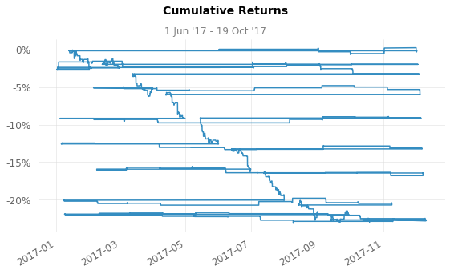
    


    
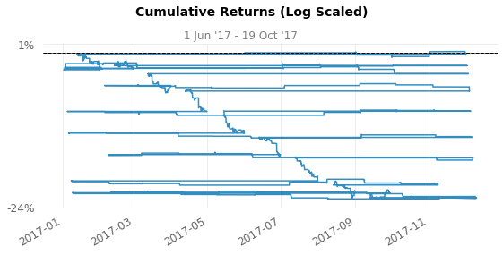
    


    
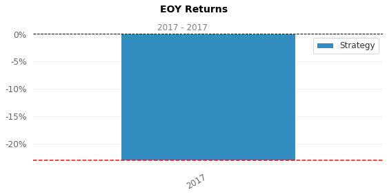
    


    
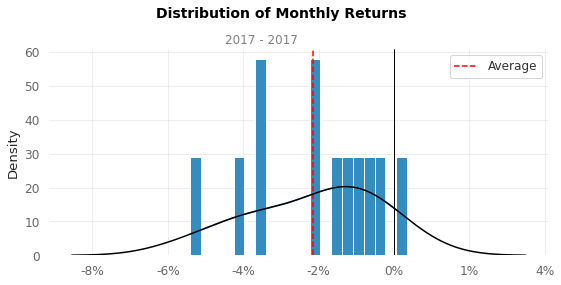
    


    
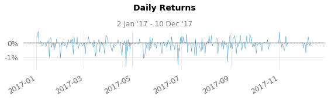
    


    
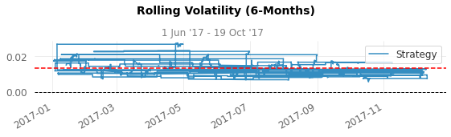
    


    
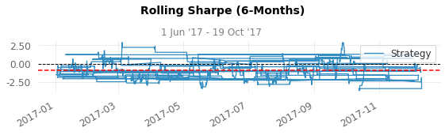
    


    
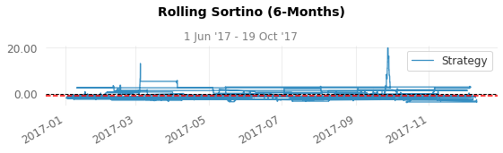
    


    
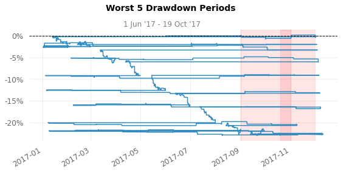
    


    
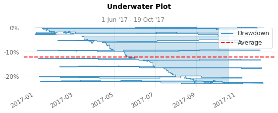
    


    
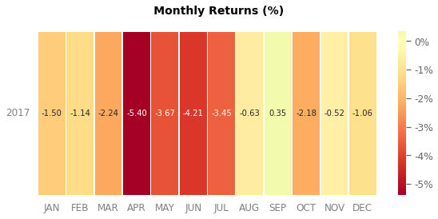
    


    
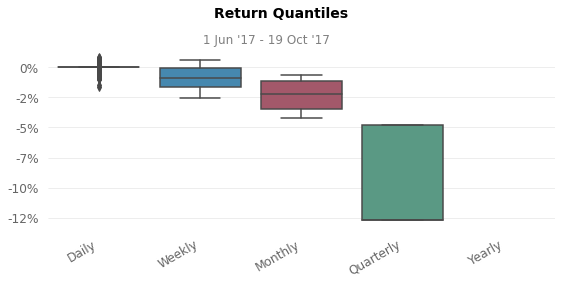
    


## Plot Results


```python
plt.figure(figsize=(30, 10))
env.render_all()
plt.show()
```


    
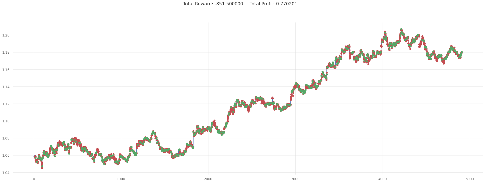
    


# tensorboard


```python
# Load the TensorBoard notebook extension
%load_ext tensorboard
```

    The tensorboard extension is already loaded. To reload it, use:
      %reload_ext tensorboard
    


```python
%tensorboard --logdir logs/
```


    Reusing TensorBoard on port 6006 (pid 3451), started 1:20:52 ago. (Use '!kill 3451' to kill it.)


<div id="root"></div>
<script>
  (function() {
    window.TENSORBOARD_ENV = window.TENSORBOARD_ENV || {};
    window.TENSORBOARD_ENV["IN_COLAB"] = true;
    document.querySelector("base").href = "https://localhost:6006";
    function fixUpTensorboard(root) {
      const tftb = root.querySelector("tf-tensorboard");
      // Disable the fragment manipulation behavior in Colab. Not
      // only is the behavior not useful (as the iframe's location
      // is not visible to the user), it causes TensorBoard's usage
      // of `window.replace` to navigate away from the page and to
      // the `localhost:<port>` URL specified by the base URI, which
      // in turn causes the frame to (likely) crash.
      tftb.removeAttribute("use-hash");
    }
    function executeAllScripts(root) {
      // When `script` elements are inserted into the DOM by
      // assigning to an element's `innerHTML`, the scripts are not
      // executed. Thus, we manually re-insert these scripts so that
      // TensorBoard can initialize itself.
      for (const script of root.querySelectorAll("script")) {
        const newScript = document.createElement("script");
        newScript.type = script.type;
        newScript.textContent = script.textContent;
        root.appendChild(newScript);
        script.remove();
      }
    }
    function setHeight(root, height) {
      // We set the height dynamically after the TensorBoard UI has
      // been initialized. This avoids an intermediate state in
      // which the container plus the UI become taller than the
      // final width and cause the Colab output frame to be
      // permanently resized, eventually leading to an empty
      // vertical gap below the TensorBoard UI. It's not clear
      // exactly what causes this problematic intermediate state,
      // but setting the height late seems to fix it.
      root.style.height = `${height}px`;
    }
    const root = document.getElementById("root");
    fetch(".")
      .then((x) => x.text())
      .then((html) => void (root.innerHTML = html))
      .then(() => fixUpTensorboard(root))
      .then(() => executeAllScripts(root))
      .then(() => setHeight(root, 800));
  })();
</script>


