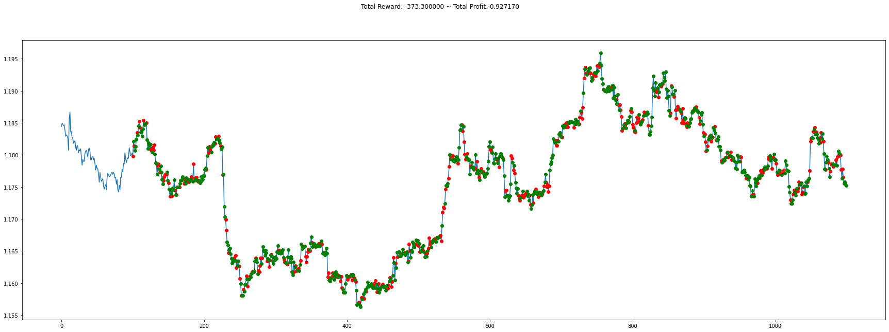

## Google Drive setting


```python
from google.colab import drive
drive.mount('/content/drive')
```

    Drive already mounted at /content/drive; to attempt to forcibly remount, call drive.mount("/content/drive", force_remount=True).
    


```python
%cd /content/drive/MyDrive/AIncome
```

    /content/drive/MyDrive/AIncome
    


```python
!pwd
```

    /content/drive/MyDrive/AIncome
    

### 作業フォルダ


```python
!mkdir AutoTrade05
```

    mkdir: cannot create directory ‘AutoTrade05’: File exists
    


```python
%cd  AutoTrade05
```

    /content/drive/MyDrive/AIncome/AutoTrade05
    


```python
!pwd
```

    /content/drive/MyDrive/AIncome/AutoTrade05
    

## 必要パッケージのインストール


```python
#!pip install gym[all] -U
!pip install "gym==0.19.0"
!pip install stable-baselines[mpi]
#!pip install tensorflow==1.14.0
!pip install tensorflow-gpu==1.14.0
!pip install pyqt5
!pip install imageio
!pip install gym-anytrading
```

    Looking in indexes: https://pypi.org/simple, https://us-python.pkg.dev/colab-wheels/public/simple/
    Requirement already satisfied: gym==0.19.0 in /usr/local/lib/python3.7/dist-packages (0.19.0)
    Requirement already satisfied: numpy>=1.18.0 in /usr/local/lib/python3.7/dist-packages (from gym==0.19.0) (1.21.6)
    Requirement already satisfied: cloudpickle<1.7.0,>=1.2.0 in /usr/local/lib/python3.7/dist-packages (from gym==0.19.0) (1.5.0)
    Looking in indexes: https://pypi.org/simple, https://us-python.pkg.dev/colab-wheels/public/simple/
    Requirement already satisfied: stable-baselines[mpi] in /usr/local/lib/python3.7/dist-packages (2.10.2)
    Requirement already satisfied: joblib in /usr/local/lib/python3.7/dist-packages (from stable-baselines[mpi]) (1.1.0)
    Requirement already satisfied: pandas in /usr/local/lib/python3.7/dist-packages (from stable-baselines[mpi]) (1.3.5)
    Requirement already satisfied: numpy in /usr/local/lib/python3.7/dist-packages (from stable-baselines[mpi]) (1.21.6)
    Requirement already satisfied: scipy in /usr/local/lib/python3.7/dist-packages (from stable-baselines[mpi]) (1.7.3)
    Requirement already satisfied: cloudpickle>=0.5.5 in /usr/local/lib/python3.7/dist-packages (from stable-baselines[mpi]) (1.5.0)
    Requirement already satisfied: matplotlib in /usr/local/lib/python3.7/dist-packages (from stable-baselines[mpi]) (3.2.2)
    Requirement already satisfied: gym[atari,classic_control]>=0.11 in /usr/local/lib/python3.7/dist-packages (from stable-baselines[mpi]) (0.19.0)
    Requirement already satisfied: opencv-python in /usr/local/lib/python3.7/dist-packages (from stable-baselines[mpi]) (4.6.0.66)
    Requirement already satisfied: mpi4py in /usr/local/lib/python3.7/dist-packages (from stable-baselines[mpi]) (3.1.3)
    Requirement already satisfied: atari-py==0.2.6 in /usr/local/lib/python3.7/dist-packages (from gym[atari,classic_control]>=0.11->stable-baselines[mpi]) (0.2.6)
    Requirement already satisfied: pyglet>=1.4.0 in /usr/local/lib/python3.7/dist-packages (from gym[atari,classic_control]>=0.11->stable-baselines[mpi]) (1.5.26)
    Requirement already satisfied: six in /usr/local/lib/python3.7/dist-packages (from atari-py==0.2.6->gym[atari,classic_control]>=0.11->stable-baselines[mpi]) (1.15.0)
    Requirement already satisfied: cycler>=0.10 in /usr/local/lib/python3.7/dist-packages (from matplotlib->stable-baselines[mpi]) (0.11.0)
    Requirement already satisfied: kiwisolver>=1.0.1 in /usr/local/lib/python3.7/dist-packages (from matplotlib->stable-baselines[mpi]) (1.4.4)
    Requirement already satisfied: pyparsing!=2.0.4,!=2.1.2,!=2.1.6,>=2.0.1 in /usr/local/lib/python3.7/dist-packages (from matplotlib->stable-baselines[mpi]) (3.0.9)
    Requirement already satisfied: python-dateutil>=2.1 in /usr/local/lib/python3.7/dist-packages (from matplotlib->stable-baselines[mpi]) (2.8.2)
    Requirement already satisfied: typing-extensions in /usr/local/lib/python3.7/dist-packages (from kiwisolver>=1.0.1->matplotlib->stable-baselines[mpi]) (4.1.1)
    Requirement already satisfied: pytz>=2017.3 in /usr/local/lib/python3.7/dist-packages (from pandas->stable-baselines[mpi]) (2022.2.1)
    Looking in indexes: https://pypi.org/simple, https://us-python.pkg.dev/colab-wheels/public/simple/
    Requirement already satisfied: tensorflow-gpu==1.14.0 in /usr/local/lib/python3.7/dist-packages (1.14.0)
    Requirement already satisfied: termcolor>=1.1.0 in /usr/local/lib/python3.7/dist-packages (from tensorflow-gpu==1.14.0) (1.1.0)
    Requirement already satisfied: six>=1.10.0 in /usr/local/lib/python3.7/dist-packages (from tensorflow-gpu==1.14.0) (1.15.0)
    Requirement already satisfied: tensorboard<1.15.0,>=1.14.0 in /usr/local/lib/python3.7/dist-packages (from tensorflow-gpu==1.14.0) (1.14.0)
    Requirement already satisfied: protobuf>=3.6.1 in /usr/local/lib/python3.7/dist-packages (from tensorflow-gpu==1.14.0) (3.17.3)
    Requirement already satisfied: wheel>=0.26 in /usr/local/lib/python3.7/dist-packages (from tensorflow-gpu==1.14.0) (0.37.1)
    Requirement already satisfied: gast>=0.2.0 in /usr/local/lib/python3.7/dist-packages (from tensorflow-gpu==1.14.0) (0.5.3)
    Requirement already satisfied: google-pasta>=0.1.6 in /usr/local/lib/python3.7/dist-packages (from tensorflow-gpu==1.14.0) (0.2.0)
    Requirement already satisfied: tensorflow-estimator<1.15.0rc0,>=1.14.0rc0 in /usr/local/lib/python3.7/dist-packages (from tensorflow-gpu==1.14.0) (1.14.0)
    Requirement already satisfied: keras-preprocessing>=1.0.5 in /usr/local/lib/python3.7/dist-packages (from tensorflow-gpu==1.14.0) (1.1.2)
    Requirement already satisfied: numpy<2.0,>=1.14.5 in /usr/local/lib/python3.7/dist-packages (from tensorflow-gpu==1.14.0) (1.21.6)
    Requirement already satisfied: wrapt>=1.11.1 in /usr/local/lib/python3.7/dist-packages (from tensorflow-gpu==1.14.0) (1.14.1)
    Requirement already satisfied: grpcio>=1.8.6 in /usr/local/lib/python3.7/dist-packages (from tensorflow-gpu==1.14.0) (1.47.0)
    Requirement already satisfied: absl-py>=0.7.0 in /usr/local/lib/python3.7/dist-packages (from tensorflow-gpu==1.14.0) (1.2.0)
    Requirement already satisfied: keras-applications>=1.0.6 in /usr/local/lib/python3.7/dist-packages (from tensorflow-gpu==1.14.0) (1.0.8)
    Requirement already satisfied: astor>=0.6.0 in /usr/local/lib/python3.7/dist-packages (from tensorflow-gpu==1.14.0) (0.8.1)
    Requirement already satisfied: h5py in /usr/local/lib/python3.7/dist-packages (from keras-applications>=1.0.6->tensorflow-gpu==1.14.0) (3.1.0)
    Requirement already satisfied: setuptools>=41.0.0 in /usr/local/lib/python3.7/dist-packages (from tensorboard<1.15.0,>=1.14.0->tensorflow-gpu==1.14.0) (57.4.0)
    Requirement already satisfied: markdown>=2.6.8 in /usr/local/lib/python3.7/dist-packages (from tensorboard<1.15.0,>=1.14.0->tensorflow-gpu==1.14.0) (3.4.1)
    Requirement already satisfied: werkzeug>=0.11.15 in /usr/local/lib/python3.7/dist-packages (from tensorboard<1.15.0,>=1.14.0->tensorflow-gpu==1.14.0) (1.0.1)
    Requirement already satisfied: importlib-metadata>=4.4 in /usr/local/lib/python3.7/dist-packages (from markdown>=2.6.8->tensorboard<1.15.0,>=1.14.0->tensorflow-gpu==1.14.0) (4.12.0)
    Requirement already satisfied: zipp>=0.5 in /usr/local/lib/python3.7/dist-packages (from importlib-metadata>=4.4->markdown>=2.6.8->tensorboard<1.15.0,>=1.14.0->tensorflow-gpu==1.14.0) (3.8.1)
    Requirement already satisfied: typing-extensions>=3.6.4 in /usr/local/lib/python3.7/dist-packages (from importlib-metadata>=4.4->markdown>=2.6.8->tensorboard<1.15.0,>=1.14.0->tensorflow-gpu==1.14.0) (4.1.1)
    Requirement already satisfied: cached-property in /usr/local/lib/python3.7/dist-packages (from h5py->keras-applications>=1.0.6->tensorflow-gpu==1.14.0) (1.5.2)
    Looking in indexes: https://pypi.org/simple, https://us-python.pkg.dev/colab-wheels/public/simple/
    Requirement already satisfied: pyqt5 in /usr/local/lib/python3.7/dist-packages (5.15.7)
    Requirement already satisfied: PyQt5-sip<13,>=12.11 in /usr/local/lib/python3.7/dist-packages (from pyqt5) (12.11.0)
    Requirement already satisfied: PyQt5-Qt5>=5.15.0 in /usr/local/lib/python3.7/dist-packages (from pyqt5) (5.15.2)
    Looking in indexes: https://pypi.org/simple, https://us-python.pkg.dev/colab-wheels/public/simple/
    Requirement already satisfied: imageio in /usr/local/lib/python3.7/dist-packages (2.9.0)
    Requirement already satisfied: pillow in /usr/local/lib/python3.7/dist-packages (from imageio) (7.1.2)
    Requirement already satisfied: numpy in /usr/local/lib/python3.7/dist-packages (from imageio) (1.21.6)
    Looking in indexes: https://pypi.org/simple, https://us-python.pkg.dev/colab-wheels/public/simple/
    Requirement already satisfied: gym-anytrading in /usr/local/lib/python3.7/dist-packages (1.3.1)
    Requirement already satisfied: matplotlib>=3.1.1 in /usr/local/lib/python3.7/dist-packages (from gym-anytrading) (3.2.2)
    Requirement already satisfied: pandas>=0.24.2 in /usr/local/lib/python3.7/dist-packages (from gym-anytrading) (1.3.5)
    Requirement already satisfied: numpy>=1.16.4 in /usr/local/lib/python3.7/dist-packages (from gym-anytrading) (1.21.6)
    Requirement already satisfied: gym>=0.12.5 in /usr/local/lib/python3.7/dist-packages (from gym-anytrading) (0.19.0)
    Requirement already satisfied: cloudpickle<1.7.0,>=1.2.0 in /usr/local/lib/python3.7/dist-packages (from gym>=0.12.5->gym-anytrading) (1.5.0)
    Requirement already satisfied: python-dateutil>=2.1 in /usr/local/lib/python3.7/dist-packages (from matplotlib>=3.1.1->gym-anytrading) (2.8.2)
    Requirement already satisfied: pyparsing!=2.0.4,!=2.1.2,!=2.1.6,>=2.0.1 in /usr/local/lib/python3.7/dist-packages (from matplotlib>=3.1.1->gym-anytrading) (3.0.9)
    Requirement already satisfied: cycler>=0.10 in /usr/local/lib/python3.7/dist-packages (from matplotlib>=3.1.1->gym-anytrading) (0.11.0)
    Requirement already satisfied: kiwisolver>=1.0.1 in /usr/local/lib/python3.7/dist-packages (from matplotlib>=3.1.1->gym-anytrading) (1.4.4)
    Requirement already satisfied: typing-extensions in /usr/local/lib/python3.7/dist-packages (from kiwisolver>=1.0.1->matplotlib>=3.1.1->gym-anytrading) (4.1.1)
    Requirement already satisfied: pytz>=2017.3 in /usr/local/lib/python3.7/dist-packages (from pandas>=0.24.2->gym-anytrading) (2022.2.1)
    Requirement already satisfied: six>=1.5 in /usr/local/lib/python3.7/dist-packages (from python-dateutil>=2.1->matplotlib>=3.1.1->gym-anytrading) (1.15.0)
    


```python
!pip uninstall tensorboard-plugin-wit --yes
```

    WARNING: Skipping tensorboard-plugin-wit as it is not installed.
    

## インポート


```python
import os, gym
import gym_anytrading
import matplotlib.pyplot as plt
from gym_anytrading.envs import TradingEnv, ForexEnv, StocksEnv, Actions, Positions
from gym_anytrading.datasets import FOREX_EURUSD_1H_ASK, STOCKS_GOOGL
from stable_baselines.common.vec_env import DummyVecEnv
from stable_baselines import PPO2
from stable_baselines import ACKTR
from stable_baselines.bench import Monitor
from stable_baselines.common import set_global_seeds
```

## 設定


```python
# ログフォルダの生成
log_dir = './logs/'
os.makedirs(log_dir, exist_ok=True)


# train data
idx1 = 100
idx2 = 5000

# test data
idx3 = 6000

window_size = 100

#trade_fee = 0
trade_fee = 0.0003
```

## 環境の生成


```python
# 環境の生成
env = gym.make('forex-v0', frame_bound=(idx1, idx2), window_size=window_size)
env.trade_fee = trade_fee


env = Monitor(env, log_dir, allow_early_resets=True)

# シードの指定
env.seed(0)
set_global_seeds(0)

# ベクトル化環境の生成
env = DummyVecEnv([lambda: env])

# モデルの生成
model = PPO2('MlpPolicy', env, tensorboard_log=log_dir)
#model = ACKTR('MlpPolicy', env, verbose=1)

# モデルの読み込み
# model = PPO2.load('trading_model')
```

    WARNING:tensorflow:Entity <bound method Flatten.call of <tensorflow.python.layers.core.Flatten object at 0x7f3112cf1f90>> could not be transformed and will be executed as-is. Please report this to the AutgoGraph team. When filing the bug, set the verbosity to 10 (on Linux, `export AUTOGRAPH_VERBOSITY=10`) and attach the full output. Cause: converting <bound method Flatten.call of <tensorflow.python.layers.core.Flatten object at 0x7f3112cf1f90>>: AttributeError: module 'gast' has no attribute 'Index'
    

    WARNING: Entity <bound method Flatten.call of <tensorflow.python.layers.core.Flatten object at 0x7f3112cf1f90>> could not be transformed and will be executed as-is. Please report this to the AutgoGraph team. When filing the bug, set the verbosity to 10 (on Linux, `export AUTOGRAPH_VERBOSITY=10`) and attach the full output. Cause: converting <bound method Flatten.call of <tensorflow.python.layers.core.Flatten object at 0x7f3112cf1f90>>: AttributeError: module 'gast' has no attribute 'Index'
    

    WARNING:tensorflow:Entity <bound method Flatten.call of <tensorflow.python.layers.core.Flatten object at 0x7f3111b9fe10>> could not be transformed and will be executed as-is. Please report this to the AutgoGraph team. When filing the bug, set the verbosity to 10 (on Linux, `export AUTOGRAPH_VERBOSITY=10`) and attach the full output. Cause: converting <bound method Flatten.call of <tensorflow.python.layers.core.Flatten object at 0x7f3111b9fe10>>: AttributeError: module 'gast' has no attribute 'Index'
    

    WARNING: Entity <bound method Flatten.call of <tensorflow.python.layers.core.Flatten object at 0x7f3111b9fe10>> could not be transformed and will be executed as-is. Please report this to the AutgoGraph team. When filing the bug, set the verbosity to 10 (on Linux, `export AUTOGRAPH_VERBOSITY=10`) and attach the full output. Cause: converting <bound method Flatten.call of <tensorflow.python.layers.core.Flatten object at 0x7f3111b9fe10>>: AttributeError: module 'gast' has no attribute 'Index'
    

## 学習


```python
# モデルの学習
model.learn(total_timesteps=128000)

# モデルの保存
model.save('trading_model4.1')
```

## モデルのテスト


```python
env = gym.make('forex-v0', frame_bound=(idx2, idx3), window_size=window_size)
env.seed(0)
state = env.reset()
while True:
    # 行動の取得
    action, _ = model.predict(state)
    # 1ステップ実行
    state, reward, done, info = env.step(action)
    # エピソード完了
    if done:
        print('info:', info)
        break
```

    info: {'total_reward': -373.2999999999831, 'total_profit': 0.9271699595232792, 'position': 1}
    


### trade_fee=0

info: {'total_reward': -152.69999999997458, 'total_profit': 0.9674896949404773, 'position': 1}

### trade_fee=0.0003

info: {'total_reward': -373.2999999999831, 'total_profit': 0.9271699595232792, 'position': 1}


```python

```

## グラフのプロット


```python
#plt.cla()
plt.figure(figsize=(30, 10))
env.render_all()
plt.show()
```


    

    


```python
# Load the TensorBoard notebook extension
%load_ext tensorboard
```

    The tensorboard extension is already loaded. To reload it, use:
      %reload_ext tensorboard
    


```python
%tensorboard --logdir logs/
```


    Reusing TensorBoard on port 6006 (pid 2753), started 1:00:42 ago. (Use '!kill 2753' to kill it.)


<div id="root"></div>
<script>
  (function() {
    window.TENSORBOARD_ENV = window.TENSORBOARD_ENV || {};
    window.TENSORBOARD_ENV["IN_COLAB"] = true;
    document.querySelector("base").href = "https://localhost:6006";
    function fixUpTensorboard(root) {
      const tftb = root.querySelector("tf-tensorboard");
      // Disable the fragment manipulation behavior in Colab. Not
      // only is the behavior not useful (as the iframe's location
      // is not visible to the user), it causes TensorBoard's usage
      // of `window.replace` to navigate away from the page and to
      // the `localhost:<port>` URL specified by the base URI, which
      // in turn causes the frame to (likely) crash.
      tftb.removeAttribute("use-hash");
    }
    function executeAllScripts(root) {
      // When `script` elements are inserted into the DOM by
      // assigning to an element's `innerHTML`, the scripts are not
      // executed. Thus, we manually re-insert these scripts so that
      // TensorBoard can initialize itself.
      for (const script of root.querySelectorAll("script")) {
        const newScript = document.createElement("script");
        newScript.type = script.type;
        newScript.textContent = script.textContent;
        root.appendChild(newScript);
        script.remove();
      }
    }
    function setHeight(root, height) {
      // We set the height dynamically after the TensorBoard UI has
      // been initialized. This avoids an intermediate state in
      // which the container plus the UI become taller than the
      // final width and cause the Colab output frame to be
      // permanently resized, eventually leading to an empty
      // vertical gap below the TensorBoard UI. It's not clear
      // exactly what causes this problematic intermediate state,
      // but setting the height late seems to fix it.
      root.style.height = `${height}px`;
    }
    const root = document.getElementById("root");
    fetch(".")
      .then((x) => x.text())
      .then((html) => void (root.innerHTML = html))
      .then(() => fixUpTensorboard(root))
      .then(() => executeAllScripts(root))
      .then(() => setHeight(root, 800));
  })();
</script>


